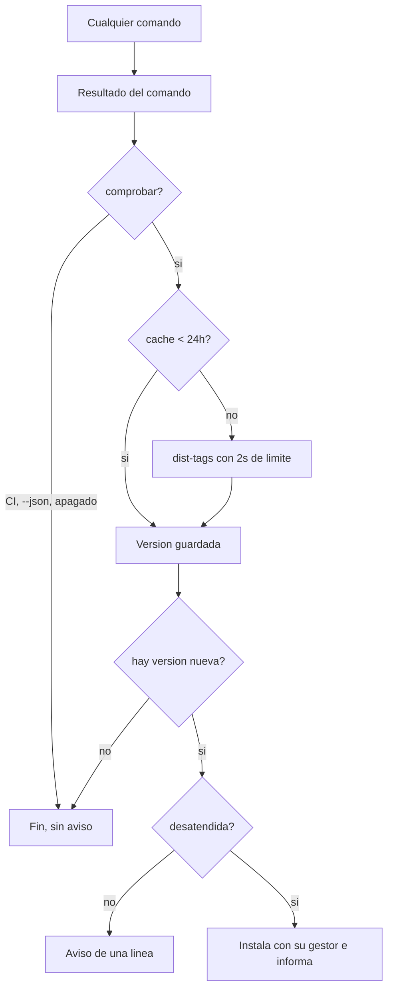

# Plan — Mantener la herramienta al día

## 1. Contexto AS-IS

`satlas upgrade` ya existe, pero migra el **esquema del proyecto** (`.sdd/`) entre versiones: no toca el binario. No hay nada que mire el registro de paquetes ni que sepa con qué gestor se instaló la herramienta, así que actualizar exige recordar `npm i -g specatlas@latest` y, antes, enterarse de que hay versión nueva.

La configuración del proyecto (`.sdd/config.yaml`) no sirve para esto: la preferencia de actualización es de la persona y de su máquina, no del repositorio que tenga abierto.

El CLI ya tiene un ejecutor de procesos con guardas (`runProcess`, en `core/exec.ts`) que rechaza metacaracteres y resuelve los lanzadores `.cmd` de Windows: la instalación puede apoyarse en él.

## 2. Enfoque técnico

Un módulo nuevo en el núcleo, `selfupdate.ts`, con todo lo que se puede probar sin red ni instalación: comparación de versiones, detección del gestor por la ruta del ejecutable, caché de la última consulta, preferencias personales y la decisión de avisar. El comando del CLI solo orquesta.

El nombre es **`self-update`**, no `update`, para que nadie lo confunda con `upgrade` (el del esquema del proyecto).

La consulta al registro usa el endpoint de etiquetas (`/-/package/specatlas/dist-tags`), que devuelve unos pocos bytes, con `AbortController` a 2 segundos. El resultado se guarda en `~/.specatlas/update-check.json` con una vigencia de 24 horas, así que el coste habitual por comando es cero.

El aviso se imprime **después** del resultado del comando y nunca toca su código de salida. Se calla en integración continua, con `--json`, con `SPECATLAS_NO_UPDATE_CHECK=1` y en `satlas mcp` (que habla por la entrada y salida estándar con un asistente: cualquier texto extra la corrompería).

Alternativas descartadas:

- **Actualizar siempre y sin preguntar**: cambiar el binario de alguien sin que lo pida es intrusivo; la actualización desatendida existe, pero hay que activarla.
- **Guardar la preferencia en `.sdd/config.yaml`**: haría que la misma persona tuviera comportamientos distintos según el repositorio abierto.
- **Un demonio que comprueba en segundo plano**: más piezas y más fallos para un problema que resuelve una consulta al día.

## 3. Diagramas

## 4. Diseño por capa / módulos

| Módulo | Responsabilidad |
|---|---|
| `core/selfupdate.ts` | Comparación de versiones, detección del gestor, caché, preferencias y decisión de avisar |
| `cli/commands/self-update.ts` | El comando (`--check`, `--auto on\|off`) y el aviso pasivo |
| `cli/cli.ts` | Imprime el aviso después del resultado, sin alterarlo |
| `~/.specatlas/config.json` | Preferencia personal (`comprobar`, `automatica`) |
| `~/.specatlas/update-check.json` | Última consulta y última versión conocida |

## 5. Matriz de trazabilidad (REQ → tareas)

| Requisito | Tareas |
|---|---|
| REQ-CLI-001 | T1.1, T1.2 |
| REQ-CLI-002 | T2.1, T2.2 |
| REQ-CLI-003 | T3.1 |

## 6. Matriz de paridad AS-IS → TO-BE

| Antes | Después |
|---|---|
| Enterarse de una versión nueva por casualidad | Aviso de una línea, una vez al día |
| Recordar la orden del gestor | `satlas self-update` |
| Actualizar a mano siempre | Desatendida opcional, desactivada por defecto |
| Nada distingue el binario del esquema | `self-update` (herramienta) y `upgrade` (proyecto) |

## 7. Tareas (ver tasks.md)

## 8. Riesgos y mitigaciones

| Riesgo | Mitigación |
|---|---|
| La consulta al registro ralentiza cada comando | Caché de 24 horas y límite de 2 segundos; sin red, no hay aviso |
| El aviso ensucia una salida que otro programa consume | No se emite con `--json`, en integración continua ni en el servidor para asistentes |
| La instalación desatendida falla a medias y deja la herramienta rota | El gestor instala de forma atómica; si falla, se informa y sigue la versión anterior |
| Actualizar mientras se está ejecutando la versión anterior | El comando en curso ya está cargado en memoria; se avisa de abrir una terminal nueva |

## 9. Rollback

Revertir el commit y borrar `~/.specatlas/`, que es donde vive todo lo que este cambio escribe. No toca nada del proyecto.

## 10. Dependencias y supuestos

- Node 20 o superior trae `fetch` y `AbortController`, así que no hace falta ninguna dependencia nueva.
- El registro público responde en `/-/package/specatlas/dist-tags`.
- La instalación global se hace con el gestor con el que se instaló; si no se reconoce, se propone npm.
