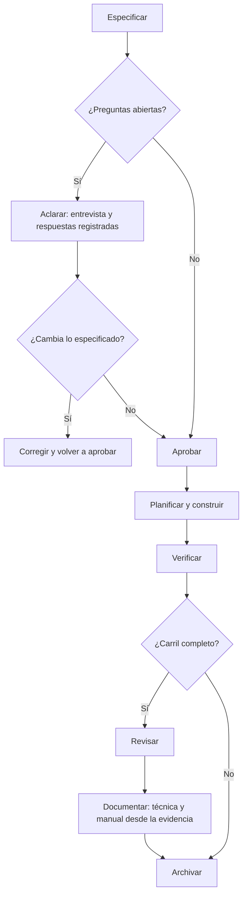
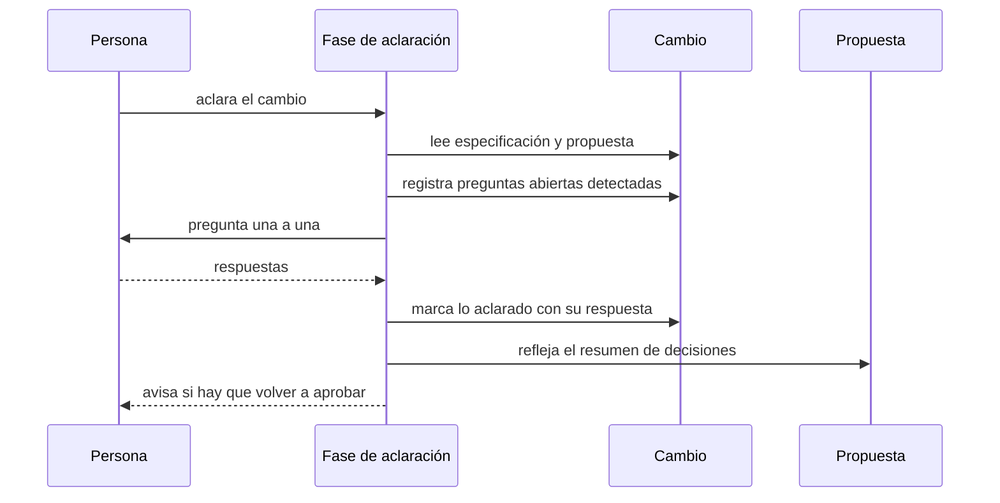
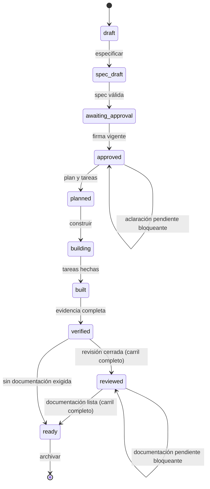

# Plan — Aclarar la especificación antes de planificar y documentar el cambio

## 1. Contexto AS-IS

Inventario real del repo (anclas al código):

- **El ciclo de vida no conoce ninguna de las dos fases**: `deriveState` (`packages/core/src/lifecycle.ts:99-159`) va de `draft` a `ready` sin mirar aclaraciones ni documentación, aunque `Phase` y `ChangeState` ya declaran `'docs'`, `'reviewed'` y `'documented'` (`lifecycle.ts:1-20`) y ARQUITECTURA §5.5 promete «review cerrado, docs pendientes → `reviewed`; next `/satlas.docs`» (regla 10) y «sin spec → `draft`; next `/satlas.clarify`» (regla 2).
- **No existen los artefactos**: `loadChange` (`workspace.ts:57-115`) carga meta, delta, plan, tareas, verificación, fix y mockups; no hay `clarify.md` ni `docs/`. No hay parser de preguntas abiertas ni generador de documentación en el núcleo.
- **La configuración no tiene modos para estas fases**: `gates` (`config.ts:25-33`) define `approval`, `analyze`, `verify`, `review` y `mockup` con `off|advisory|blocking`; faltan `clarify` y `docs`.
- **Punto único de evaluación**: `evaluateChange` (`packages/cli/src/evaluate.ts:37-68`) alimenta `status`, `validate`, la vía de consulta MCP y el árbol del editor; la extensión reimplementa la evaluación en `buildSnapshot` (`packages/vscode/src/logic.ts:171-225`) usando `deriveState` directamente.
- **Fases del agente**: `workflow/phases/*.md` (9 fases) se compilan por `@specatlas/adapters` a `.opencode/command/satlas-<id>.md`, `.opencode/skills/satlas-<id>/SKILL.md`, `prompts/satlas-<id>.md` y demás targets (`targets.ts:61-90`); el manifiesto `.sdd/.generated/manifest.json` y `satlas doctor`/`ci` verifican que estén al día. Añadir fases exige **recompilar adaptadores** y commitear los generados.
- **CLI**: catálogo (`catalog.ts`) + despachador (`cli.ts` HANDLERS) con patrón `CommandResult`; `--json` en todos.
- **Editor**: `changeFiles` (`logic.ts`) lista los artefactos del cambio por tipo (spec, tasks, verify, plan, presentación, mockups); `runNext` (`extension.ts`) mapea acciones de agente conocidas.

## 2. Enfoque técnico

- **Aclaraciones** (`packages/core/src/parse/clarify.ts`): artefacto `changes/<slug>/clarify.md` con encabezado y entradas canónicas `- [ ] pregunta` (abierta) y `- [x] pregunta — respuesta` (aclarada); `parseClarify` devuelve abiertas y aclaradas. `Change.clarifyPath` en `workspace.ts`.
- **Modos** (`config.ts`): `gates.clarify.mode: off | advisory | blocking` (por defecto `advisory`) y `gates.docs.mode: off | advisory | blocking` (por defecto `blocking`, solo aplica al carril completo, como en la tabla de gates de ARQUITECTURA §5.6).
- **Ciclo de vida** (`lifecycle.ts`):
  - **Aclaración**: con preguntas abiertas, `blocking` bloquea el paso a plan (`blockedBy: 'aclaración pendiente (N)'`, `next: /satlas.clarify <slug>`); `advisory` no bloquea y expone un aviso (`ATLAS-CLARIFY-001`, warning) con el número y la acción; `off` no emite nada. Sin preguntas, nada en ningún modo.
  - **Documentación**: en carril `full`, si falta `docs/` y el modo es `blocking`, tras review se queda en `reviewed` con `blockedBy: 'documentación pendiente'` y `next: /satlas.docs <slug>`; `advisory` avisa (`ATLAS-DOCS-001`) sin bloquear; `off` nada. En carriles `fix`/`standard` nunca bloquea.
  - Los avisos se exponen con helpers exportados (`clarifyAdvisory`, `docsAdvisory`) para que `evaluateChange` y `buildSnapshot` los sumen sin duplicar lógica.
- **Generación de documentación** (`packages/core/src/docs.ts` + plantillas en `templates.ts`): `generateDocs(root, slug, { tipo: 'tecnica' | 'manual' | 'all' })` escribe `changes/<slug>/docs/tecnica.md` y `docs/manual.md` desde plantilla + **datos reales**: identidad del cambio, requisitos/escenarios del delta con su estado de evidencia, tareas (hechas/total), evidencias registradas (método, resultado, fecha) y **lo que queda sin evidencia señalado**. El contenido generado vive entre marcadores `<!-- specatlas:generado:inicio -->` / `<!-- specatlas:generado:fin -->`: regenerar reemplaza solo ese bloque y conserva lo escrito a mano (idempotente, sin duplicar secciones). Elegir un tipo no toca el otro documento.
- **CLI** (`commands/clarify.ts`, `commands/docs.ts`): `satlas clarify <slug>` informa preguntas abiertas/aclaradas, modo y acción (solo lectura, sin efectos); `satlas docs <slug> [--tipo tecnica|manual|all]` genera y reporta rutas; cambio inexistente → aviso explícito y sin efectos; ambos con `--json` y registrados en el catálogo.
- **Fases del agente** (`workflow/phases/clarify.md`, `workflow/phases/docs.md`): `clarify` entrevista una a una (lee spec y propuesta, detecta supuestos/dependencias/preguntas, escribe `clarify.md`, refleja el resumen en la propuesta y avisa re-firma si cambia la spec); `docs` genera con `satlas docs` y completa con el contexto real sin inventar. Recompilar adaptadores (`satlas adapters`) y commitear los generados.
- **Editor** (`logic.ts`): `changeFiles` gana los tipos «Aclaraciones» (`clarify.md`) y «Documentación» (`docs/tecnica.md` + `docs/manual.md`), con su existencia por tipo; el árbol ya los muestra al expandir el cambio.
- **Alternativas descartadas**:
  - Guardar las preguntas dentro de `spec.md`: la especificación es de negocio y aprobada; las aclaraciones son conversación y quedan aparte (BR-FASES-001).
  - Un único documento de docs: el usuario eligió técnica + manual.
  - Bloquear la aprobación por aclaraciones pendientes: la spec bloquea plan, no la firma (decisión del usuario: aviso configurable; el humano decide cuándo firma).
  - Reescribir el documento completo al regenerar: perdería ediciones manuales; el bloque gestionado las conserva.

## 3. Diagramas

### 3.1 El ciclo con las dos fases (flowchart)

### 3.2 Una ronda de aclaración (sequence)

### 3.3 Estados del cambio con los gates nuevos (stateDiagram-v2)

## 4. Diseño por capa / módulos

| Módulo | Capa | Responsabilidad |
|---|---|---|
| `packages/core/src/parse/clarify.ts` | Núcleo | Parser de `clarify.md` (abiertas y aclaradas) |
| `packages/core/src/docs.ts` | Núcleo | Generación de técnica y manual desde plantillas + evidencia, con bloque gestionado |
| `packages/core/src/{config,model,workspace}.ts` | Núcleo | Modos `clarify`/`docs`, `clarifyPath`/`docsPaths`, carga |
| `packages/core/src/lifecycle.ts` | Núcleo | Bloqueos y avisos de aclaración y documentación |
| `packages/core/src/templates.ts` | Núcleo | Plantillas de `clarify.md` y de los dos documentos |
| `packages/core/src/index.ts` | Núcleo | Exportar parser, generador y avisos |
| `packages/cli/src/commands/{clarify,docs}.ts` | CLI | Comandos de aclaración (informe) y documentación (generación) |
| `packages/cli/src/{catalog,cli}.ts` | CLI | Registro de ambos comandos |
| `packages/cli/src/evaluate.ts` | CLI | Suma de avisos de aclaración/documentación |
| `packages/vscode/src/logic.ts` | Extensión | Artefactos del cambio (aclaraciones, documentación) y avisos |
| `workflow/phases/{clarify,docs}.md` + generados | Fases | Fases del agente y artefactos compilados |
| `packages/core/test/clarify-docs.test.ts`, `packages/cli/test/cli.test.ts`, `packages/vscode/test/logic.test.ts` | Pruebas | Núcleo y superficies |
| `README.md`, `ARQUITECTURA.md` | Docs | Fases, modos y gates |

## 5. Matriz de trazabilidad (REQ → tareas)

| Requisito | Escenarios | Tareas |
|---|---|---|
| REQ-FASES-001 — Vaciar preguntas antes de planificar | S1…S4 | T1.1, T1.2, T1.5, T2.1, T2.2, T2.4 |
| REQ-FASES-002 — Aviso de aclaración configurable | S1…S4 | T1.2, T1.5 |
| REQ-FASES-003 — Documentación del carril completo | S1…S4 | T1.1, T1.3, T1.5, T2.2, T2.3 |
| REQ-FASES-004 — Documentación pendiente y archivado | S1…S4 | T1.1, T1.4, T1.5 |
| REQ-FASES-005 — Terminal y asistentes | S1…S4 | T2.1, T2.2, T2.4 |

## 6. Matriz de paridad AS-IS → TO-BE

Es aditivo: el ciclo actual y sus gates no cambian cuando no hay aclaraciones ni documentación pendientes.

| Elemento | Conservar | Descartar | Nuevo |
|---|---|---|---|
| `deriveState` | Orden de estados y gates actuales | — | Bloqueos/avisos de aclaración y documentación |
| `gates` (config) | Modos existentes | — | `clarify` y `docs` |
| `loadChange` | Artefactos actuales | — | `clarifyPath` y `docsPaths` |
| Fases del agente (9) | Se conservan | — | `clarify` y `docs` (y recompilación) |
| CLI | Comandos actuales | — | `satlas clarify` y `satlas docs` |
| Editor | Artefactos actuales | — | Tipos «Aclaraciones» y «Documentación» |

## 7. Tareas

Ver `tasks.md`: 11 tareas en 2 bloques.

## 8. Riesgos y mitigaciones

| Riesgo | Mitigación |
|---|---|
| El modo bloqueante de docs sorprende a proyectos con carril completo | Solo aplica al carril `full`; documentado y configurable (`off`/`advisory`); por defecto alineado con la tabla de gates |
| Regenerar la documentación pisa ediciones a mano | Bloque gestionado entre marcadores: solo se reemplaza lo generado; prueba que lo escrito fuera del bloque sobrevive |
| El parser de aclaraciones se rompe con formatos libres | Gramática canónica simple (`- [ ]` / `- [x]`) con plantilla; prueba con ejemplos y con archivo vacío |
| Añadir fases deja los adaptadores desactualizados (doctor/ci en rojo) | Tarea explícita de recompilación y commit de `prompts/`, `.opencode/` y el manifiesto |
| Avisos nuevos rompen pruebas de estado existentes | Modos por defecto sin efecto en proyectos sin `clarify.md`/`docs/`; se ajustan pruebas solo si un fixture los crea |
| Duplicar la lógica de avisos entre CLI y extensión | Helpers puros en el núcleo (`clarifyAdvisory`, `docsAdvisory`) usados por ambos |

Talla y confianza: núcleo M (confianza alta: parser y plantillas deterministas); lifecycle S (confianza alta); CLI S; fases/adaptadores S (confianza alta: patrón existente); pruebas M. Sin estimaciones de horas.

## 9. Rollback

Aditivo: quitar los modos nuevos de `gates`, revertir los bloques de aclaración/documentación en `lifecycle.ts`, eliminar `parse/clarify.ts` y `docs.ts` con sus exportaciones, retirar los comandos del catálogo, eliminar las dos fases y recompilar adaptadores, y revertir las secciones de documentación. Los artefactos creados (`clarify.md`, `docs/`) son datos del proyecto: se conservan o se borran a mano. En construcción: `git revert` del commit.

## 10. Dependencias y supuestos

- Dependencia entre bloques (documentada aquí, no en las tareas — el planificador de olas exige dependencias intra-bloque): el Bloque 2 consume el núcleo del Bloque 1; se construyen en orden.
- Sin dependencias npm nuevas; Node ≥ 20.
- Supuesto: la fase de aclaración la conduce el agente con el humano; la terminal solo informa (BR-FASES-008: misma semántica, distinto actor).
- Supuesto: «documentación existente» significa que están los dos documentos del tipo pedido; un carril completo con solo uno se considera incompleto para el gate.
- Supuesto: el resumen de lo aclarado en la propuesta lo escribe la fase del agente (no el comando), dentro de sus secciones existentes.
