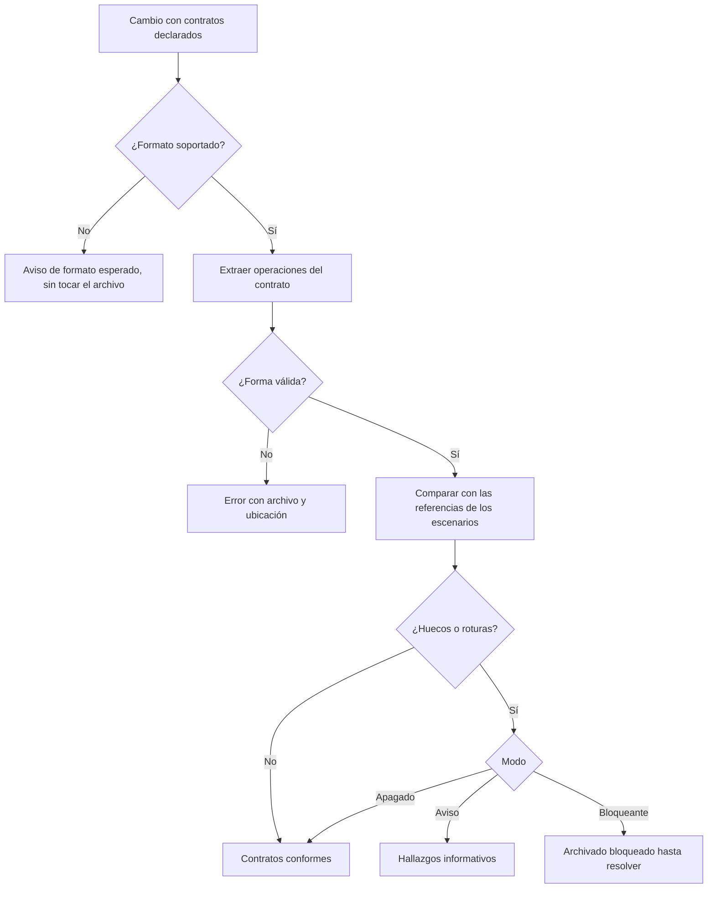
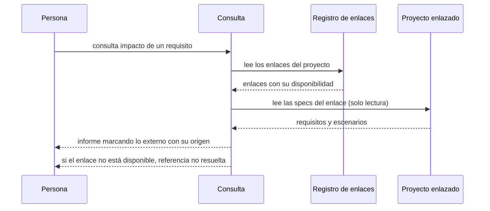
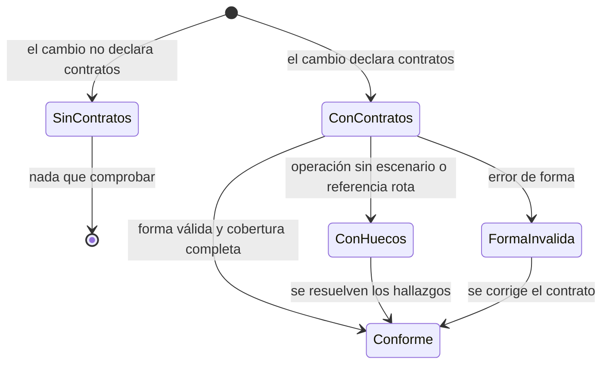

# Plan — Verificar contratos y compartir specs entre repos

## 1. Contexto AS-IS

Inventario real del repo (anclas al código):

- **Los escenarios no declaran contratos**: `Scenario` (`model.ts`) tiene `id, title, reqId, when, then, line`; el parser (`parse/spec.ts:8-11`) reconoce `CUANDO`/`ENTONCES` y encabezados, nada más. No hay carpeta `contracts/` ni lectura de OpenAPI/GraphQL/protobuf en el núcleo (búsqueda sin resultados).
- **No hay gate de contratos**: `gates` (`config.ts`) tiene `approval`, `analyze`, `verify`, `review`, `clarify`, `docs`; falta `contracts`. `deriveState` (`lifecycle.ts`) no conoce contratos.
- **La evaluación compartida** suma avisos de fase en `evaluateChange` (`packages/cli/src/evaluate.ts:56-70`) y en `buildSnapshot` (`packages/vscode/src/logic.ts:181-196`) con helpers puros (`clarifyAdvisory`, `docsAdvisory`).
- **No hay multi-repo**: no existe registro de enlaces; `loadWorkspace` (`workspace.ts:123-147`) carga specs locales y cambios (activos y archivados) de un solo proyecto. `impactOfRequirement` (`impact.ts:91`) y `checkTrace` (`trace.ts:79`) solo miran `workspace.specs`.
- **Referencias locales vs externas**: `checkTrace` marca `TRACE-003` («cubre X, que no existe») para cualquier id desconocido; `impactOfRequirement` devuelve vacío si el requisito no está en las specs locales.
- **CLI y consulta**: catálogo (`catalog.ts`) + `HANDLERS` (`cli.ts`); operaciones MCP en `packages/cli/src/mcp/tools/` con `READ_ONLY_TOOL_NAMES` y `listTools()`.
- **Estado**: `runStatus` lista cambios, specs vivas y fixes vivos; `data` del envelope es el contrato de CI/agentes.

## 2. Enfoque técnico

- **Referencias de contrato en escenarios** (`parse/spec.ts`, `model.ts`): una línea opcional por escenario `- **Contrato**: <operación>` (se acepta `Contract`), guardada en `Scenario.contracts?: string[]`; sin ella el escenario no cambia.
- **Configuración**: `gates.contracts.mode: off | advisory | blocking` (por defecto `advisory`).
- **Núcleo `contracts.ts`** (nuevo):
  - Descubre `changes/<slug>/contracts/` y clasifica por formato: descripción de servicios (OpenAPI 3.x, YAML/JSON), esquema de consultas (GraphQL SDL) y definición de mensajes (protobuf).
  - Extrae **operaciones** con identificador canónico: `GET /tareas` (OpenAPI), `Query.tareas` / `Mutation.crearTarea` (GraphQL), `TareasServicio.Crear` (protobuf). Forma: versión/estructura mínima por formato; un archivo ilegible o sin estructura esperada produce `ATLAS-CONTRACT-001` (error) con archivo y ubicación; un archivo de formato no soportado produce `ATLAS-CONTRACT-002` (aviso) indicando los formatos esperados y **sin tocarlo**.
  - `checkContracts(change, cfg)` → contratos, operaciones y hallazgos:
    - **Forma**: siempre (aunque el modo esté apagado), severidad error.
    - **Cobertura** (solo si hay contratos y `mode !== 'off'`): operación sin escenario → `ATLAS-CONTRACT-003` (aviso, «operación sin escenario»); referencia de escenario inexistente en el contrato → `ATLAS-CONTRACT-004` (aviso, «referencia rota»).
  - Sin contratos declarados no hay hallazgos de cobertura (no se inventan).
- **Ciclo de vida** (`lifecycle.ts`): helper `contractsAdvisory(change, cfg)` para el modo aviso (los avisos 003/004 se suman en `evaluateChange`/`buildSnapshot`); con `mode === 'blocking'` y hallazgos de cobertura, antes de `ready` se devuelve `blockedBy: 'contratos con hallazgos (N)'` y `next: satlas contracts <slug>`.
- **Núcleo `links.ts`** (nuevo): registro en `.sdd/links.yaml` (`schema_version`, `links: [{ name, path }]`).
  - `addLink(root, { path, name? })`: resuelve la ruta (absoluta o relativa), exige que sea un proyecto inicializado, nombre por defecto del proyecto enlazado; idempotente (actualiza si ya existe).
  - `loadLinks(sddDir)`: cada enlace con **disponibilidad** y número de requisitos aportados (lee las specs del enlazado en solo lectura).
  - `removeLink(root, ref)`: por nombre o ruta; aviso si no existe.
  - `loadLinkedSpecs(root)`: specs de los enlaces disponibles, con su origen.
- **Workspace** (`workspace.ts`): si existe `.sdd/links.yaml`, `loadWorkspace` añade `links: { entries, specs, unavailable }` (sin enlaces, no cambia nada). Los enlaces son de **solo lectura**: el núcleo nunca escribe en el proyecto enlazado.
- **Trazabilidad e impacto** (`trace.ts`, `impact.ts`, `gate.ts`, `evaluate.ts`):
  - `checkTrace` recibe los ids enlazados: una tarea que cubre un requisito externo **resuelve** (sin `TRACE-003`); si hay enlaces no disponibles, la referencia no resuelta se acompaña de `ATLAS-LINK-003` («referencia no resuelta; hay N enlace(s) no disponible(s)»).
  - `impactOfRequirement` reconoce requisitos enlazados y devuelve el informe marcado `external: true` con `origin` (nombre del enlace) y sus escenarios; el impacto local no se mezcla.
- **CLI** (`commands/contracts.ts`, `commands/link.ts`): `satlas contracts <slug>` (forma + cobertura, exit 1 con errores), `satlas link add <ruta> [--name <n>]`, `satlas link list`, `satlas link remove <nombre|ruta>`; cambio o proyecto inexistente → aviso y sin efectos.
- **Estado** (`status.ts`): línea y dato `links` (enlaces, externos y no disponibles) solo cuando hay enlaces.
- **Vía de consulta** (`mcp/tools/contracts.ts`, `mcp/tools/links.ts`): `atlas_contracts` (por cambio: contratos, operaciones, hallazgos) y `atlas_links` (enlaces, disponibilidad, requisitos aportados), ambas de solo lectura y registradas en el catálogo.
- **Alternativas descartadas**:
  - Validar contratos contra un servicio vivo: fuera de alcance por decisión del usuario (la comprobación es local).
  - Parsear OpenAPI/GraphQL/protobuf con librerías: añadirían dependencias de runtime al CLI/núcleo; la extracción necesaria (operaciones y forma mínima) es acotada y se hace con el parser YAML existente + patrones.
  - Enlaces por URL de git: decisión del usuario (rutas locales en esta entrega).
  - Fusionar specs enlazadas en la Matriz del editor: decisión del usuario (comandos + consultas).
  - Guardar copias de las specs enlazadas: duplicaría la verdad; se leen del origen.

## 3. Diagramas

### 3.1 Comprobación de contratos (flowchart)

### 3.2 Consulta con specs enlazadas (sequence)

### 3.3 Decisión del gate de contratos (stateDiagram-v2)

## 4. Diseño por capa / módulos

| Módulo | Capa | Responsabilidad |
|---|---|---|
| `packages/core/src/contracts.ts` | Núcleo | Descubrir, parsear y comprobar contratos (forma y cobertura) |
| `packages/core/src/links.ts` | Núcleo | Registro de enlaces, disponibilidad y lectura de specs enlazadas |
| `packages/core/src/{parse/spec,model}.ts` | Núcleo | Referencias de contrato por escenario |
| `packages/core/src/{config,workspace}.ts` | Núcleo | Modo de contratos y carga de enlaces |
| `packages/core/src/{lifecycle,trace,impact,gate}.ts` | Núcleo | Gate de contratos y requisitos externos en trazabilidad/impacto |
| `packages/cli/src/commands/{contracts,link}.ts` + `{catalog,cli}.ts` | CLI | Comandos de contratos y enlaces |
| `packages/cli/src/{evaluate,commands/status}.ts` | CLI | Avisos y resumen de enlaces |
| `packages/cli/src/mcp/tools/{contracts,links,index,list}.ts` | CLI | Operaciones de consulta de solo lectura |
| `packages/core/test/{contracts,links}.test.ts`, `packages/cli/test/{cli,mcp}.test.ts` | Pruebas | Forma, cobertura, modos, enlaces y solo lectura |
| `README.md`, `ARQUITECTURA.md` | Docs | Contratos, enlaces y gates |

## 5. Matriz de trazabilidad (REQ → tareas)

| Requisito | Escenarios | Tareas |
|---|---|---|
| REQ-INTEGRACIONES-001 — Forma de los contratos | S1…S4 | T1.1, T1.2, T1.5 |
| REQ-INTEGRACIONES-002 — Cobertura cruzada y modo | S1…S5 | T1.1, T1.3, T1.4, T1.5 |
| REQ-INTEGRACIONES-003 — Enlaces entre repos | S1…S5 | T2.1, T2.5 |
| REQ-INTEGRACIONES-004 — Trazabilidad e impacto externos | S1…S4 | T2.2, T2.5 |
| REQ-INTEGRACIONES-005 — Terminal y asistentes | S1…S4 | T2.3, T2.4, T2.5 |

## 6. Matriz de paridad AS-IS → TO-BE

Es aditivo: sin contratos ni enlaces, el comportamiento actual no cambia.

| Elemento | Conservar | Descartar | Nuevo |
|---|---|---|---|
| `Scenario` y su parser | Campos y gramática actuales | — | `contracts` opcional por escenario |
| `gates` | Modos existentes | — | `contracts` |
| `loadWorkspace` | Specs y cambios locales | — | `links` (solo si hay registro) |
| `checkTrace` | Hallazgos locales actuales | — | Requisitos externos resueltos y no resueltos |
| `impactOfRequirement` | Impacto local | — | Informe externo con origen |
| CLI | Comandos actuales | — | `satlas contracts`, `satlas link` |
| Consulta MCP | Operaciones actuales | — | `atlas_contracts`, `atlas_links` |

## 7. Tareas

Ver `tasks.md`: 12 tareas en 2 bloques.

## 8. Riesgos y mitigaciones

| Riesgo | Mitigación |
|---|---|
| Los contratos se escriben en formatos muy libres y el extractor falla | Extracción acotada a operaciones y estructura mínima; lo no interpretable se reporta (error con ubicación) sin completar nada; pruebas por formato |
| El modo bloqueante sorprende a proyectos con contratos | Por defecto `advisory`; solo bloquea el archivado y lo indica con la acción |
| `loadWorkspace` se ralentiza por leer proyectos enlazados | Solo se lee si existe `.sdd/links.yaml`; un enlace no disponible no se lee y se reporta |
| Referencias a enlaces caídos se confunden con ids inventados | Con enlaces no disponibles se añade `ATLAS-LINK-003` («referencia no resuelta») y el mensaje apunta a revisar el enlace |
| Escrituras accidentales en el proyecto enlazado | El núcleo solo lee rutas enlazadas; prueba que compara el árbol del enlazado antes y después |
| Cambios en `checkTrace` rompen gates existentes | Los ids enlazados solo se consideran si hay enlaces; pruebas de no regresión en los casos locales |

Talla y confianza: núcleo M (confianza alta: parseo acotado + YAML existente); integración trace/impact M (confianza media-alta: toca rutas centrales con pruebas); CLI/MCP S. Sin estimaciones de horas.

## 9. Rollback

Aditivo: quitar `contracts.ts` y `links.ts` con sus exportaciones, revertir el campo `contracts` del escenario y su parser, el modo de configuración, los bloques de lifecycle/trace/impact, los comandos y operaciones de consulta, y las secciones de documentación. Los registros y contratos creados son datos del proyecto (se conservan o se borran a mano). En construcción: `git revert` del commit.

## 10. Dependencias y supuestos

- Dependencia entre bloques (documentada aquí, no en las tareas — el planificador de olas exige dependencias intra-bloque): los comandos y la consulta de contratos del Bloque 2 consumen el núcleo del Bloque 1.
- Sin dependencias npm nuevas; Node ≥ 20.
- Supuesto: los enlaces son rutas locales a proyectos inicializados; no se sincronizan copias.
- Supuesto: el identificador de operación es el canónico por formato (`GET /ruta`, `Query.campo`, `Servicio.Método`); los escenarios lo escriben tal cual.
- Supuesto: un enlace no disponible conserva su entrada en el registro (no se borra solo) y las consultas lo informan.
