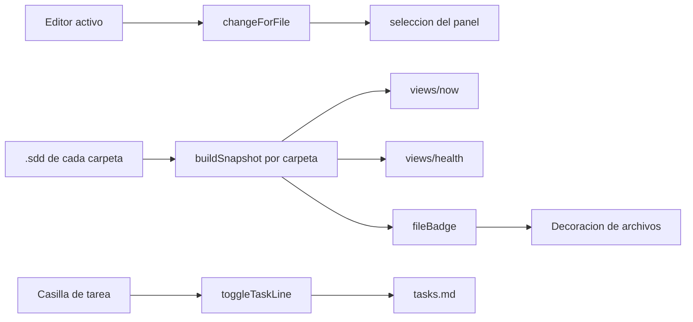

<!-- specatlas:generado:inicio -->
# Documentación técnica — El editor, integrado con el trabajo

> **Cambio**: `editor-integrado` · **Dominio**: editor · **Carril**: full · **Tareas**: 6/6 · **Actualizado**: 2026-09-21

## 1. Resumen del cambio

Este documento describe **El editor, integrado con el trabajo** (cambio `editor-integrado`), del dominio **editor** y carril **full**. Recoge el porqué, el estado anterior, el enfoque técnico, los diagramas, el mapa de archivos, la trazabilidad completa y la evidencia con la que se dio por terminado.

| Dato | Valor |
|---|---|
| Requisitos del cambio | 3 (3 nuevos, 0 modificados) |
| Escenarios especificados | 13 |
| Tareas | 6 hechas de 6 · 3 bloque(s) |
| Evidencia | 13 / 13 escenarios |
| Archivos tocados | 6 |
| Mockups | 0 pantalla(s) |
| Carril y dominio | full · editor |

## 2. Qué es y por qué

Como desarrollador que tiene el editor abierto todo el día, quiero que el panel del flujo esté donde estoy trabajando y me diga el estado de cada artefacto sin abrirlo, para dejar de saltar entre ventanas y de comprobar a mano en qué punto está cada cosa.

Tres cosas rompen hoy esa continuidad. La primera: abro la especificación de un cambio y el panel sigue mostrando otro, así que las acciones que ofrece no son las de lo que tengo delante. La segunda: cuando la ventana tiene dos carpetas de proyecto, el estado, la salud y el asistente que se abre corresponden solo a la primera, mientras el árbol lista los cambios de todas — veo una cosa y actúo sobre otra. La tercera: el editor ofrece acciones que no puede ejecutar (en un proyecto sin inicializar todas están disponibles y no hacen nada) y un ajuste de idioma que no cambia nada.

## 3. Qué cambia, en lenguaje de negocio

### REQ-EDITOR-015 — El panel lateral acompaña al archivo abierto

Quien trabaja pasa el día en los archivos, no en el panel. Hoy abre la especificación de un cambio y el panel lateral sigue mostrando otro, así que las acciones que ofrece no son las del trabajo que tiene delante. El panel debe seguir al archivo abierto, y los propios archivos deben decir en qué estado están sin necesidad de abrirlos.

**Reglas de negocio**

- `BR-EDITOR-025` — al abrir un artefacto de un cambio, ese cambio queda seleccionado y las acciones del panel pasan a ser las suyas.
- `BR-EDITOR-026` — un archivo que no pertenece a ningún cambio no altera la selección vigente.
- `BR-EDITOR-027` — los archivos del flujo muestran su estado junto a su nombre; lo que bloquea el avance se distingue de lo que solo avisa y tiene prioridad sobre la fase.
- `BR-EDITOR-028` — una tarea se marca como hecha desde el propio panel, y el cambio queda escrito en el artefacto de tareas sin alterar el resto de su contenido.

**Escenarios**: 6 · 4 de uso · 1 de estado vacío · 1 de error o aviso.

### REQ-EDITOR-016 — Más de una carpeta de proyecto en la misma ventana

Un equipo abre a la vez el servicio y su cliente, o dos productos que comparten specs. Hoy el editor solo atiende a la primera carpeta: el estado, la salud y el asistente que se abre corresponden a un proyecto mientras el árbol muestra los de todos, así que se ve una cosa y se actúa sobre otra.

**Reglas de negocio**

- `BR-EDITOR-029` — el trabajo en curso, la salud y el recuento de hallazgos abarcan todas las carpetas de proyecto abiertas.
- `BR-EDITOR-030` — con más de una carpeta, cada cambio indica a qué proyecto pertenece.
- `BR-EDITOR-031` — cada acción se ejecuta en el proyecto de su cambio, con el asistente que ese proyecto tiene configurado.

**Escenarios**: 4 · 3 de uso · 0 de estado vacío · 1 de error o aviso.

### REQ-EDITOR-017 — El editor solo ofrece lo que puede hacer

Ofrecer una acción que no va a funcionar cuesta más que no ofrecerla: quien la elige espera un resultado y no recibe nada. Las acciones del editor deben estar disponibles solo cuando tienen sentido, y los ajustes que se ofrecen deben tener efecto.

**Reglas de negocio**

- `BR-EDITOR-032` — una acción que necesita un proyecto inicializado no se ofrece mientras no lo haya.
- `BR-EDITOR-033` — una acción que opera sobre un cambio no se ofrece mientras no haya ninguno.
- `BR-EDITOR-034` — los ajustes ofrecidos tienen efecto observable; los que no lo tienen se retiran.

**Escenarios**: 3 · 0 de uso · 3 de estado vacío · 0 de error o aviso.

## 4. Cómo estaba antes (AS-IS)

`extension.ts` mantenía ocho puntos con `snapshotOf(0)` / `snapshots[0]`: barra de estado, badges, vistas Ahora y Salud, el ejecutable del asistente, la instrucción de cada paso y el helper `providerSnapshot`. El árbol, en cambio, ya recorría todos los snapshots, de ahí la incoherencia entre lo que se ve y lo que se ejecuta.

Las vistas nuevas (`views/now.ts`, `views/health.ts`) recibían un único `Snapshot`. `buildSnapshot` se llama una vez por carpeta del workspace y cada snapshot trae su propio `agent`, `drift` y `diagnostics`.

No había ningún proveedor de decoraciones ni escucha del editor activo; los nodos de tarea del árbol se pintaban con icono pero sin casilla. `package.json` declaraba 30 comandos sin `enablement` y el ajuste `specatlas.language`, que no se lee en ningún punto del código.

## 5. Enfoque técnico y decisiones

Mantener la separación que ya funciona: **modelo puro y testeable** en `src/views/*`, y `extension.ts` como capa fina de VS Code. Las funciones de vista pasan a aceptar `Snapshot | Snapshot[]` mediante un normalizador (`asList`), así el cambio no rompe a los llamadores existentes ni a los tests.

Un módulo nuevo, `views/artefactos.ts`, concentra lo que relaciona un archivo con el flujo: a qué cambio pertenece, qué decoración le corresponde y cómo se marca una tarea en el markdown. Las tres cosas son texto puro, así que se prueban sin arrancar el editor.

Alternativas descartadas:

- **Un proveedor de árbol por carpeta**: multiplicaría vistas y rompería el orden por prioridad entre proyectos.
- **Reescribir el markdown con un parser completo** para marcar tareas: basta con sustituir el marcador de la línea, que es lo único que cambia y preserva el resto por construcción.

## 6. Diagramas

## 7. Diseño por capas y componentes

| Módulo | Responsabilidad |
|---|---|
| `src/views/artefactos.ts` | `changeForFile`, `fileBadge`, `toggleTaskLine`, `tasksPath` |
| `src/views/now.ts` | `asList`, `activeChanges`; la vista y la barra de estado aceptan varias carpetas |
| `src/views/health.ts` | Agrega diagnósticos y deriva de todas las carpetas |
| `src/extension.ts` | `all()`, `changes()`, `snapshotOfChange()`; decoraciones, seguimiento del editor y casillas |
| `package.json` | `enablement` por comando, contexto `specatlas.hasChanges`, ajuste sin efecto retirado |

## 8. Mapa de archivos

Cada archivo, la tarea que lo tocó y el requisito al que responde.

| Archivo | Tareas | Requisitos que cubre |
|---|---|---|
| `packages/vscode/package.json` | T3.1 | REQ-EDITOR-017 |
| `packages/vscode/src/extension.ts` | T1.3 | REQ-EDITOR-015 |
| `packages/vscode/src/views/artefactos.ts` | T1.1 | REQ-EDITOR-015 |
| `packages/vscode/src/views/health.ts` | T2.1 | REQ-EDITOR-016 |
| `packages/vscode/src/views/now.ts` | T2.2 | REQ-EDITOR-016 |
| `packages/vscode/test/artefactos.test.ts` | T1.2 | REQ-EDITOR-015 |

## 9. Trazabilidad requisito → escenario → tarea → evidencia

3 requisito(s) · 13 escenario(s) · 13 con tarea · 13 con evidencia favorable · **0 hueco(s)**.

| Requisito | Escenario | Tareas | Evidencia |
|---|---|---|---|
| REQ-EDITOR-015 | `REQ-EDITOR-015-S1` Abrir el artefacto de otro cambio | T1.1 | pass |
| REQ-EDITOR-015 | `REQ-EDITOR-015-S2` Abrir un archivo ajeno al flujo | T1.1 | pass |
| REQ-EDITOR-015 | `REQ-EDITOR-015-S3` Un archivo con hallazgos que bloquean | T1.2 | pass |
| REQ-EDITOR-015 | `REQ-EDITOR-015-S4` Un archivo sin hallazgos | T1.2 | pass |
| REQ-EDITOR-015 | `REQ-EDITOR-015-S5` Marcar una tarea como hecha | T1.3 | pass |
| REQ-EDITOR-015 | `REQ-EDITOR-015-S6` La tarea ya no está donde se creía | T1.3 | pass |
| REQ-EDITOR-016 | `REQ-EDITOR-016-S1` Dos proyectos con trabajo en curso | T2.1 | pass |
| REQ-EDITOR-016 | `REQ-EDITOR-016-S2` La salud es la del conjunto | T2.1 | pass |
| REQ-EDITOR-016 | `REQ-EDITOR-016-S3` Cada acción en su proyecto | T2.2 | pass |
| REQ-EDITOR-016 | `REQ-EDITOR-016-S4` Una sola carpeta | T2.1 | pass |
| REQ-EDITOR-017 | `REQ-EDITOR-017-S1` Proyecto sin inicializar | T3.1 | pass |
| REQ-EDITOR-017 | `REQ-EDITOR-017-S2` Proyecto sin cambios | T3.1 | pass |
| REQ-EDITOR-017 | `REQ-EDITOR-017-S3` Ajustes sin efecto | T3.1 | pass |

## 10. Pruebas y evidencia

13 de 13 escenario(s) con evidencia favorable (13 ejecutable). Registrada por Alonso Anchante entre el 2026-09-21 y el 2026-09-21.

| Escenario | Qué se comprobó | Método | Resultado | Fecha |
|---|---|---|---|---|
| `REQ-EDITOR-015-S1` | Abrir el artefacto de otro cambio | executable | pass | 2026-09-21 14:44 |
| `REQ-EDITOR-015-S2` | Abrir un archivo ajeno al flujo | executable | pass | 2026-09-21 14:44 |
| `REQ-EDITOR-015-S3` | Un archivo con hallazgos que bloquean | executable | pass | 2026-09-21 14:44 |
| `REQ-EDITOR-015-S4` | Un archivo sin hallazgos | executable | pass | 2026-09-21 14:44 |
| `REQ-EDITOR-015-S5` | Marcar una tarea como hecha | executable | pass | 2026-09-21 14:44 |
| `REQ-EDITOR-015-S6` | La tarea ya no está donde se creía | executable | pass | 2026-09-21 14:44 |
| `REQ-EDITOR-016-S1` | Dos proyectos con trabajo en curso | executable | pass | 2026-09-21 14:45 |
| `REQ-EDITOR-016-S2` | La salud es la del conjunto | executable | pass | 2026-09-21 14:45 |
| `REQ-EDITOR-016-S3` | Cada acción en su proyecto | executable | pass | 2026-09-21 14:45 |
| `REQ-EDITOR-016-S4` | Una sola carpeta | executable | pass | 2026-09-21 14:45 |
| `REQ-EDITOR-017-S1` | Proyecto sin inicializar | executable | pass | 2026-09-21 14:45 |
| `REQ-EDITOR-017-S2` | Proyecto sin cambios | executable | pass | 2026-09-21 14:45 |
| `REQ-EDITOR-017-S3` | Ajustes sin efecto | executable | pass | 2026-09-21 14:45 |

### 10.1 Cómo se reproduce la evidencia

Comandos con los que se obtuvo la evidencia ejecutable:

- `npx vitest run packages/vscode/test/artefactos.test.ts` — 6 escenario(s)
- `npx vitest run packages/vscode/test/artefactos.test.ts packages/vscode/test/views.test.ts` — 4 escenario(s)
- `npx vitest run packages/vscode/test/contribuciones.test.ts` — 3 escenario(s)

## 11. Riesgos y mitigaciones

| Riesgo | Mitigación |
|---|---|
| Escribir en el artefacto de tareas desde la casilla pisa una edición en curso | Se sustituye solo el marcador de esa línea y se aborta si ya no es una tarea |
| El seguimiento del editor pelea con la selección manual | Solo cambia la selección cuando el archivo pertenece a otro cambio |
| Las decoraciones se recalculan en cada refresco | Se emiten en bloque tras el refresco, que ya está antirrebote |

## 12. Cómo se revierte

Revertir el commit: las decoraciones, el seguimiento y las casillas desaparecen, y las vistas vuelven a leer la primera carpeta. No cambia ningún artefacto del flujo, así que no hay estado que migrar.

## 13. Pendientes y deuda conocida

El informe de consistencia del cambio está en `analyze.md`: explica qué se comprobó antes de dar el cambio por cerrado.
<!-- specatlas:generado:fin -->

## Notas

(Escribe aquí lo que quieras conservar entre regeneraciones.)
