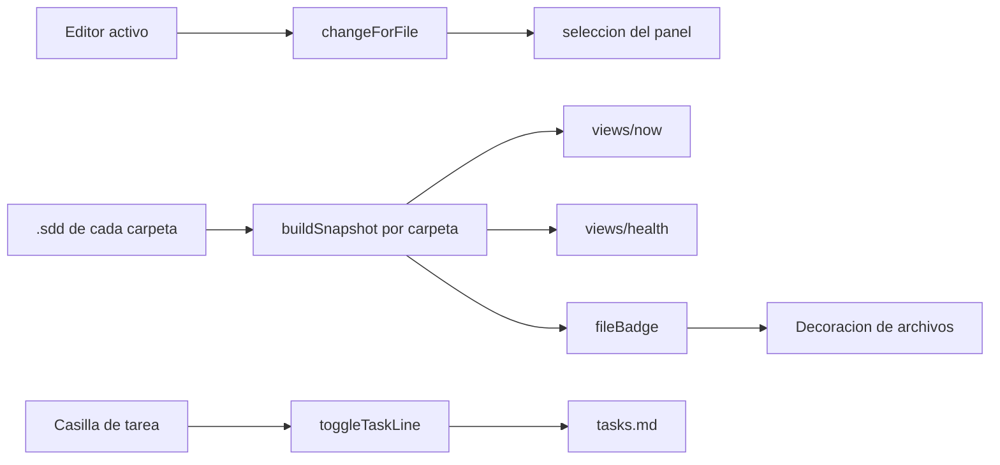

# Plan — El editor, integrado con el trabajo

## 1. Contexto AS-IS

`extension.ts` mantenía ocho puntos con `snapshotOf(0)` / `snapshots[0]`: barra de estado, badges, vistas Ahora y Salud, el ejecutable del asistente, la instrucción de cada paso y el helper `providerSnapshot`. El árbol, en cambio, ya recorría todos los snapshots, de ahí la incoherencia entre lo que se ve y lo que se ejecuta.

Las vistas nuevas (`views/now.ts`, `views/health.ts`) recibían un único `Snapshot`. `buildSnapshot` se llama una vez por carpeta del workspace y cada snapshot trae su propio `agent`, `drift` y `diagnostics`.

No había ningún proveedor de decoraciones ni escucha del editor activo; los nodos de tarea del árbol se pintaban con icono pero sin casilla. `package.json` declaraba 30 comandos sin `enablement` y el ajuste `specatlas.language`, que no se lee en ningún punto del código.

## 2. Enfoque técnico

Mantener la separación que ya funciona: **modelo puro y testeable** en `src/views/*`, y `extension.ts` como capa fina de VS Code. Las funciones de vista pasan a aceptar `Snapshot | Snapshot[]` mediante un normalizador (`asList`), así el cambio no rompe a los llamadores existentes ni a los tests.

Un módulo nuevo, `views/artefactos.ts`, concentra lo que relaciona un archivo con el flujo: a qué cambio pertenece, qué decoración le corresponde y cómo se marca una tarea en el markdown. Las tres cosas son texto puro, así que se prueban sin arrancar el editor.

Alternativas descartadas:

- **Un proveedor de árbol por carpeta**: multiplicaría vistas y rompería el orden por prioridad entre proyectos.
- **Reescribir el markdown con un parser completo** para marcar tareas: basta con sustituir el marcador de la línea, que es lo único que cambia y preserva el resto por construcción.

## 3. Diagramas

## 4. Diseño por capa / módulos

| Módulo | Responsabilidad |
|---|---|
| `src/views/artefactos.ts` | `changeForFile`, `fileBadge`, `toggleTaskLine`, `tasksPath` |
| `src/views/now.ts` | `asList`, `activeChanges`; la vista y la barra de estado aceptan varias carpetas |
| `src/views/health.ts` | Agrega diagnósticos y deriva de todas las carpetas |
| `src/extension.ts` | `all()`, `changes()`, `snapshotOfChange()`; decoraciones, seguimiento del editor y casillas |
| `package.json` | `enablement` por comando, contexto `specatlas.hasChanges`, ajuste sin efecto retirado |

## 5. Matriz de trazabilidad (REQ → tareas)

| Requisito | Tareas |
|---|---|
| REQ-EDITOR-015 | T1.1, T1.2, T1.3 |
| REQ-EDITOR-016 | T2.1, T2.2 |
| REQ-EDITOR-017 | T3.1 |

## 6. Matriz de paridad AS-IS → TO-BE

| Antes | Después |
|---|---|
| El panel se queda donde lo dejaste | Sigue al artefacto abierto |
| Todos los archivos del flujo se ven igual | Llevan su estado y sus hallazgos |
| Marcar una tarea exige editar markdown | Casilla en el árbol |
| La primera carpeta manda | Todas las carpetas, cada acción en la suya |
| 30 comandos siempre ofrecidos | Se ofrecen cuando aplican |
| Ajuste de idioma sin efecto | Retirado |

## 7. Tareas (ver tasks.md)

## 8. Riesgos y mitigaciones

| Riesgo | Mitigación |
|---|---|
| Escribir en el artefacto de tareas desde la casilla pisa una edición en curso | Se sustituye solo el marcador de esa línea y se aborta si ya no es una tarea |
| El seguimiento del editor pelea con la selección manual | Solo cambia la selección cuando el archivo pertenece a otro cambio |
| Las decoraciones se recalculan en cada refresco | Se emiten en bloque tras el refresco, que ya está antirrebote |

## 9. Rollback

Revertir el commit: las decoraciones, el seguimiento y las casillas desaparecen, y las vistas vuelven a leer la primera carpeta. No cambia ningún artefacto del flujo, así que no hay estado que migrar.

## 10. Dependencias y supuestos

- `TreeItem.checkboxState`, `onDidChangeCheckboxState` y `registerFileDecorationProvider` existen en la API de VS Code desde 1.72; el `engines.vscode` del paquete ya lo cubre.
- La prueba sigue siendo sobre módulos puros con vitest; los proveedores de VS Code quedan como capa sin lógica.
