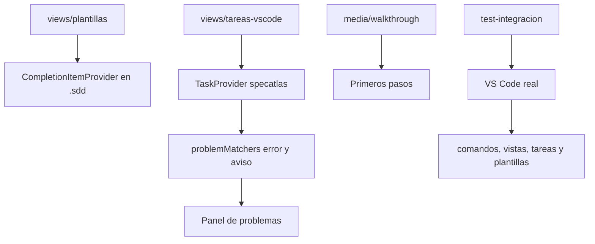

<!-- specatlas:generado:inicio -->
# Documentación técnica — Primeros pasos, plantillas y comprobaciones del editor

> **Cambio**: `editor-productivo` · **Dominio**: editor · **Carril**: full · **Tareas**: 7/7 · **Actualizado**: 2026-09-21

## 1. Resumen del cambio

Este documento describe **Primeros pasos, plantillas y comprobaciones del editor** (cambio `editor-productivo`), del dominio **editor** y carril **full**. Recoge el porqué, el estado anterior, el enfoque técnico, los diagramas, el mapa de archivos, la trazabilidad completa y la evidencia con la que se dio por terminado.

| Dato | Valor |
|---|---|
| Requisitos del cambio | 4 (4 nuevos, 0 modificados) |
| Escenarios especificados | 11 |
| Tareas | 7 hechas de 7 · 4 bloque(s) |
| Evidencia | 11 / 11 escenarios |
| Archivos tocados | 13 |
| Mockups | 0 pantalla(s) |
| Carril y dominio | full · editor |

## 2. Qué es y por qué

Como equipo que adopta el flujo, queremos aprenderlo y usarlo sin salir del editor, para que la ceremonia no cueste más que el trabajo que ordena.

Hoy pasan tres cosas. Quien empieza tiene que leerse un tutorial que vive fuera del editor para entender qué es un cambio, por qué se firma y qué cuenta como evidencia. Quien ya lo conoce escribe los artefactos de memoria —el identificador del requisito, los archivos de una tarea, el bloque de evidencia con su método y su comando— y los errores solo aparecen al validar. Y las comprobaciones del flujo viven en una terminal aparte, mientras el equipo ya lanza sus pruebas y mira sus errores en el propio editor.

Hay además un riesgo que no se ve: todo lo que probamos del editor es lógica pura. Una acción declarada y nunca registrada, una vista que no abre o una plantilla que dejó de ofrecerse pasarían inadvertidas, porque nada arranca el editor para comprobarlo.

## 3. Qué cambia, en lenguaje de negocio

### REQ-EDITOR-018 — El editor enseña el ciclo la primera vez

Quien abre la herramienta por primera vez no sabe qué es un cambio, ni por qué hay que firmar, ni qué cuenta como evidencia. Hoy eso se explica en un tutorial que vive fuera del editor, así que quien empieza tiene que salir de su trabajo para entenderlo. El editor debe enseñar el ciclo desde dentro, y marcar cada paso conforme se cumple.

**Reglas de negocio**

- `BR-EDITOR-035` — el editor ofrece un recorrido de primeros pasos con las cinco etapas del ciclo: inicializar, crear un cambio, especificar, aprobar y cerrar con evidencia.
- `BR-EDITOR-036` — cada etapa explica para qué sirve y deja a mano la acción que la cumple.
- `BR-EDITOR-037` — una etapa se marca como cumplida cuando se cumple de verdad, no cuando se lee.

**Escenarios**: 2 · 2 de uso · 0 de estado vacío · 0 de error o aviso.

### REQ-EDITOR-019 — Escribir un artefacto sin recordar su estructura

Cada artefacto del flujo tiene una gramática exacta: los requisitos llevan su identificador y sus escenarios, las tareas declaran archivos y lo que cubren, la evidencia declara método, comando y resultado. Escribir eso de memoria es lento y produce errores que solo aparecen al validar.

**Reglas de negocio**

- `BR-EDITOR-038` — al escribir dentro de un artefacto del flujo se ofrecen las plantillas de lo que ese artefacto admite.
- `BR-EDITOR-039` — las plantillas no se ofrecen fuera de los artefactos del flujo.
- `BR-EDITOR-040` — cada plantilla produce contenido que la validación acepta.

**Escenarios**: 3 · 3 de uso · 0 de estado vacío · 0 de error o aviso.

### REQ-EDITOR-020 — Las comprobaciones se lanzan como cualquier otra del proyecto

El equipo ya lanza sus pruebas y su compilación desde el editor. Las comprobaciones del flujo deberían lanzarse igual, y sus hallazgos aparecer donde el equipo ya mira los errores, en vez de exigir una terminal aparte.

**Reglas de negocio**

- `BR-EDITOR-041` — las comprobaciones del flujo se ofrecen como tareas del editor, cada una con lo que hace.
- `BR-EDITOR-042` — la comprobación completa queda bajo la tecla de compilación y la de trazabilidad bajo la de pruebas.
- `BR-EDITOR-043` — los hallazgos de una comprobación se recogen con su archivo, su línea y su gravedad.
- `BR-EDITOR-044` — una comprobación que opera sobre un cambio no se ofrece mientras no haya ninguno.

**Escenarios**: 3 · 2 de uso · 1 de estado vacío · 0 de error o aviso.

### REQ-EDITOR-021 — Lo que solo se ve en el editor también se prueba

La lógica del editor se prueba sin abrirlo, pero hay cosas que solo existen dentro: que la extensión arranque, que sus acciones estén registradas, que sus vistas se abran y que las plantillas y comprobaciones lleguen a ofrecerse. Hoy nada de eso se comprueba, así que una acción declarada y no registrada pasaría inadvertida.

**Reglas de negocio**

- `BR-EDITOR-045` — existe una comprobación que arranca el editor de verdad y verifica que la extensión activa con un proyecto del flujo.
- `BR-EDITOR-046` — esa comprobación verifica que cada acción declarada está registrada, que las secciones del panel se abren y que las plantillas y comprobaciones se ofrecen.
- `BR-EDITOR-047` — la comprobación forma parte de la verificación continua del proyecto.

**Escenarios**: 3 · 2 de uso · 0 de estado vacío · 1 de error o aviso.

## 4. Cómo estaba antes (AS-IS)

La extensión declara vistas, comandos y menús, pero ninguna de las tres contribuciones que VS Code ofrece para este trabajo: `walkthroughs` (primeros pasos), `taskDefinitions` + `problemMatchers` (comprobaciones) ni proveedor de completado (plantillas). El onboarding vive en `docs/tutorial/`, fuera del editor.

La salida del CLI tiene un formato estable que se puede recoger: `NIVEL␠␠CÓDIGO ruta[:línea] — mensaje`. El nivel viene en español (`ERROR`, `AVISO`, `NOTA`), que no coincide con los valores que VS Code mapea por sí solo.

Las pruebas del paquete (`packages/vscode/test/`) son de lógica pura con vitest: no arrancan el editor, así que nada comprueba el registro real de comandos ni las contribuciones en ejecución.

## 5. Enfoque técnico y decisiones

Tres contribuciones declarativas y un arnés de pruebas nuevo, manteniendo la separación que ya funciona: los datos (plantillas y catálogo de comprobaciones) viven en módulos puros de `src/views/`, y `extension.ts` solo los registra.

Las plantillas se ofrecen con un proveedor de completado filtrado por patrón de ruta (`**/.sdd/**/*.md`) en lugar de `contributes.snippets`, porque los snippets se declaran por lenguaje y ensuciarían todo el markdown del proyecto.

Para los hallazgos hacen falta **dos** `problemMatcher`: el nivel del CLI está en español y VS Code solo mapea `error`/`warning`/`info`, así que cada uno fija su gravedad y captura su propio nivel.

El arnés de integración usa `@vscode/test-cli`, que descarga VS Code y ejecuta mocha dentro del editor. Los archivos se escriben en `.cts` para que compilen a CommonJS: el paquete es ESM y el anfitrión de extensiones carga CommonJS.

Alternativas descartadas:

- **`contributes.snippets`**: no permite filtrar por ruta.
- **Un solo `problemMatcher` con la gravedad capturada**: VS Code no reconoce `AVISO` como gravedad.
- **Extender vitest con un entorno falso de VS Code**: probaría el doble, no el editor.

## 6. Diagramas

## 7. Diseño por capas y componentes

| Módulo | Responsabilidad |
|---|---|
| `src/views/plantillas.ts` | Catálogo de plantillas y a qué artefacto pertenece cada una |
| `src/views/tareas-vscode.ts` | Catálogo de comprobaciones, su grupo y su comando |
| `src/extension.ts` | Registro del proveedor de completado y del proveedor de tareas |
| `media/walkthrough/*.md` | Contenido de las cinco etapas |
| `package.json` | `walkthroughs`, `taskDefinitions`, `problemMatchers` |
| `test-integracion/` | Arnés que arranca VS Code y su proyecto de prueba |

## 8. Mapa de archivos

Cada archivo, la tarea que lo tocó y el requisito al que responde.

| Archivo | Tareas | Requisitos que cubre |
|---|---|---|
| `.github/workflows/ci.yml` | T4.2 | REQ-EDITOR-021 |
| `packages/vscode/.vscode-test.mjs` | T4.1 | REQ-EDITOR-021 |
| `packages/vscode/media/walkthrough/aprobar.md` | T1.1 | REQ-EDITOR-018 |
| `packages/vscode/media/walkthrough/cambio.md` | T1.1 | REQ-EDITOR-018 |
| `packages/vscode/media/walkthrough/especificar.md` | T1.1 | REQ-EDITOR-018 |
| `packages/vscode/media/walkthrough/evidencia.md` | T1.1 | REQ-EDITOR-018 |
| `packages/vscode/media/walkthrough/inicializar.md` | T1.1 | REQ-EDITOR-018 |
| `packages/vscode/package.json` | T3.2 | REQ-EDITOR-020 |
| `packages/vscode/src/views/plantillas.ts` | T2.1 | REQ-EDITOR-019 |
| `packages/vscode/src/views/tareas-vscode.ts` | T3.1 | REQ-EDITOR-020 |
| `packages/vscode/test-integracion/src/extension.test.cts` | T4.2 | REQ-EDITOR-021 |
| `packages/vscode/test-integracion/tsconfig.json` | T4.1 | REQ-EDITOR-021 |
| `packages/vscode/test/plantillas-tareas.test.ts` | T2.2 | REQ-EDITOR-019 |

## 9. Trazabilidad requisito → escenario → tarea → evidencia

4 requisito(s) · 11 escenario(s) · 11 con tarea · 11 con evidencia favorable · **0 hueco(s)**.

| Requisito | Escenario | Tareas | Evidencia |
|---|---|---|---|
| REQ-EDITOR-018 | `REQ-EDITOR-018-S1` Primer contacto con la herramienta | T1.1 | pass |
| REQ-EDITOR-018 | `REQ-EDITOR-018-S2` Una etapa se cumple | T1.1 | pass |
| REQ-EDITOR-019 | `REQ-EDITOR-019-S1` Escribir un requisito | T2.1 | pass |
| REQ-EDITOR-019 | `REQ-EDITOR-019-S2` Escribir una tarea | T2.1 | pass |
| REQ-EDITOR-019 | `REQ-EDITOR-019-S3` Un archivo fuera del flujo | T2.2 | pass |
| REQ-EDITOR-020 | `REQ-EDITOR-020-S1` Lanzar la comprobación completa | T3.1 | pass |
| REQ-EDITOR-020 | `REQ-EDITOR-020-S2` Los hallazgos van donde el equipo mira | T3.2 | pass |
| REQ-EDITOR-020 | `REQ-EDITOR-020-S3` Sin cambios en curso | T3.1 | pass |
| REQ-EDITOR-021 | `REQ-EDITOR-021-S1` La extensión arranca | T4.1 | pass |
| REQ-EDITOR-021 | `REQ-EDITOR-021-S2` Una acción declarada y no registrada | T4.2 | pass |
| REQ-EDITOR-021 | `REQ-EDITOR-021-S3` Las secciones del panel se abren | T4.2 | pass |

## 10. Pruebas y evidencia

11 de 11 escenario(s) con evidencia favorable (11 ejecutable). Registrada por Alonso Anchante entre el 2026-09-21 y el 2026-09-21.

| Escenario | Qué se comprobó | Método | Resultado | Fecha |
|---|---|---|---|---|
| `REQ-EDITOR-018-S1` | Primer contacto con la herramienta | executable | pass | 2026-09-21 16:57 |
| `REQ-EDITOR-018-S2` | Una etapa se cumple | executable | pass | 2026-09-21 16:57 |
| `REQ-EDITOR-019-S1` | Escribir un requisito | executable | pass | 2026-09-21 16:58 |
| `REQ-EDITOR-019-S2` | Escribir una tarea | executable | pass | 2026-09-21 16:58 |
| `REQ-EDITOR-019-S3` | Un archivo fuera del flujo | executable | pass | 2026-09-21 16:58 |
| `REQ-EDITOR-020-S1` | Lanzar la comprobación completa | executable | pass | 2026-09-21 16:58 |
| `REQ-EDITOR-020-S3` | Sin cambios en curso | executable | pass | 2026-09-21 16:58 |
| `REQ-EDITOR-020-S2` | Los hallazgos van donde el equipo mira | executable | pass | 2026-09-21 16:58 |
| `REQ-EDITOR-021-S1` | La extensión arranca | executable | pass | 2026-09-21 16:58 |
| `REQ-EDITOR-021-S2` | Una acción declarada y no registrada | executable | pass | 2026-09-21 16:58 |
| `REQ-EDITOR-021-S3` | Las secciones del panel se abren | executable | pass | 2026-09-21 16:58 |

### 10.1 Cómo se reproduce la evidencia

Comandos con los que se obtuvo la evidencia ejecutable:

- `npx vitest run packages/vscode/test/plantillas-tareas.test.ts` — 5 escenario(s)
- `npx vitest run packages/vscode/test/contribuciones.test.ts` — 3 escenario(s)
- `pnpm --filter specatlas-vscode test:integracion` — 3 escenario(s)

## 11. Riesgos y mitigaciones

| Riesgo | Mitigación |
|---|---|
| Las plantillas ensucian el markdown del proyecto | El proveedor se filtra por patrón de ruta, y hay prueba de que fuera no aparecen |
| El formato de los hallazgos cambia y los matchers dejan de recoger | El formato de salida está cubierto por las pruebas del CLI; los matchers viven junto a las tareas que los usan |
| Las pruebas del editor son lentas o frágiles en la verificación continua | Arrancan una sola instancia, con las extensiones ajenas desactivadas y un proyecto mínimo propio |
| En Linux no hay pantalla para arrancar el editor | La verificación continua lo ejecuta con servidor X virtual |

## 12. Cómo se revierte

Revertir el commit: desaparecen las tres contribuciones y el arnés. No cambia ningún artefacto del flujo ni el comportamiento del núcleo.

## 13. Pendientes y deuda conocida

El informe de consistencia del cambio está en `analyze.md`: explica qué se comprobó antes de dar el cambio por cerrado.
<!-- specatlas:generado:fin -->

## Notas

(Escribe aquí lo que quieras conservar entre regeneraciones.)
