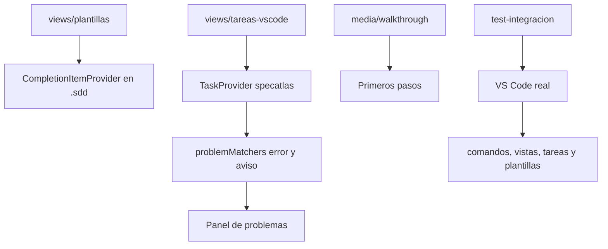

# Plan — Primeros pasos, plantillas y comprobaciones del editor

## 1. Contexto AS-IS

La extensión declara vistas, comandos y menús, pero ninguna de las tres contribuciones que VS Code ofrece para este trabajo: `walkthroughs` (primeros pasos), `taskDefinitions` + `problemMatchers` (comprobaciones) ni proveedor de completado (plantillas). El onboarding vive en `docs/tutorial/`, fuera del editor.

La salida del CLI tiene un formato estable que se puede recoger: `NIVEL␠␠CÓDIGO ruta[:línea] — mensaje`. El nivel viene en español (`ERROR`, `AVISO`, `NOTA`), que no coincide con los valores que VS Code mapea por sí solo.

Las pruebas del paquete (`packages/vscode/test/`) son de lógica pura con vitest: no arrancan el editor, así que nada comprueba el registro real de comandos ni las contribuciones en ejecución.

## 2. Enfoque técnico

Tres contribuciones declarativas y un arnés de pruebas nuevo, manteniendo la separación que ya funciona: los datos (plantillas y catálogo de comprobaciones) viven en módulos puros de `src/views/`, y `extension.ts` solo los registra.

Las plantillas se ofrecen con un proveedor de completado filtrado por patrón de ruta (`**/.sdd/**/*.md`) en lugar de `contributes.snippets`, porque los snippets se declaran por lenguaje y ensuciarían todo el markdown del proyecto.

Para los hallazgos hacen falta **dos** `problemMatcher`: el nivel del CLI está en español y VS Code solo mapea `error`/`warning`/`info`, así que cada uno fija su gravedad y captura su propio nivel.

El arnés de integración usa `@vscode/test-cli`, que descarga VS Code y ejecuta mocha dentro del editor. Los archivos se escriben en `.cts` para que compilen a CommonJS: el paquete es ESM y el anfitrión de extensiones carga CommonJS.

Alternativas descartadas:

- **`contributes.snippets`**: no permite filtrar por ruta.
- **Un solo `problemMatcher` con la gravedad capturada**: VS Code no reconoce `AVISO` como gravedad.
- **Extender vitest con un entorno falso de VS Code**: probaría el doble, no el editor.

## 3. Diagramas

## 4. Diseño por capa / módulos

| Módulo | Responsabilidad |
|---|---|
| `src/views/plantillas.ts` | Catálogo de plantillas y a qué artefacto pertenece cada una |
| `src/views/tareas-vscode.ts` | Catálogo de comprobaciones, su grupo y su comando |
| `src/extension.ts` | Registro del proveedor de completado y del proveedor de tareas |
| `media/walkthrough/*.md` | Contenido de las cinco etapas |
| `package.json` | `walkthroughs`, `taskDefinitions`, `problemMatchers` |
| `test-integracion/` | Arnés que arranca VS Code y su proyecto de prueba |

## 5. Matriz de trazabilidad (REQ → tareas)

| Requisito | Tareas |
|---|---|
| REQ-EDITOR-018 | T1.1 |
| REQ-EDITOR-019 | T2.1, T2.2 |
| REQ-EDITOR-020 | T3.1, T3.2 |
| REQ-EDITOR-021 | T4.1, T4.2 |

## 6. Matriz de paridad AS-IS → TO-BE

| Antes | Después |
|---|---|
| El onboarding vive fuera del editor | Recorrido de cinco etapas dentro |
| Los artefactos se escriben de memoria | Plantillas donde corresponde |
| Las comprobaciones exigen terminal | Tareas del editor con sus hallazgos recogidos |
| Solo se prueba lógica pura | Además, el editor de verdad |

## 7. Tareas (ver tasks.md)

## 8. Riesgos y mitigaciones

| Riesgo | Mitigación |
|---|---|
| Las plantillas ensucian el markdown del proyecto | El proveedor se filtra por patrón de ruta, y hay prueba de que fuera no aparecen |
| El formato de los hallazgos cambia y los matchers dejan de recoger | El formato de salida está cubierto por las pruebas del CLI; los matchers viven junto a las tareas que los usan |
| Las pruebas del editor son lentas o frágiles en la verificación continua | Arrancan una sola instancia, con las extensiones ajenas desactivadas y un proyecto mínimo propio |
| En Linux no hay pantalla para arrancar el editor | La verificación continua lo ejecuta con servidor X virtual |

## 9. Rollback

Revertir el commit: desaparecen las tres contribuciones y el arnés. No cambia ningún artefacto del flujo ni el comportamiento del núcleo.

## 10. Dependencias y supuestos

- `@vscode/test-cli`, `@vscode/test-electron` y `mocha` como dependencias de desarrollo del paquete de la extensión.
- La verificación continua dispone de `xvfb-run` en Linux (viene en las imágenes de GitHub).
- El formato de salida del CLI (`NIVEL CÓDIGO ruta[:línea] — mensaje`) se mantiene estable.
