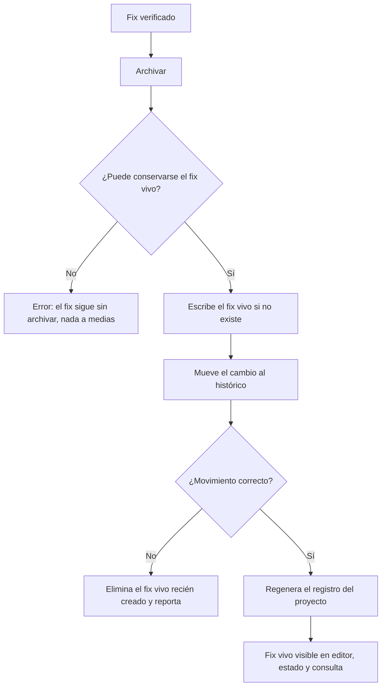
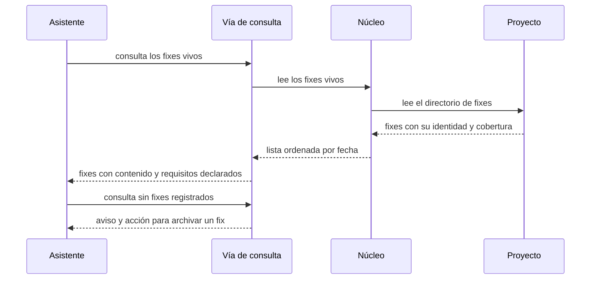
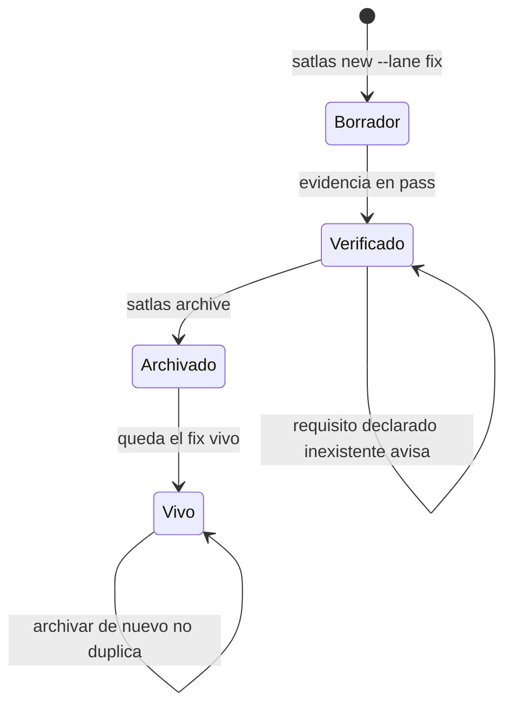

# Plan — Fixes vivos y trazabilidad de specs y fixes

## 1. Contexto AS-IS

Inventario real del repo (anclas al código):

- **El archivado del carril fix no deja nada vivo**: `archive.ts:181-208` valida que exista `fix.md`, mueve el cambio a `changes/archive/AAAA-MM-<slug>/` y regenera el registro; no crea ningún artefacto vivo.
- **No existe `.sdd/fixes/`**: `ensureSddDirs` (`workspace.ts:149`) crea `specs`, `changes`, `runs`, `metrics` y `profiles/custom`; el directorio de fixes no existe.
- **El fix se modela como evidencia**: `Change.fix?: VerifyFile` (`model.ts:179`, cargado en `workspace.ts:104-109` con `parseVerifyFile`); las evidencias del fix ya alimentan ciclo de vida (`lifecycle.ts:87-96`), métricas y packs. No hay cobertura (`Cubre:`) en el fix.
- **El registro del proyecto** lo genera `regenerateIndex` (`archive.ts:271`) con `indexMarkdown` (`templates.ts:328`): lista specs vivas, cambios activos y el conteo de archivados; no lista fixes.
- **Estado del proyecto**: `runStatus` (`packages/cli/src/commands/status.ts`) lista cambios activos y specs vivas; no consulta fixes.
- **Vía de consulta para asistentes**: catálogo en `packages/cli/src/mcp/tools/list.ts` (`READ_ONLY_TOOL_NAMES` + `listTools`), despacho en `tools/index.ts`, patrón de handler `(args, host) → ToolResult`. Solo lectura verificada por pruebas.
- **Vista lateral**: grupos «Specs vivas» y «Cambios» (`extension.ts:299-326`); los nodos `spec`/`change` abren con `specatlas.openPreview`/`openAt`. `buildSnapshot` (`logic.ts:154`) arma specs + cambios activos; no incluye archivados ni fixes.
- **Matriz**: `buildMatrix` (`logic.ts:433`) se apoya en `buildIndex` del LSP (`packages/lsp/src/index.ts`): requisitos vivos con `changes` (solo de deltas **activos**, `registerRequirement`), escenarios, tareas (fusionadas entre cambios, incl. archivados) y evidencia. Los deltas archivados no aportan procedencia; los fixes no existen en el índice. La matriz ya tiene filtros por dominio y cambio (`panels.ts`, `MATRIX_FILTERS_SCRIPT`).
- **Plantilla del fix** (`templates.ts:159`): secciones Síntoma/Causa raíz/Cambio/Rollback/Evidencia; sin mención a cobertura.

## 2. Enfoque técnico

- **Núcleo `packages/core/src/fixes.ts`** (nuevo): fixes vivos.
  - `LivingFix { slug, file, domain?, title?, date, result, covers: string[], content }`.
  - `parseLivingFix(content, file)`: encabezado YAML (dominio, fecha, título, resultado, cobertura) + cuerpo.
  - `loadLivingFixes(root)`: lee `.sdd/fixes/*.md`, ordena por fecha descendente y nombre.
  - `writeLivingFix(root, fix)`: escribe `.sdd/fixes/<AAAA-MM>-<slug>.md`; **idempotente** (si existe, no lo pisa) y devuelve si lo creó.
  - `parseFixCovers(content)`: lee la línea opcional `Cubre: REQ-…, REQ-…` **ignorando comentarios** del documento (para que la plantilla pueda documentarla comentada sin falsos positivos).
- **Archivado del fix** (`archive.ts:181`): antes de mover, escribe el fix vivo (marca `<mes>-<slug>`, fecha y resultado `pass`); si el movimiento falla, elimina el fix vivo recién creado (**todo-o-nada**, REQ-FIXES-001-S5); si ya existía, no lo pisa ni duplica (S3). Las specs vivas no se tocan (S4). `regenerateIndex` e `indexMarkdown` añaden la sección «Fixes vivos».
- **Cobertura del fix** (`model.ts`, `workspace.ts`, `trace.ts`, `templates.ts`): `Change.fixCovers?: string[]` se carga desde `fix.md`; `checkTrace` emite el aviso `TRACE-011` por cada requisito declarado que no exista en las specs vivas (el fix sigue válido, REQ-FIXES-004-S2). La plantilla documenta la línea como comentario opcional. `ensureSddDirs` crea `.sdd/fixes`.
- **Estado del proyecto** (`status.ts`): sección «Fixes vivos» con fecha, dominio y resultado (o «Sin fixes vivos»); `data.fixes` para `--json`.
- **Vía de consulta** (`mcp/tools/fixes.ts` + registro): operación `atlas_fixes` de solo lectura con la identidad, el contenido y la cobertura de cada fix; sin fixes, indica y sugiere archivar un fix activo (o crear uno con el carril fix); añadida a `READ_ONLY_TOOL_NAMES` y al catálogo.
- **Vista lateral** (`logic.ts` + `extension.ts`): el snapshot añade `fixes` (fixes vivos) y `archived` (cambios archivados que no son fix, con carril y mes de cierre); dos grupos nuevos «Fixes» (icono llave, descripción con fecha/dominio/resultado, clic abre el fix vivo) e «Histórico» (icono archivo, clic abre el artefacto del cambio archivado).
- **Matriz** (`lsp/index.ts`, `logic.ts`, `panels.ts`): el índice LSP añade la **procedencia histórica** — lee los deltas de los cambios archivados (`parseDelta`) y los fixes vivos (`loadLivingFixes`) y anota en cada requisito existente qué cambios y fixes lo declararon (`changes` + `fixes`); la matriz muestra ambos con sus nombres, avisa cuando no hay procedencia registrada y suma un filtro por tipo (todos · con cambios · con fixes) junto a los filtros actuales (dominio/cambio/búsqueda).
- **Alternativas descartadas**:
  - Guardar el fix vivo dentro de `changes/archive/` y leerlo de ahí (sin artefacto nuevo): el usuario eligió una pieza viva navegable, análoga a `.sdd/specs/`.
  - Un único `.sdd/fixes.md`: pierde la navegación por fix y ensucia el registro con contenido largo.
  - Fusionar fixes en las specs vivas: el carril express no pliega comportamiento; quedaría una spec viva que miente.
  - Leer la procedencia de los archivados en el panel (en vez del índice): duplicaría el parseo y dejaría al LSP sin la información (hover/CodeLens también la usan).
  - Guardar `Cubre:` en `meta.yaml`: la declaración pertenece al artefacto del fix y así viaja con él al archivarse.

## 3. Diagramas

### 3.1 Archivado de un fix (flowchart)

### 3.2 Consulta de fixes vivos (sequence)

### 3.3 Estados del fix (stateDiagram-v2)

## 4. Diseño por capa / módulos

| Módulo | Capa | Responsabilidad |
|---|---|---|
| `packages/core/src/fixes.ts` | Núcleo | Lectura/escritura de fixes vivos y cobertura declarada |
| `packages/core/src/archive.ts` | Núcleo | Sellado del fix vivo en el archivado (idempotente, todo-o-nada) |
| `packages/core/src/{model,workspace,trace,templates}.ts` | Núcleo | `fixCovers`, carga, aviso `TRACE-011`, plantilla y carpeta |
| `packages/core/src/index.ts` | Núcleo | Exportar `fixes` |
| `packages/cli/src/commands/status.ts` | CLI | Sección «Fixes vivos» |
| `packages/cli/src/mcp/tools/{fixes,index,list}.ts` | CLI | Operación `atlas_fixes` de solo lectura |
| `packages/vscode/src/logic.ts` | Extensión | Snapshot con fixes e histórico |
| `packages/vscode/src/extension.ts` | Extensión | Grupos «Fixes» e «Histórico» en la vista lateral |
| `packages/lsp/src/index.ts` | LSP | Procedencia histórica (cambios archivados + fixes) por requisito |
| `packages/vscode/src/panels.ts` | Extensión | Procedencia y filtro por tipo en la Matriz |
| `packages/core/test/fixes.test.ts`, `packages/cli/test/mcp.test.ts`, `packages/vscode/test/logic.test.ts` | Pruebas | Núcleo, consulta y superficies |
| `README.md`, `ARQUITECTURA.md` | Docs | Fixes vivos, operación de consulta y vista lateral |

## 5. Matriz de trazabilidad (REQ → tareas)

| Requisito | Escenarios | Tareas |
|---|---|---|
| REQ-FIXES-001 — Un fix archivado queda vivo | S1…S5 | T1.1, T1.3 |
| REQ-FIXES-002 — Fixes e histórico en la vista lateral | S1…S4 | T2.3, T2.5 |
| REQ-FIXES-003 — La trazabilidad muestra qué tocó cada requisito | S1…S3 | T2.4, T2.5 |
| REQ-FIXES-004 — Cobertura opcional del fix | S1…S3 | T1.2, T1.3, T2.4 |
| REQ-FIXES-005 — Fixes vivos fuera del editor | S1…S4 | T2.1, T2.2, T2.5 |

## 6. Matriz de paridad AS-IS → TO-BE

Es aditivo: el archivado, el registro y la matriz conservan su comportamiento actual.

| Elemento | Conservar | Descartar | Nuevo |
|---|---|---|---|
| `archiveChange` (carril fix) | Validación de `fix.md` y movimiento al histórico | — | Sellado del fix vivo + limpieza si el movimiento falla |
| `indexMarkdown` | Secciones actuales | — | Sección «Fixes vivos» |
| `Change.fix` (evidencias) | Se conserva | — | `fixCovers` opcional |
| Vista lateral | Grupos Specs vivas/Cambios | — | Grupos Fixes/Histórico |
| `buildMatrix` | Requisitos, escenarios, tareas, evidencia y filtros | — | Procedencia (cambios archivados + fixes) y filtro por tipo |
| Catálogo MCP | Operaciones actuales | — | `atlas_fixes` (solo lectura) |

## 7. Tareas

Ver `tasks.md`: 10 tareas en 2 bloques.

## 8. Riesgos y mitigaciones

| Riesgo | Mitigación |
|---|---|
| Fix vivo escrito y movimiento fallido (queda un fantasma) | Orden: escribir (idempotente) → mover; si el movimiento falla se elimina el fix recién creado y se reporta (REQ-FIXES-001-S5) |
| Re-archivar pisa un fix vivo corregido a mano | `writeLivingFix` no sobrescribe si existe (REQ-FIXES-001-S3) |
| `Cubre:` comentado en la plantilla genera falsos avisos | El lector ignora comentarios antes de buscar la línea |
| Procedencia histórica pesada (parsear todos los deltas archivados) | Un parseo por cambio archivado en `buildIndex`, ya memoizado por la caché del workspace; presupuesto de la matriz sin cambios |
| Duplicar fixes entre «Fixes» e «Histórico» | El histórico excluye el carril fix (REQ-FIXES-002, regla BR-FIXES-003) |
| Nombres de fix repetidos entre meses | El nombre del fix vivo incluye el mes; el slug se conserva y el lector ordena por fecha |
| `.sdd/fixes` no versionado o ignorado | Se versiona como `.sdd/specs`; `ensureSddDirs` y la escritura lo crean; sin cambios en `.gitignore` |

Talla y confianza: núcleo M (confianza alta: escritura/lectura de archivos y parseo); LSP/Matriz M (confianza media-alta: parseo de deltas archivados); extensión M (confianza alta: patrón de nodos existente); pruebas M. Sin estimaciones de horas.

## 9. Rollback

Aditivo y sin migraciones: eliminar `fixes.ts` y su exportación, revertir el bloque del carril fix en `archive.ts`, quitar la sección del registro, el aviso `TRACE-011` y `fixCovers`, retirar la operación `atlas_fixes` del catálogo, revertir los grupos de la vista lateral y la procedencia de la matriz, y las secciones de documentación. Los `.sdd/fixes/*.md` creados son datos del proyecto: se conservan o se borran a mano. En construcción: `git revert` del commit.

## 10. Dependencias y supuestos

- Dependencia entre bloques (documentada aquí, no en las tareas — el planificador de olas exige dependencias intra-bloque): el Bloque 2 consume el núcleo del Bloque 1; se construyen en orden.
- Sin dependencias npm nuevas; Node ≥ 20.
- Supuesto: el fix vivo conserva el contenido del `fix.md` tal como quedó (con su evidencia) y añade encabezado con identidad; no se re-firma.
- Supuesto: la fecha de cierre del histórico es el mes del nombre del cambio archivado (`AAAA-MM-slug`), y la fecha del fix vivo es la fecha de archivado.
- Supuesto: la procedencia de requisitos desde deltas archivados cubre `ADDED` y `MODIFIED`; los `REMOVED` no se asocian (el requisito ya no vive).
