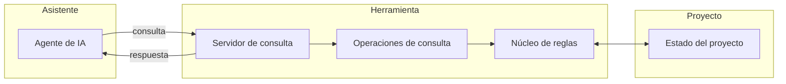
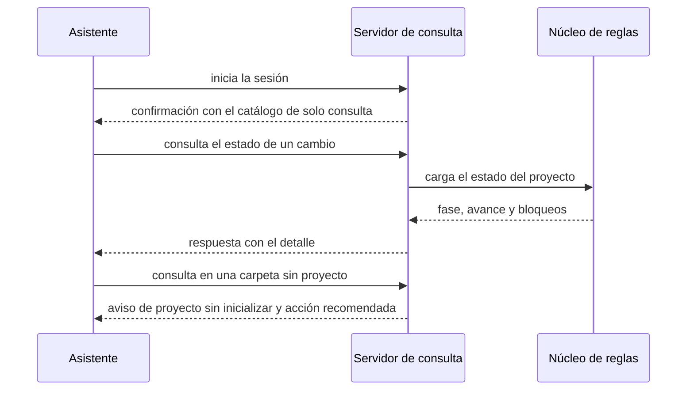
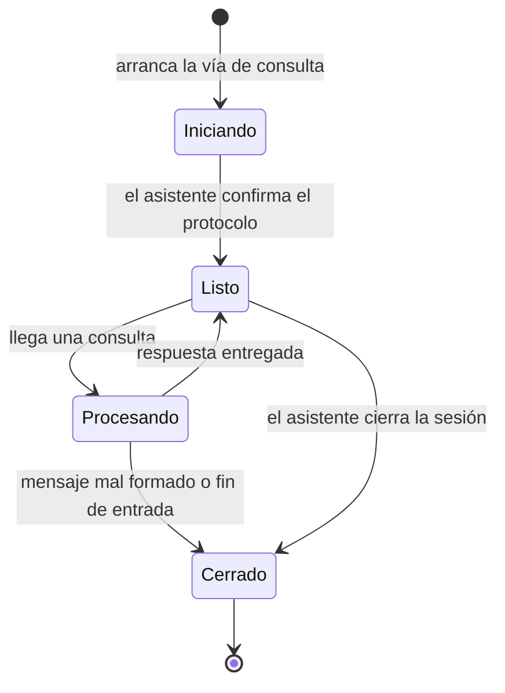

# Plan — Consultar el estado del proyecto desde el asistente

## 1. Contexto AS-IS

Inventario real del repo (anclas al código):

- La vía de consulta para asistentes **no existe**: no hay implementación del protocolo MCP ni comando en el CLI (búsqueda en `packages/` sin resultados). `ARQUITECTURA.md` §12 la promete: `satlas mcp` (stdio) con operaciones de solo lectura `atlas_status`, `atlas_next`, `atlas_validate`, `atlas_trace`, `atlas_impact`, `atlas_glossary`.
- El núcleo ya expone lo necesario para estado, validación y trazabilidad: `loadWorkspace` (`packages/core/src/workspace.ts`), `deriveState` y `verifyApproval` (`lifecycle.ts`), `checkTrace` (`trace.ts`), `lintDelta` (`lint.ts`). El CLI las orquesta en `evaluateChange` (`packages/cli/src/evaluate.ts`): el servidor reutiliza esa misma función, de modo que BR-MCP-001 («idéntico a lo que reporta el estado del proyecto») se cumple por construcción.
- **No existe** análisis de impacto (ningún módulo del núcleo) ni lector del glosario (el glosario solo se genera en `init.ts`). → módulos nuevos del núcleo.
- El CLI tiene catálogo (`catalog.ts`) y despachador (`cli.ts` → `HANDLERS`) con patrón `CommandResult` → `printResult` (stdout solo resultado, salida de error por stderr) y exit codes 0/1/2/3.
- Principios que obligan: CLI sin dependencias de runtime (`packages/cli/package.json`: solo `yaml` y `zod`); sin red por defecto (ADR-010). Node ≥ 20 (módulo `readline/promises` disponible).
- Presupuesto de rendimiento (ARQUITECTURA §15): `status` ≤ 300 ms en workspaces grandes — la operación de estado del servidor debe heredarlo.

## 2. Enfoque técnico

- **Transporte**: comando `satlas mcp` que entra en modo servidor sobre entrada/salida estándar, protocolo JSON-RPC 2.0 delimitado por saltos de línea (el estándar del transporte stdio de MCP), implementado con Node built-ins (`readline`). Sin dependencias nuevas.
- **Operaciones 1:1 con los requisitos**: `atlas_status` (REQ-MCP-001), `atlas_next` (REQ-MCP-002), `atlas_validate` (REQ-MCP-003-S1/S2), `atlas_trace` (REQ-MCP-003-S3), `atlas_impact` (REQ-MCP-004), `atlas_glossary` (REQ-MCP-005) y el catálogo de solo consulta (REQ-MCP-006).
- **Reutilización**: `atlas_status`, `atlas_next`, `atlas_validate` y `atlas_trace` usan `evaluateChange` y `checkTrace`, la misma fuente que el CLI.
- **Nuevo en el núcleo**: `impact.ts` (impacto por requisito y por archivo sobre el grafo de trazabilidad, las declaraciones `Archivos` de las tareas y las anclas de las specs) y `parse/glossary.ts` (lector de la tabla de términos). Módulos puros y testeables, sin I/O (reciben el workspace cargado).
- **Garantía de solo lectura** (REQ-MCP-006): las operaciones solo leen; se verifica con pruebas que inspeccionan el catálogo expuesto y ejecutan todas las operaciones comprobando que el proyecto queda intacto.
- **Idioma**: respuestas en español (`config.project.language`), códigos estables en inglés — el mismo patrón que el CLI.
- **Sin workspace** (REQ-MCP-001-S5): resultado estructurado con aviso y acción recomendada (inicializar el proyecto), nunca una excepción de protocolo.
- **Caché del workspace** en memoria con invalidación al detectar cambios de archivos (mtime), para cumplir el presupuesto sin recargar en cada mensaje.
- **Alternativas descartadas**:
  - Paquete npm separado `@specatlas/mcp` (prometido en ARQUITECTURA §4): suma superficie de publicación y versionado sin ganancia funcional en v1; el CLI ya es el punto de entrada único y el módulo puede extraerse después si crece.
  - SDK oficial `@modelcontextprotocol/sdk`: rompe el principio de cero dependencias de runtime del CLI y el subconjunto necesario (initialize, tools/list, tools/call, errores) es pequeño y estable.
  - Comando nuevo `satlas impact` en el CLI: fuera del alcance de esta spec (la consulta es la vía de los asistentes); el módulo del núcleo queda listo para exponerlo después.

## 3. Diagramas

### 3.1 Arquitectura (módulo nuevo)

### 3.2 Secuencia de una consulta

### 3.3 Estados del servidor

## 4. Diseño por capa / módulos

| Módulo | Capa | Responsabilidad |
|---|---|---|
| `packages/core/src/impact.ts` | Núcleo | Impacto por requisito y por archivo (puro) |
| `packages/core/src/parse/glossary.ts` | Núcleo | Lector del glosario (tabla de términos) |
| `packages/core/src/index.ts` | Núcleo | Exportaciones nuevas (impacto, glosario) |
| `packages/cli/src/mcp/protocol.ts` | CLI | Tipos JSON-RPC, errores de protocolo y serialización |
| `packages/cli/src/mcp/server.ts` | CLI | Bucle stdio (stdout solo JSON-RPC, logs a stderr), carga y caché del workspace |
| `packages/cli/src/mcp/tools/status.ts` | CLI | `atlas_status` |
| `packages/cli/src/mcp/tools/next.ts` | CLI | `atlas_next` |
| `packages/cli/src/mcp/tools/validate.ts` | CLI | `atlas_validate` |
| `packages/cli/src/mcp/tools/trace.ts` | CLI | `atlas_trace` |
| `packages/cli/src/mcp/tools/impact.ts` | CLI | `atlas_impact` |
| `packages/cli/src/mcp/tools/glossary.ts` | CLI | `atlas_glossary` |
| `packages/cli/src/mcp/tools/list.ts` + `tools/index.ts` | CLI | Catálogo de solo consulta y registro de operaciones |
| `packages/cli/src/commands/mcp.ts` | CLI | Handler del comando `mcp` |
| `packages/cli/src/catalog.ts`, `cli.ts` | CLI | Registro del comando en catálogo y despachador |
| `packages/cli/test/mcp.test.ts`, `packages/core/test/impact-glossary.test.ts` | Pruebas | Contrato de mensajes y lógica de impacto/glosario |

## 5. Matriz de trazabilidad (REQ → tareas)

| Requisito | Escenarios | Tareas |
|---|---|---|
| REQ-MCP-001 — Estado general y por cambio | S1…S5 | T2.4, T2.11 |
| REQ-MCP-002 — Siguiente acción recomendada | S1…S4 | T2.5, T2.11 |
| REQ-MCP-003 — Hallazgos y cobertura | S1…S3 | T2.6, T2.7, T2.11 |
| REQ-MCP-004 — Impacto de requisito o archivo | S1…S3 | T1.1, T1.3, T2.8 |
| REQ-MCP-005 — Glosario del negocio | S1, S2 | T1.2, T1.3, T2.9 |
| REQ-MCP-006 — Solo lectura | S1, S2 | T2.10, T2.11 |

## 6. Matriz de paridad AS-IS → TO-BE

No es un refactor sustitutivo: se añade una vía de consulta sin reemplazar componentes existentes.

| Elemento | Conservar | Descartar | Nuevo |
|---|---|---|---|
| `evaluateChange` (CLI) | Se conserva como fuente única de estado | — | Reutilizado por las operaciones de consulta |
| `checkTrace` / `deriveState` | Se conservan | — | — |
| Catálogo `CATALOG` + `HANDLERS` | Se conserva | — | Entrada nueva `mcp` |
| Análisis de impacto | — | — | `impact.ts` (núcleo) |
| Glosario | Generación en `init` | — | `parse/glossary.ts` (lectura) |
| `printResult` | Se conserva para el CLI | No lo usa el servidor (su salida es solo JSON-RPC) | — |

## 7. Tareas

Ver `tasks.md`: 16 tareas en 2 bloques.

## 8. Riesgos y mitigaciones

| Riesgo | Mitigación |
|---|---|
| Diferencias de implementación del protocolo entre hosts (opencode, Claude Code, Cursor) | Responder `initialize` con `protocolVersion` 2024-11-05 (la más extendida) y probar la vía contra al menos dos hosts en la verificación |
| Contaminación de la salida estándar (logs del CLI) rompería el protocolo | Regla dura: stdout solo transporta mensajes; todo registro va a stderr; prueba que lo comprueba |
| Rendimiento en workspaces grandes (recargar el workspace por mensaje) | Caché en memoria con invalidación por mtime; presupuesto heredado de `status` (≤ 300 ms) |
| Alcance del análisis de impacto sin análisis semántico del código | Solo relaciones registradas (`Cubre`, `Archivos`, anclas, deltas); BR-MCP-004 lo fija |
| Hosts sin soporte de protocolo stdio | La vía degrada a la terminal actual; no bloquea nada existente |

## 9. Rollback

Todo el cambio es aditivo: eliminar los módulos nuevos, quitar la entrada `mcp` del catálogo y el despachador, y revertir la documentación. No hay migraciones de esquema ni cambios a artefactos existentes. En construcción: `git revert` del commit.

## 10. Dependencias y supuestos

- Dependencia entre bloques (documentada aquí, no en las tareas — el planificador de olas exige dependencias intra-bloque): el Bloque 2 consume los módulos del núcleo del Bloque 1; los bloques se construyen en orden.
- Sin dependencias npm nuevas; Node ≥ 20 (`readline/promises` sobre stdio).
- El transporte stdio usa mensajes JSON-RPC delimitados por salto de línea (sin framing Content-Length).
- Supuesto: los hosts de los asistentes exponen la vía MCP stdio como proceso local (patrón estándar).
- El workspace se localiza con `findWorkspaceRoot` desde el directorio actual del proceso (misma semántica que el CLI).
