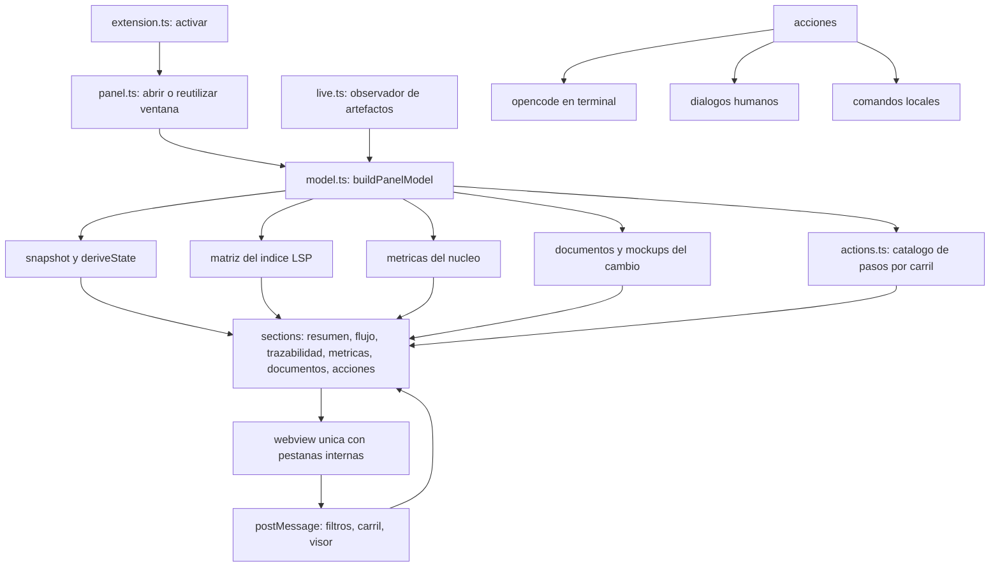
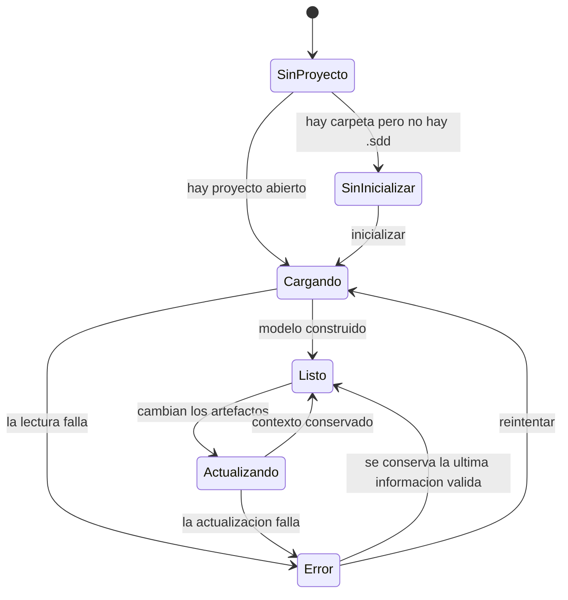
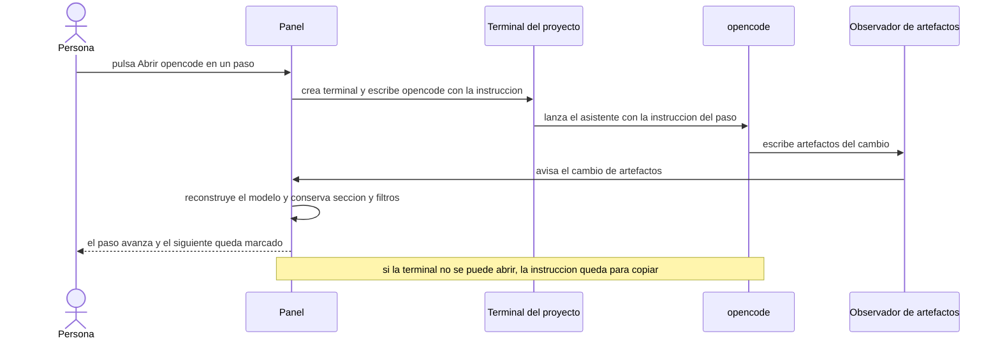
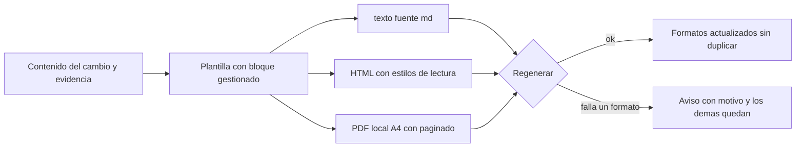

<!-- specatlas:generado:inicio -->
# Documentación técnica — Un panel principal único para la extensión

> **Cambio**: `panel-principal` · **Dominio**: editor · **Carril**: standard · **Tareas**: 24/24 · **Actualizado**: 2026-09-21

## 1. Resumen del cambio

Este documento describe **Un panel principal único para la extensión** (cambio `panel-principal`), del dominio **editor** y carril **standard**. Recoge el porqué, el estado anterior, el enfoque técnico, los diagramas, el mapa de archivos, la trazabilidad completa y la evidencia con la que se dio por terminado.

| Dato | Valor |
|---|---|
| Requisitos del cambio | 11 (11 nuevos, 0 modificados) |
| Escenarios especificados | 56 |
| Tareas | 24 hechas de 24 · 5 bloque(s) |
| Evidencia | 56 / 56 escenarios |
| Archivos tocados | 32 |
| Mockups | 9 pantalla(s) |
| Carril y dominio | standard · editor |

## 2. Qué es y por qué

Hoy la herramienta reparte su información en ventanas separadas (matriz de trazabilidad, tablero y métricas) más las vistas de documentos y mockups. Quien trabaja en un cambio debe abrir una ventana por tema, alternar entre ellas y pierde el hilo de lo que está haciendo.

Como responsable de un cambio, quiero un único panel principal que reúna el estado, el flujo, la trazabilidad, las métricas, los documentos y las acciones, para trabajar sin dispersarme y tener un solo lugar donde mirar.

## 3. Qué cambia, en lenguaje de negocio

### REQ-EDITOR-001 — Un único panel principal reúne el trabajo

El equipo necesita un solo punto de entrada en el editor: hoy el estado, el flujo de los cambios, la trazabilidad y las métricas viven en ventanas separadas, hay que abrir una para cada tema y el trabajo queda disperso. Un panel principal único, con secciones internas, reúne la información y las acciones en un mismo lugar.

**Reglas de negocio**

- `BR-EDITOR-001` — El panel principal es el único punto de entrada de la herramienta en el editor y reúne, en secciones internas, el resumen, el flujo de los cambios, la trazabilidad, las métricas, los documentos y las acciones; cambiar de sección no abre ventanas nuevas.
- `BR-EDITOR-002` — El panel principal es único: si ya está abierto, pedirlo de nuevo lo reutiliza y activa la sección pedida; nunca se duplica.
- `BR-EDITOR-003` — Las ventanas independientes de matriz, tablero y métricas dejan de existir; su información se consulta en el panel principal.

**Escenarios**: 5 · 3 de uso · 2 de estado vacío · 0 de error o aviso.

### REQ-EDITOR-002 — Resumen: salud del proyecto y siguiente acción

El equipo necesita, al abrir la herramienta, saber de un vistazo cómo está el proyecto y qué hacer ahora, sin interpretar datos por su cuenta.

**Reglas de negocio**

- `BR-EDITOR-004` — El resumen muestra los indicadores del proyecto (cambios activos, avance de tareas, evidencia y hallazgos) y, por cada cambio activo, su estado, su carril, su avance y su siguiente acción.
- `BR-EDITOR-005` — El resumen solo muestra lo registrado; lo que no existe se indica como ausente, sin inventarlo.
- `BR-EDITOR-006` — Cuando hay puntos que requieren atención (bloqueos, hallazgos o evidencia pendiente), el resumen los destaca con su motivo y la acción sugerida.

**Escenarios**: 5 · 2 de uso · 3 de estado vacío · 0 de error o aviso.

### REQ-EDITOR-003 — Sección Flujo: el avance de los cambios por fase

El equipo necesita seguir el avance de cada cambio por las fases del ciclo desde el panel principal, sin abrir el tablero aparte.

**Reglas de negocio**

- `BR-EDITOR-007` — El flujo muestra las fases del ciclo con los cambios que están en cada una, con su carril, su dominio, su avance de tareas y evidencia y, si lo tienen, su bloqueo.
- `BR-EDITOR-008` — Los filtros del flujo (texto, carril y dominio) acotan lo visible sin alterar los datos ni recargar el panel; el conteo por fase refleja lo filtrado.

**Escenarios**: 4 · 2 de uso · 1 de estado vacío · 1 de error o aviso.

### REQ-EDITOR-004 — Sección Trazabilidad: requisito, escenario, tarea y evidencia

El equipo necesita comprobar la trazabilidad completa desde el panel principal, con los huecos primero, sin abrir la matriz aparte.

**Reglas de negocio**

- `BR-EDITOR-009` — La trazabilidad muestra cada requisito con sus escenarios, las tareas que los cubren, la evidencia de cada escenario y su procedencia (cambios y fixes), con los huecos primero.
- `BR-EDITOR-010` — Los filtros (texto, estado, dominio, cambio y procedencia) acotan lo visible sin alterar los datos; el conteo refleja lo filtrado.
- `BR-EDITOR-011` — Cada identificador abre su artefacto en la línea exacta dentro del editor.

**Escenarios**: 5 · 3 de uso · 2 de estado vacío · 0 de error o aviso.

### REQ-EDITOR-005 — Sección Métricas: la salud del proceso

El equipo necesita las métricas del proceso (evidencia, cierres por mes, antigüedad del trabajo, distribución por carril, trabajo en curso y puntos de atención) dentro del panel principal.

**Reglas de negocio**

- `BR-EDITOR-012` — Las métricas se calculan localmente; el panel no envía datos fuera del equipo.
- `BR-EDITOR-013` — Las métricas mostradas son las mismas que ya ofrece la herramienta; el panel no inventa indicadores.

**Escenarios**: 3 · 2 de uso · 1 de estado vacío · 0 de error o aviso.

### REQ-EDITOR-006 — Documentos y mockups dentro del panel

El equipo necesita leer los documentos del cambio y ver sus mockups dentro del panel, sin abrir ventanas adicionales ni perder el contexto.

**Reglas de negocio**

- `BR-EDITOR-014` — El panel ofrece los documentos del cambio (propuesta, especificación, aclaraciones, plan, tareas, verificación, documentación, presentación y fix, cuando existan) y los muestra en su propia sección; los documentos ausentes se indican como tales.
- `BR-EDITOR-015` — Los mockups del cambio se ven dentro del panel, pantalla a pantalla; si el cambio no los declara se indica, y si están desactualizados se avisa.
- `BR-EDITOR-016` — Un documento que no se puede leer se informa con su motivo, sin mostrar contenido incompleto.

**Escenarios**: 6 · 2 de uso · 2 de estado vacío · 2 de error o aviso.

### REQ-EDITOR-007 — Acciones del ciclo desde el panel

El equipo necesita ejecutar desde el panel las acciones del ciclo, con las mismas reglas y registros que ya rigen la herramienta.

**Reglas de negocio**

- `BR-EDITOR-017` — El panel ofrece las acciones válidas para el estado del proyecto y del cambio activo; las que no aplican no se ofrecen y, si se piden, se explica por qué no aplican.
- `BR-EDITOR-018` — Las acciones humanas (aprobar y archivar) conservan sus reglas: piden quién las ejecuta y quedan auditadas con nombre y fecha.
- `BR-EDITOR-019` — Una acción que falla informa el motivo y no deja el trabajo a medias.
- `BR-EDITOR-020` — Las acciones que requieren un asistente abren el asistente en una terminal del proyecto con la instrucción de la acción ya dirigida; la acción no se ejecuta por sí sola.
- `BR-EDITOR-021` — Si el asistente no se puede abrir, la instrucción queda disponible para copiarla y se informa el motivo.
- `BR-EDITOR-022` — Las acciones se presentan en el orden del ciclo y agrupadas por carril (express, estándar y completo), con el paso actual marcado y el actor de cada paso (asistente, persona o local), de modo que el flujo completo de un cambio se pueda recorrer desde el panel.
- `BR-EDITOR-023` — Crear un cambio desde el panel pide carril, título y dominio, y lo deja en el primer paso del flujo de su carril.
- `BR-EDITOR-030` — Cada paso del flujo ofrece su acción en el propio paso (o explica por qué no aplica); ninguna acción queda escondida detrás de un botón genérico.

**Escenarios**: 9 · 4 de uso · 1 de estado vacío · 4 de error o aviso.

### REQ-EDITOR-008 — El panel se mantiene al día sin perder el contexto

El equipo necesita que el panel refleje los cambios hechos desde la terminal o el asistente sin recargarlo a mano y sin perder dónde estaba.

**Reglas de negocio**

- `BR-EDITOR-021` — El panel se actualiza solo cuando cambian los artefactos del proyecto; la sección activa y los filtros en uso se conservan.
- `BR-EDITOR-022` — Sin cambios en el proyecto, el panel no se altera.
- `BR-EDITOR-023` — Una actualización que falla se informa y no deja el panel en un estado incompleto.

**Escenarios**: 4 · 2 de uso · 1 de estado vacío · 1 de error o aviso.

### REQ-EDITOR-009 — La presentación para aprobar

El equipo necesita una página de presentación que reúna lo que se va a aprobar —la propuesta, la especificación y los mockups— con un diseño legible y navegable, porque la presentación actual no invita a leer ni a firmar y la aprobación es un acto humano.

**Reglas de negocio**

- `BR-EDITOR-024` — La presentación reúne, en este orden, la identidad del cambio (nombre, carril, dominio, versión, fecha y huella), el resumen de negocio, la especificación con sus requisitos y escenarios, los mockups y el bloque de firma; con una guía de secciones navegable y sin recursos externos.
- `BR-EDITOR-025` — La presentación se puede imprimir o guardar como PDF con el contenido completo, sin cortes que oculten información y con el bloque de firma en una página propia.
- `BR-EDITOR-026` — La presentación refleja el estado real de la firma: vigente, pendiente u obsoleta cuando la especificación cambió después de firmarse.

**Escenarios**: 6 · 2 de uso · 3 de estado vacío · 1 de error o aviso.

### REQ-EDITOR-010 — La documentación en tres formatos

El equipo necesita que los documentos técnico y manual salgan además del texto fuente en HTML y PDF, para entregarlos a quien no trabaja en el repositorio sin depender de herramientas externas.

**Reglas de negocio**

- `BR-EDITOR-027` — Cada documento se produce en su texto fuente y en HTML y PDF con el mismo contenido; el PDF se genera localmente, sin servicios externos.
- `BR-EDITOR-028` — Si un formato no se puede generar, se avisa con el motivo y los demás quedan disponibles.
- `BR-EDITOR-029` — Regenerar la documentación actualiza todos sus formatos sin duplicar secciones ni perder lo escrito a mano.

**Escenarios**: 5 · 3 de uso · 1 de estado vacío · 1 de error o aviso.

### REQ-EDITOR-011 — La revisión y el análisis entran en el flujo

El equipo necesita que el flujo no salte de la verificación al archivo: la revisión de código y el análisis del cambio deben ser pasos visibles del ciclo, con su acción en el panel y su artefacto en el cambio, aunque no bloqueen el archivado en el carril estándar.

**Reglas de negocio**

- `BR-EDITOR-031` — El flujo del carril estándar y del completo incluye Revisar (con asistente) y Analizar (local) entre verificar y archivar; cada paso muestra su actor y su acción.
- `BR-EDITOR-032` — La revisión y el análisis se marcan hechos cuando su artefacto existe en el cambio; si no existen, el panel los ofrece como pasos recomendados u opcionales antes de archivar, sin impedir el archivado del carril estándar.

**Escenarios**: 4 · 3 de uso · 1 de estado vacío · 0 de error o aviso.

## 4. Cómo estaba antes (AS-IS)

Inventario real del repo (anclas al código):

- **Tres paneles sueltos**: `specatlas.matrix`, `specatlas.board` y `specatlas.metrics` se registran con `openLivePanel` (`packages/vscode/src/extension.ts:1315-1362`); `openLivePanel` crea un `createWebviewPanel` por clave (`extension.ts:546-557`) con registro en `packages/vscode/src/live.ts` (clave → panel, refresco por observador).
- **Renderizadores y estilos**: `matrixHtml` (`packages/vscode/src/panels.ts:440`), `boardHtml` (`panels.ts:588`), `metricsHtml` (`panels.ts:651`), sobre `panelPage` (`panels.ts:272`), `PANEL_CSS` (`panels.ts:31`) y scripts de filtros en línea (`panels.ts:345`, `panels.ts:405`).
- **Modelo de datos del panel**: `buildMatrix` (`packages/vscode/src/logic.ts:497`) usa el índice del LSP (`@specatlas/lsp` `buildIndex`); `buildSnapshot` (`logic.ts:171`) evalúa el cambio con `deriveState`; las métricas las calcula el núcleo (`packages/core/src/metrics.ts`) y se consumen en `extension.ts:1348-1362`.
- **Secciones que ya existen como capacidades**: vista previa de artefactos (`specatlas.openPreview`, `extension.ts:1209`), visor de mockups (`specatlas.mockup.open`, `extension.ts:906`), decisión de mockups (`extension.ts:885`), presentación (`specatlas.present`, `extension.ts:865`), verificación con formulario (`extension.ts:997`), aprobar (`extension.ts:1158`), archivar (`extension.ts:1185`), nuevo cambio (`extension.ts:921`), validar/CI/diagnóstico/adaptadores/packs (`extension.ts:742-1156`).
- **Acciones con agente**: `runNext` (`extension.ts:1286`) mapea acciones conocidas a comandos y, para las de agente, **copia la instrucción al portapapeles**; no abre terminal.
- **Vista lateral**: `toolGroups` (`logic.ts:570`) expone el grupo «Paneles» con Matriz, Tablero y Métricas; el árbol (`extension.ts:110-395`) muestra specs, cambios, fixes, histórico y archivos del cambio.
- **Presentación**: `generatePresentation` (`packages/core/src/present.ts`) escribe `presentation/index.html` con `page()` + `labelsFor()` y estilos de `@specatlas/render` (`renderStyles`), copia mockups y capturas, y refleja el estado de la firma (`verifyApproval`). El CLI `satlas present` (`packages/cli/src/commands/present.ts`) lo invoca.
- **Documentación**: `generateDocs` (`packages/core/src/docs.ts`) escribe **solo** `docs/tecnica.md` y `docs/manual.md` con bloque gestionado (`mergeManaged`); el CLI `satlas docs --tipo` (`packages/cli/src/commands/docs.ts`) reporta rutas. El gate de documentación (`lifecycle.ts:199-202`, solo carril `full`) comprueba `tecnica.md`/`manual.md` (`docsReady`, `lifecycle.ts:74`).
- **Renderizador**: `packages/render/src/index.ts` expone `renderStyles`, `renderMarkdown`, `renderDocument`, `tableOfContents`, `inlineMarkdown`, `escapeHtml` y `defaultTokens`; su única dependencia es `highlight.js`. **No hay generación de PDF en el repo.**
- **Empaquetado y pruebas**: monorepo pnpm con `core`, `render`, `lsp`, `cli`, `vscode` y `adapters`; pruebas con vitest (`packages/*/test/*.test.ts`); versiones por paquete y `CHANGELOG.md` en la raíz.

## 5. Enfoque técnico y decisiones

- **Ventana única del panel** (`packages/vscode/src/panel/`): nuevo módulo `panel.ts` (controlador: abrir/reutilizar la ventana, enrutar secciones, conservar contexto y refrescar) y `sections/` (resumen, flujo, trazabilidad, métricas, documentos, acciones) que reutiliza los renderizadores actuales de `panels.ts` (movidos/refactorizados) y `logic.ts`. El panel se registra como `specatlas.panel` y sustituye a los tres comandos sueltos; la vista lateral pasa a un único acceso «Panel principal».
  - **Navegación interna**: pestañas como enlaces entre estados de la misma webview (`enableCommandUris` ya está activo) + `postMessage` para acciones internas (filtros, carril seleccionado, visor).
  - **Contexto**: sección activa y filtros en uso se guardan con `vscode.getState()/setState()` de la webview y se restauran en cada refresco (REQ-EDITOR-008-S2).
  - **Vivo**: se reutiliza `live.ts` (observador de artefactos) para reconstruir el modelo y repintar sin recargar; sin cambios en disco no se repinta (REQ-EDITOR-008-S3); un fallo de lectura informa y conserva la última información válida (REQ-EDITOR-008-S4).
- **Modelo del panel**: `buildPanelModel(root)` en `packages/vscode/src/panel/model.ts` que compone: snapshot (`buildSnapshot`), matriz (`buildMatrix`), métricas (`collectMetrics`), documentos y mockups del cambio activo, y el catálogo de acciones. Es puro y testeable (sin `vscode`).
- **Acciones por paso** (`packages/vscode/src/actions.ts`): catálogo puro con los pasos de cada carril (express, standard, full) y, por paso: id, título, actor (`agent` | `human` | `local`), comando, validez según estado y motivo cuando no aplica. La UI (stepper) se genera desde el catálogo y el encabezado muestra la acción del paso actual.
  - **Agente**: `vscode.window.createTerminal({ name: 'opencode', cwd: root })` + `sendText('opencode "<instrucción>"')` (REQ-EDITOR-007-S5); si la terminal falla, se copia la instrucción al portapapeles y se avisa el motivo (S6); un fallo de la acción no deja trabajo a medias (S4).
  - **Humanas**: aprobar (diálogo con nombre, huella y fecha, como hoy) y archivar (confirmación); **locales**: verificar, presentar, validar, CI, diagnóstico, adaptadores, contratos, actualizar esquema, enlazar repos, packs.
  - **Nuevo cambio**: asistente carril/título/dominio (reutiliza `createChange`) y deja el cambio en el primer paso (REQ-EDITOR-007-S8).
- **Sección Flujo**: carriles verticales por fase, incluida `awaiting_mockups` (hoy ausente de `BOARD_ORDER`, `panels.ts:576`), con filtros y contadores por fase (REQ-EDITOR-003).
- **Sección Documentos**: lista de documentos del cambio con formatos, visor de markdown dentro del panel (reutiliza `previewHtml`) y visor de mockups (reutiliza el manifiesto y `pathForScreen`); variantes: ausente, sin mockups, desactualizados, ilegible (REQ-EDITOR-006).
- **Presentación rediseñada** (`packages/core/src/present.ts`): nueva `page()` con el contrato visual — portada (identidad, estado de firma, huella), guía de secciones navegable, resumen de negocio, especificación completa, galería de mockups, bloque de firma y `@media print` (portada y firma en páginas propias, sin cortes). Se mantienen la copia de mockups/capturas, el hash y `verifyApproval` (firma vigente, pendiente u obsoleta) y los avisos de mockup faltante (REQ-EDITOR-009).
- **Documentación en tres formatos** (`packages/core/src/docs.ts` + `packages/render/src/pdf.ts`): el mismo contenido genera `tecnica.md`/`manual.md`, `tecnica.html`/`manual.html` y `tecnica.pdf`/`manual.pdf`. El PDF se arma localmente con `pdf-lib` (nueva dependencia de `@specatlas/render`): A4, márgenes, títulos, párrafos con ajuste de línea, listas, tablas simples, encabezado y pie con paginado. Si un formato falla, se avisa con el motivo y los demás quedan (REQ-EDITOR-010-S3); regenerar respeta el bloque gestionado en los tres formatos (S4).
- **Alternativas descartadas**:
  - Mantener los tres paneles y añadir un cuarto de resumen: contradice REQ-EDITOR-001 y BR-EDITOR-003.
  - Una webview por sección con pestañas externas: multiplica ventanas y ciclos de vida, y pierde el contexto al refrescar.
  - PDF con navegador headless (Playwright): dependencia pesada y no determinista; hoy Playwright es opcional y no está instalado.
  - Escribir el PDF a mano (sintaxis PDF cruda): más código y fragilidad de formato; `pdf-lib` es puro JavaScript y determinista.
  - Servicios externos de conversión: prohibido por BR-EDITOR-027.
  - Reescribir el documento completo al regenerar: perdería lo escrito a mano; se conserva el bloque gestionado.

## 6. Diagramas

### Arquitectura del panel único (flowchart)

### Estados de la ventana (stateDiagram-v2)

### Acción con agente (sequenceDiagram)

### Documentación en tres formatos (flowchart)

## 7. Diseño por capas y componentes

| Capa | Módulo | Responsabilidad | Archivos |
|---|---|---|---|
| Editor | `panel/panel.ts` | ventana única, pestañas internas, contexto, refresco | `packages/vscode/src/panel/panel.ts`, `packages/vscode/src/extension.ts`, `packages/vscode/src/live.ts` |
| Editor | `panel/model.ts` | modelo del panel (puro) | `packages/vscode/src/panel/model.ts` |
| Editor | `panel/sections/*.ts` | HTML por sección (resumen, flujo, trazabilidad, métricas, documentos, acciones) | `packages/vscode/src/panel/sections/`, `packages/vscode/src/panels.ts`, `packages/vscode/src/logic.ts` |
| Editor | `actions.ts` | catálogo de pasos por carril con actor y validez | `packages/vscode/src/actions.ts`, `packages/core/src/lifecycle.ts` |
| Editor | Acciones | ejecución (terminal opencode, diálogos, comandos locales) y fallback | `packages/vscode/src/extension.ts` |
| Núcleo | Presentación | rediseño del HTML de presentación y firma | `packages/core/src/present.ts`, `packages/render/src/index.ts` |
| Núcleo | Documentación | tres formatos con bloque gestionado | `packages/core/src/docs.ts`, `packages/render/src/pdf.ts` |
| Núcleo | Gates/estado | sin cambios de comportamiento; se mantiene `docsReady` sobre el texto fuente | `packages/core/src/lifecycle.ts` |
| CLI | `docs`, `present` | reportan formatos y rutas | `packages/cli/src/commands/docs.ts`, `packages/cli/src/commands/present.ts` |
| Editor | Vista lateral | acceso único al panel | `packages/vscode/src/logic.ts`, `packages/vscode/package.json` |
| Pruebas | vitest | modelo, secciones, acciones, PDF, presentación | `packages/vscode/test/`, `packages/core/test/`, `packages/render/test/` |
| Docs | guía | README y ARQUITECTURA | `README.md`, `ARQUITECTURA.md`, `CHANGELOG.md` |

## 8. Mapa de archivos

Cada archivo, la tarea que lo tocó y el requisito al que responde.

| Archivo | Tareas | Requisitos que cubre |
|---|---|---|
| `.sdd/changes/panel-principal/verify.md` | T5.4 | REQ-EDITOR-001, REQ-EDITOR-002, REQ-EDITOR-003, REQ-EDITOR-004, REQ-EDITOR-005, REQ-EDITOR-006, REQ-EDITOR-007, REQ-EDITOR-008, REQ-EDITOR-009, REQ-EDITOR-010 |
| `ARQUITECTURA.md` | T5.3 | — |
| `CHANGELOG.md` | T5.3 | — |
| `README.md` | T5.3 | — |
| `packages/cli/src/commands/docs.ts` | T4.3 | REQ-EDITOR-010 |
| `packages/core/src/docs.ts` | T4.3, T4.4 | REQ-EDITOR-010 |
| `packages/core/src/lifecycle.ts` | T3.1 | REQ-EDITOR-007 |
| `packages/core/src/new.ts` | T3.5 | REQ-EDITOR-007 |
| `packages/core/src/present.ts` | T4.1, T4.2 | REQ-EDITOR-009 |
| `packages/core/test/present-docs.test.ts` | T5.2 | REQ-EDITOR-009, REQ-EDITOR-010 |
| `packages/render/package.json` | T4.3 | REQ-EDITOR-010 |
| `packages/render/src/index.ts` | T4.1 | REQ-EDITOR-009 |
| `packages/render/src/pdf.ts` | T4.3 | REQ-EDITOR-010 |
| `packages/render/test/pdf.test.ts` | T5.2 | REQ-EDITOR-009, REQ-EDITOR-010 |
| `packages/vscode/package.json` | T1.4 | REQ-EDITOR-001 |
| `packages/vscode/src/actions.ts` | T3.1, T3.3, T3.6 | REQ-EDITOR-007, REQ-EDITOR-011 |
| `packages/vscode/src/extension.ts` | T1.1, T1.4, T3.3, T3.4, T3.5 | REQ-EDITOR-001, REQ-EDITOR-007, REQ-EDITOR-008 |
| `packages/vscode/src/live.ts` | T1.1, T1.5 | REQ-EDITOR-001, REQ-EDITOR-008 |
| `packages/vscode/src/logic.ts` | T1.2, T1.4, T2.5 | REQ-EDITOR-001, REQ-EDITOR-002, REQ-EDITOR-006 |
| `packages/vscode/src/panel/model.ts` | T1.2 | REQ-EDITOR-002 |
| `packages/vscode/src/panel/panel.ts` | T1.1, T1.3, T1.5 | REQ-EDITOR-001, REQ-EDITOR-002, REQ-EDITOR-003, REQ-EDITOR-004, REQ-EDITOR-005, REQ-EDITOR-006, REQ-EDITOR-008 |
| `packages/vscode/src/panel/sections/acciones.ts` | T3.2, T3.6 | REQ-EDITOR-007, REQ-EDITOR-011 |
| `packages/vscode/src/panel/sections/documentos.ts` | T2.5 | REQ-EDITOR-006 |
| `packages/vscode/src/panel/sections/estados.ts` | T1.3 | REQ-EDITOR-001, REQ-EDITOR-002, REQ-EDITOR-003, REQ-EDITOR-004, REQ-EDITOR-005, REQ-EDITOR-006, REQ-EDITOR-008 |
| `packages/vscode/src/panel/sections/flujo.ts` | T2.2 | REQ-EDITOR-003 |
| `packages/vscode/src/panel/sections/metricas.ts` | T2.4 | REQ-EDITOR-005 |
| `packages/vscode/src/panel/sections/resumen.ts` | T2.1 | REQ-EDITOR-002 |
| `packages/vscode/src/panel/sections/trazabilidad.ts` | T2.3 | REQ-EDITOR-004 |
| `packages/vscode/src/panels.ts` | T2.2, T2.3, T2.4 | REQ-EDITOR-003, REQ-EDITOR-004, REQ-EDITOR-005 |
| `packages/vscode/test/actions.test.ts` | T5.1 | REQ-EDITOR-001, REQ-EDITOR-002, REQ-EDITOR-003, REQ-EDITOR-004, REQ-EDITOR-005, REQ-EDITOR-006, REQ-EDITOR-007, REQ-EDITOR-008 |
| `packages/vscode/test/panel-scenarios.test.ts` | T3.6 | REQ-EDITOR-011 |
| `packages/vscode/test/panel.test.ts` | T5.1 | REQ-EDITOR-001, REQ-EDITOR-002, REQ-EDITOR-003, REQ-EDITOR-004, REQ-EDITOR-005, REQ-EDITOR-006, REQ-EDITOR-007, REQ-EDITOR-008 |

## 9. Trazabilidad requisito → escenario → tarea → evidencia

11 requisito(s) · 56 escenario(s) · 56 con tarea · 56 con evidencia favorable · **0 hueco(s)**.

| Requisito | Escenario | Tareas | Evidencia |
|---|---|---|---|
| REQ-EDITOR-001 | `REQ-EDITOR-001-S1` Abrir el panel principal | T1.1, T1.4, T5.4 | pass |
| REQ-EDITOR-001 | `REQ-EDITOR-001-S2` Cambiar de sección | T1.1, T5.1, T5.4 | pass |
| REQ-EDITOR-001 | `REQ-EDITOR-001-S3` El panel ya estaba abierto | T1.1, T1.4, T5.1, T5.4 | pass |
| REQ-EDITOR-001 | `REQ-EDITOR-001-S4` Proyecto sin inicializar | T1.3, T5.4 | pass |
| REQ-EDITOR-001 | `REQ-EDITOR-001-S5` Sin proyecto abierto | T1.3, T5.4 | pass |
| REQ-EDITOR-002 | `REQ-EDITOR-002-S1` Proyecto con cambios activos | T1.2, T2.1, T5.1, T5.4 | pass |
| REQ-EDITOR-002 | `REQ-EDITOR-002-S2` Proyecto al día | T1.2, T2.1, T5.4 | pass |
| REQ-EDITOR-002 | `REQ-EDITOR-002-S3` Puntos que requieren atención | T1.2, T2.1, T5.4 | pass |
| REQ-EDITOR-002 | `REQ-EDITOR-002-S4` Proyecto sin cambios activos | T1.3, T2.1, T5.4 | pass |
| REQ-EDITOR-002 | `REQ-EDITOR-002-S5` Proyecto sin historial | T1.2, T2.1, T5.4 | pass |
| REQ-EDITOR-003 | `REQ-EDITOR-003-S1` Cambios en distintas fases | T2.2, T5.4 | pass |
| REQ-EDITOR-003 | `REQ-EDITOR-003-S2` Cambio bloqueado | T2.2, T5.4 | pass |
| REQ-EDITOR-003 | `REQ-EDITOR-003-S3` Filtros del flujo | T2.2, T5.1, T5.4 | pass |
| REQ-EDITOR-003 | `REQ-EDITOR-003-S4` Proyecto sin cambios activos | T1.3, T2.2, T5.4 | pass |
| REQ-EDITOR-004 | `REQ-EDITOR-004-S1` Requisito con huecos | T2.3, T5.4 | pass |
| REQ-EDITOR-004 | `REQ-EDITOR-004-S2` Todo verificado | T2.3, T5.4 | pass |
| REQ-EDITOR-004 | `REQ-EDITOR-004-S3` Sin requisitos | T1.3, T2.3, T5.4 | pass |
| REQ-EDITOR-004 | `REQ-EDITOR-004-S4` Filtros de la trazabilidad | T2.3, T5.1, T5.4 | pass |
| REQ-EDITOR-004 | `REQ-EDITOR-004-S5` Abrir un identificador | T2.3, T5.4 | pass |
| REQ-EDITOR-005 | `REQ-EDITOR-005-S1` Proyecto con actividad | T2.4, T5.1, T5.4 | pass |
| REQ-EDITOR-005 | `REQ-EDITOR-005-S2` Puntos de atención | T2.4, T5.4 | pass |
| REQ-EDITOR-005 | `REQ-EDITOR-005-S3` Proyecto sin actividad | T1.3, T2.4, T5.4 | pass |
| REQ-EDITOR-006 | `REQ-EDITOR-006-S1` Abrir un documento del cambio | T2.5, T5.1, T5.4 | pass |
| REQ-EDITOR-006 | `REQ-EDITOR-006-S2` Documento ausente | T1.3, T2.5, T5.4 | pass |
| REQ-EDITOR-006 | `REQ-EDITOR-006-S3` Mockups del cambio | T2.5, T5.4 | pass |
| REQ-EDITOR-006 | `REQ-EDITOR-006-S4` Cambio sin mockups | T2.5, T5.4 | pass |
| REQ-EDITOR-006 | `REQ-EDITOR-006-S5` Mockups desactualizados | T2.5, T5.4 | pass |
| REQ-EDITOR-006 | `REQ-EDITOR-006-S6` Documento ilegible | T2.5, T5.4 | pass |
| REQ-EDITOR-007 | `REQ-EDITOR-007-S1` Acción válida | T3.2, T3.4, T5.1, T5.4 | pass |
| REQ-EDITOR-007 | `REQ-EDITOR-007-S2` Acción no válida | T3.1, T5.1, T5.4 | pass |
| REQ-EDITOR-007 | `REQ-EDITOR-007-S3` Acción humana sin nombre | T3.4, T5.1, T5.4 | pass |
| REQ-EDITOR-007 | `REQ-EDITOR-007-S4` Acción que falla | T3.3, T3.4, T5.4 | pass |
| REQ-EDITOR-007 | `REQ-EDITOR-007-S5` Acción con asistente | T3.3, T5.4 | pass |
| REQ-EDITOR-007 | `REQ-EDITOR-007-S6` El asistente no se puede abrir | T3.3, T5.4 | pass |
| REQ-EDITOR-007 | `REQ-EDITOR-007-S7` El flujo completo, en orden y por carril | T3.1, T3.2, T5.1, T5.4 | pass |
| REQ-EDITOR-007 | `REQ-EDITOR-007-S8` Crear un cambio desde el panel | T3.5, T5.1, T5.4 | pass |
| REQ-EDITOR-007 | `REQ-EDITOR-007-S9` Ejecutar un paso ya pasado u omitido | T3.1, T3.2, T5.1, T5.4 | pass |
| REQ-EDITOR-008 | `REQ-EDITOR-008-S1` Cambio hecho fuera del panel | T1.5, T5.4 | pass |
| REQ-EDITOR-008 | `REQ-EDITOR-008-S2` Contexto conservado | T1.1, T1.5, T5.1, T5.4 | pass |
| REQ-EDITOR-008 | `REQ-EDITOR-008-S3` Sin cambios | T1.5, T5.1, T5.4 | pass |
| REQ-EDITOR-008 | `REQ-EDITOR-008-S4` Actualización fallida | T1.3, T5.4 | pass |
| REQ-EDITOR-009 | `REQ-EDITOR-009-S1` Presentación completa | T4.1, T5.2, T5.4 | pass |
| REQ-EDITOR-009 | `REQ-EDITOR-009-S2` Cambio sin mockups | T4.2, T5.4 | pass |
| REQ-EDITOR-009 | `REQ-EDITOR-009-S3` Cambio sin propuesta | T4.2, T5.4 | pass |
| REQ-EDITOR-009 | `REQ-EDITOR-009-S4` Imprimir o guardar como PDF | T4.1, T5.2, T5.4 | pass |
| REQ-EDITOR-009 | `REQ-EDITOR-009-S5` Firma obsoleta | T4.2, T5.2, T5.4 | pass |
| REQ-EDITOR-009 | `REQ-EDITOR-009-S6` Mockup declarado que falta | T4.2, T5.4 | pass |
| REQ-EDITOR-010 | `REQ-EDITOR-010-S1` Los dos documentos en todos los formatos | T4.3, T5.2, T5.4 | pass |
| REQ-EDITOR-010 | `REQ-EDITOR-010-S2` Un solo documento | T4.3, T5.4 | pass |
| REQ-EDITOR-010 | `REQ-EDITOR-010-S3` Un formato no se puede generar | T4.4, T5.2, T5.4 | pass |
| REQ-EDITOR-010 | `REQ-EDITOR-010-S4` Regenerar la documentación | T4.4, T5.2, T5.4 | pass |
| REQ-EDITOR-010 | `REQ-EDITOR-010-S5` Documentación sin evidencia | T4.3, T5.4 | pass |
| REQ-EDITOR-011 | `REQ-EDITOR-011-S1` Revisión en el flujo | T3.6 | pass |
| REQ-EDITOR-011 | `REQ-EDITOR-011-S2` Análisis en el flujo | T3.6 | pass |
| REQ-EDITOR-011 | `REQ-EDITOR-011-S3` Archivado sin revisión en el carril estándar | T3.6 | pass |
| REQ-EDITOR-011 | `REQ-EDITOR-011-S4` Carril completo con revisión y análisis | T3.6 | pass |

## 10. Pruebas y evidencia

56 de 56 escenario(s) con evidencia favorable (52 ejecutable, 4 semiautomático). Registrada por Alonso Anchante entre el 2026-09-20 y el 2026-09-21.

| Escenario | Qué se comprobó | Método | Resultado | Fecha |
|---|---|---|---|---|
| `REQ-EDITOR-001-S1` | Panel unico - pagina con pestanas internas y seccion activa al abrir | executable | pass | 2026-09-20 20:51 |
| `REQ-EDITOR-001-S2` | Cambiar de seccion reemplaza el contenido en la misma ventana | executable | pass | 2026-09-20 20:51 |
| `REQ-EDITOR-001-S3` | El panel ya abierto se reutiliza por clave sin duplicarse | executable | pass | 2026-09-20 20:51 |
| `REQ-EDITOR-001-S4` | Proyecto sin inicializar - el panel lo indica y ofrece inicializar | executable | pass | 2026-09-20 20:52 |
| `REQ-EDITOR-001-S5` | Sin proyecto abierto - el panel lo indica sin acciones que requieran proyecto | executable | pass | 2026-09-20 20:52 |
| `REQ-EDITOR-002-S1` | Resumen con indicadores, cambios y siguiente accion | executable | pass | 2026-09-20 20:52 |
| `REQ-EDITOR-002-S2` | Resumen al dia - sin bloqueos ni pendientes lo dice | executable | pass | 2026-09-20 20:52 |
| `REQ-EDITOR-002-S3` | Resumen destaca los puntos que requieren atencion con su motivo | executable | pass | 2026-09-20 20:52 |
| `REQ-EDITOR-002-S4` | Sin cambios activos - lo indica y ofrece crear uno | executable | pass | 2026-09-20 20:52 |
| `REQ-EDITOR-002-S5` | Sin historial - no presenta datos de archivo | executable | pass | 2026-09-20 20:52 |
| `REQ-EDITOR-003-S1` | Flujo - cada cambio en la fase que le corresponde con avance y siguiente accion | executable | pass | 2026-09-20 20:52 |
| `REQ-EDITOR-003-S2` | Cambio bloqueado - aparece con el motivo del bloqueo | executable | pass | 2026-09-20 20:52 |
| `REQ-EDITOR-003-S3` | Filtros del flujo - texto, carril y dominio acotan sin alterar los datos | executable | pass | 2026-09-20 20:52 |
| `REQ-EDITOR-003-S4` | Sin cambios activos - las fases no muestran datos inexistentes | executable | pass | 2026-09-20 20:52 |
| `REQ-EDITOR-004-S1` | Matriz - huecos primero y deteccion de escenarios sin tarea o sin evidencia | executable | pass | 2026-09-20 20:52 |
| `REQ-EDITOR-004-S2` | Trazabilidad completa - lo indica de forma expresa | executable | pass | 2026-09-20 20:52 |
| `REQ-EDITOR-004-S3` | Sin requisitos - la seccion lo indica y senala como empezar | executable | pass | 2026-09-20 20:52 |
| `REQ-EDITOR-004-S4` | Filtros de la trazabilidad - texto, estado, dominio, cambio y procedencia | executable | pass | 2026-09-20 20:52 |
| `REQ-EDITOR-004-S5` | Los identificadores abren el artefacto en la linea con command openAt | executable | pass | 2026-09-20 20:52 |
| `REQ-EDITOR-005-S1` | Metricas - evidencia, antiguedad, carriles, WIP y tabla de cambios | executable | pass | 2026-09-20 20:52 |
| `REQ-EDITOR-005-S2` | Puntos de atencion listados con su motivo | executable | pass | 2026-09-20 20:52 |
| `REQ-EDITOR-005-S3` | Sin actividad - lo indica sin indicadores inexistentes | executable | pass | 2026-09-20 20:52 |
| `REQ-EDITOR-006-S1` | La presentacion dentro del panel no incrusta el visor de mockups: ofrece abrirlo aparte | executable | pass | 2026-09-21 11:12 |
| `REQ-EDITOR-006-S2` | Documento ausente - se indica con la accion que lo produce | executable | pass | 2026-09-20 20:52 |
| `REQ-EDITOR-006-S3` | Mockups del cambio visibles en el panel con su visor | executable | pass | 2026-09-20 20:52 |
| `REQ-EDITOR-006-S4` | Cambio sin mockups - se indica sin contenido de ejemplo | executable | pass | 2026-09-20 20:52 |
| `REQ-EDITOR-006-S5` | Mockups desactualizados - se avisa | executable | pass | 2026-09-20 20:52 |
| `REQ-EDITOR-006-S6` | Documento ilegible - no muestra contenido parcial | executable | pass | 2026-09-20 20:52 |
| `REQ-EDITOR-007-S1` | La accion valida del estado ofrece su boton ejecutable en el paso actual | executable | pass | 2026-09-20 20:52 |
| `REQ-EDITOR-007-S2` | Accion no valida - deshabilitada con el motivo y no se ejecuta | executable | pass | 2026-09-20 20:52 |
| `REQ-EDITOR-007-S7` | Flujo por carril en orden con el paso actual marcado y el actor de cada paso | executable | pass | 2026-09-20 20:52 |
| `REQ-EDITOR-007-S8` | Crear un cambio desde el panel con carril, titulo y dominio | executable | pass | 2026-09-20 20:53 |
| `REQ-EDITOR-007-S9` | Cada paso ofrece su accion o explica por que no aplica | executable | pass | 2026-09-20 20:53 |
| `REQ-EDITOR-008-S1` | Panel vivo - se reconstruye cuando cambian los artefactos | executable | pass | 2026-09-20 20:53 |
| `REQ-EDITOR-008-S2` | Contexto conservado - seccion y filtros guardados y restaurados | executable | pass | 2026-09-20 20:53 |
| `REQ-EDITOR-008-S3` | Sin cambios - el panel no se altera | executable | pass | 2026-09-20 20:53 |
| `REQ-EDITOR-008-S4` | Actualizacion fallida - se aisla el fallo y se conserva la ultima informacion valida | executable | pass | 2026-09-20 20:53 |
| `REQ-EDITOR-009-S1` | La galeria de mockups de la presentacion ofrece abrir cada pantalla aparte y no depende del iframe | executable | pass | 2026-09-21 11:11 |
| `REQ-EDITOR-009-S2` | Sin mockups - la seccion lo indica sin quedar vacia | executable | pass | 2026-09-20 20:53 |
| `REQ-EDITOR-009-S3` | Sin propuesta - lo indica y sigue mostrando la especificacion | executable | pass | 2026-09-20 20:53 |
| `REQ-EDITOR-009-S4` | Imprimible - se guarda como PDF con la firma en pagina propia | executable | pass | 2026-09-20 20:53 |
| `REQ-EDITOR-009-S5` | Firma - pendiente, vigente y obsoleta, sin mostrarla como vigente | executable | pass | 2026-09-20 20:53 |
| `REQ-EDITOR-009-S6` | Mockup declarado que falta - se avisa y la presentacion sigue valida | executable | pass | 2026-09-20 20:53 |
| `REQ-EDITOR-010-S1` | Documentacion regenerada con el nuevo contenido en texto fuente, HTML y PDF | executable | pass | 2026-09-21 11:11 |
| `REQ-EDITOR-010-S2` | Un solo documento - se generan sus formatos y el otro queda intacto | executable | pass | 2026-09-20 20:53 |
| `REQ-EDITOR-010-S3` | PDF no disponible - aviso con motivo y quedan texto fuente y HTML | executable | pass | 2026-09-20 20:53 |
| `REQ-EDITOR-010-S4` | Documentacion regenerada con el nuevo contenido en texto fuente, HTML y PDF | executable | pass | 2026-09-21 11:11 |
| `REQ-EDITOR-010-S5` | Documentacion regenerada con el nuevo contenido en texto fuente, HTML y PDF | executable | pass | 2026-09-21 11:11 |
| `REQ-EDITOR-007-S3` | Accion humana sin nombre - el comando y el dialogo piden quien firma y no hay firma anonima; el flujo de aprobar y las pruebas de approvals lo cubren (revision de codigo y CLI) | semi | pass | 2026-09-20 20:53 |
| `REQ-EDITOR-007-S4` | Accion que falla - las acciones informan el motivo y no dejan trabajo a medias; los comandos del nucleo devuelven diagnostico y ninguna escritura parcial (pruebas de archive y perfiles) | semi | pass | 2026-09-20 20:53 |
| `REQ-EDITOR-007-S5` | Accion con asistente - el panel abre una terminal del proyecto y lanza opencode con la instruccion del paso (extension.ts openOpencode) verificado en la construccion | semi | pass | 2026-09-20 20:53 |
| `REQ-EDITOR-007-S6` | Si el asistente no se puede abrir, la instruccion queda para copiar y se avisa el motivo - respaldo con portapapeles implementado en openOpencode | semi | pass | 2026-09-20 20:53 |
| `REQ-EDITOR-011-S1` | Revision y analisis en el flujo del panel por carril | executable | pass | 2026-09-20 21:54 |
| `REQ-EDITOR-011-S2` | Revision y analisis en el flujo del panel por carril | executable | pass | 2026-09-20 21:54 |
| `REQ-EDITOR-011-S3` | Revision y analisis en el flujo del panel por carril | executable | pass | 2026-09-20 21:54 |
| `REQ-EDITOR-011-S4` | Revision y analisis en el flujo del panel por carril | executable | pass | 2026-09-20 21:54 |

### 10.1 Cómo se reproduce la evidencia

Comandos con los que se obtuvo la evidencia ejecutable:

- `node node_modules/vitest/vitest.mjs run packages/vscode/test/panel-scenarios.test.ts -t \[<ID-DEL-ESCENARIO>\]` — 21 escenario(s)
- `node node_modules/vitest/vitest.mjs run packages/vscode/test/panel.test.ts -t \[<ID-DEL-ESCENARIO>\]` — 9 escenario(s)
- `node node_modules/vitest/vitest.mjs run packages/vscode/test/logic.test.ts -t \[<ID-DEL-ESCENARIO>\]` — 7 escenario(s)
- `node node_modules/vitest/vitest.mjs run packages/core/test/present.test.ts -t \[<ID-DEL-ESCENARIO>\]` — 6 escenario(s)
- `node node_modules/vitest/vitest.mjs run packages/vscode/test/live.test.ts -t \[<ID-DEL-ESCENARIO>\]` — 4 escenario(s)
- `node node_modules/vitest/vitest.mjs run packages/core/test/docs-formatos.test.ts packages/render/test/pdf.test.ts -t \[<ID-DEL-ESCENARIO>\]` — 3 escenario(s)
- `node node_modules/vitest/vitest.mjs run packages/core/test/docs-formatos.test.ts -t \[<ID-DEL-ESCENARIO>\]` — 2 escenario(s)

## 11. Riesgos y mitigaciones

| Riesgo | Mitigación |
|---|---|
| La webview pierde el contexto al refrescar | Sección y filtros en `getState/setState`; prueba de contexto conservado (T5.1) |
| El panel único crece y se vuelve lento de pintar | Modelo puro y memoizado; se repinta solo la sección activa; medir con la matriz real del repo |
| La terminal de opencode no existe o falla en algún entorno | Fallback a copiar la instrucción con aviso del motivo (T3.3, escenario S6) |
| `pdf-lib` añade peso al paquete | Dependencia solo en `@specatlas/render`; el PDF se genera bajo demanda; alternativa sin dependencia descartada por fragilidad |
| Acentos y símbolos en el PDF | Fuentes estándar con codificación WinAnsi; prueba con textos reales del repo (T5.2) |
| Retirar los paneles rompe enlaces o menús existentes | Revisar `contributes` y menús del editor en T1.4; mantener la paleta con el acceso único |
| Regenerar documentación pisa ediciones manuales | Bloque gestionado también en HTML y PDF; prueba de regeneración (T5.2) |
| El stepper muestra acciones no válidas como disponibles | Catálogo con validez y motivo; prueba de acción no válida (T5.1, escenario S2) |

## 12. Cómo se revierte

- Revertir los commits del cambio: `panel/` nuevo, los renderizadores movidos y los comandos retirados vuelven a `panels.ts`/`extension.ts` con `git revert`.
- La presentación y `docs.ts` son sustituciones internas: revertir el commit restaura el diseño y los formatos anteriores sin tocar artefactos aprobados.
- `pdf-lib` se retira de `packages/render/package.json` si se revierte T4.3.
- Los artefactos del cambio (spec, plan, tareas, mockups) no se tocan en el rollback de código.

## 13. Pendientes y deuda conocida

El informe de consistencia del cambio está en `analyze.md`: explica qué se comprobó antes de dar el cambio por cerrado.
<!-- specatlas:generado:fin -->

## Notas

(Escribe aquí lo que quieras conservar entre regeneraciones.)
