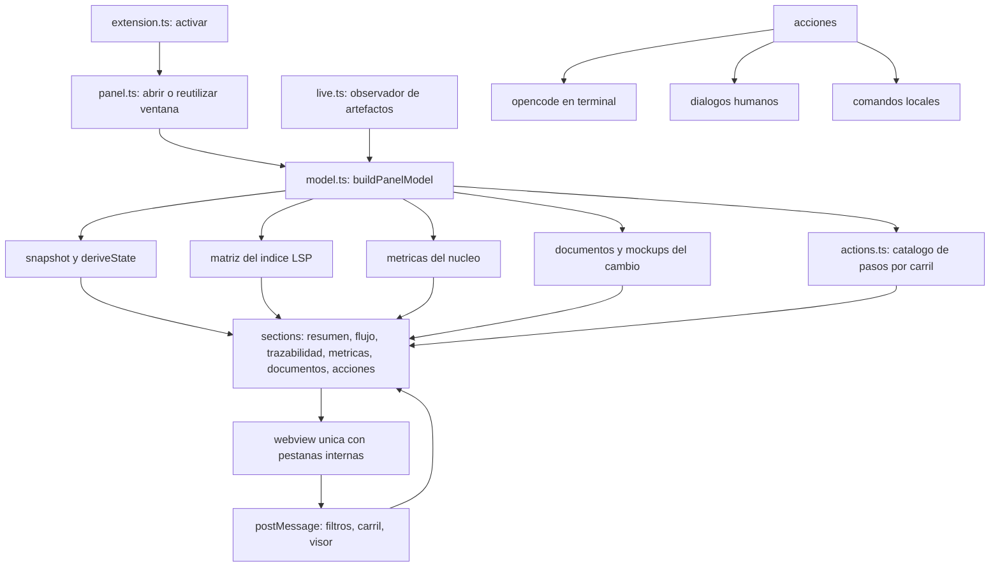
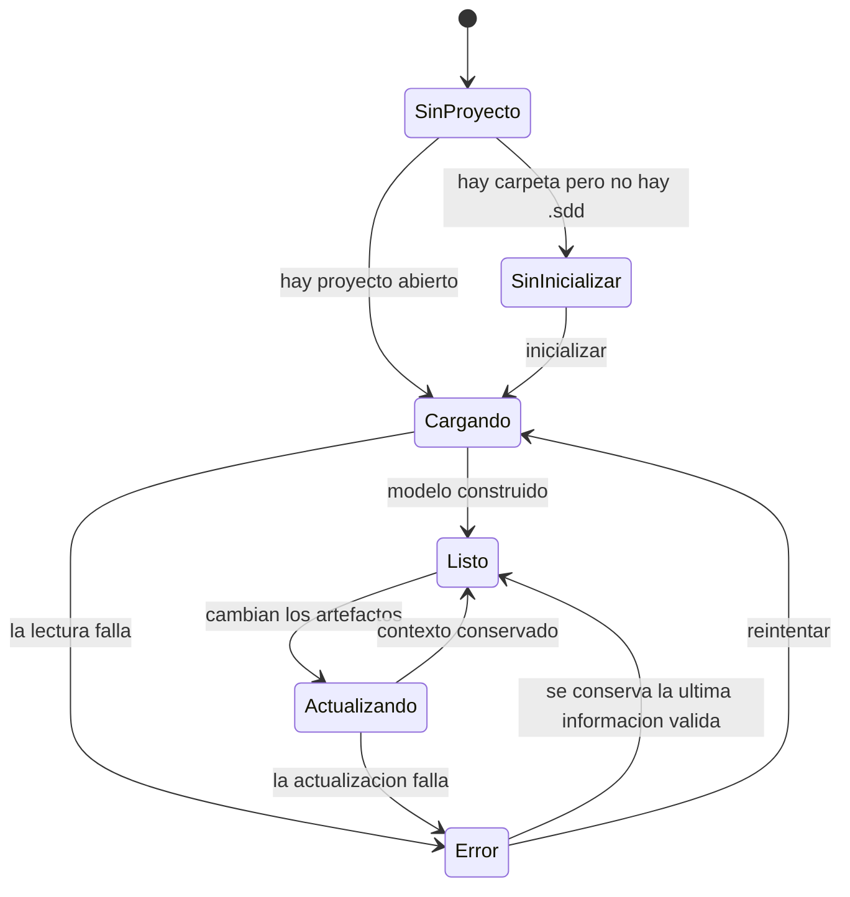
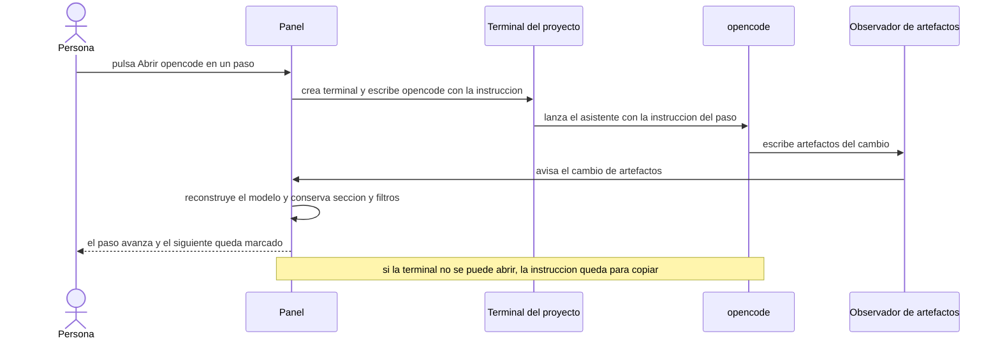
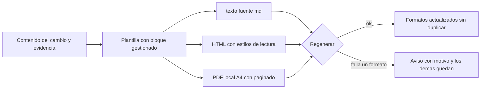

# Plan — Un panel principal único para la extensión

> **Cambio**: panel-principal
> **Carril**: standard
> **Dominio**: editor
> **Spec aprobada**: changes/panel-principal/spec.md · sha256:6405a9329c7f811af0288755aa2c3720e5fe6a6f055f882508ade6f4f38d6956 · Alonso Anchante · 2026-09-20 19:38
> **Contrato visual**: changes/panel-principal/mockups/manifest.yaml · 9 pantallas hifi (panel-resumen, panel-flujo, panel-trazabilidad, panel-metricas, panel-documentos, panel-acciones, panel-estados, presentacion, docs-formatos)
>
> Los artefactos aprobados no se editan: este plan y `tasks.md` son los únicos artefactos que produce esta fase.

## 1. Contexto AS-IS

Inventario real del repo (anclas al código):

- **Tres paneles sueltos**: `specatlas.matrix`, `specatlas.board` y `specatlas.metrics` se registran con `openLivePanel` (`packages/vscode/src/extension.ts:1315-1362`); `openLivePanel` crea un `createWebviewPanel` por clave (`extension.ts:546-557`) con registro en `packages/vscode/src/live.ts` (clave → panel, refresco por observador).
- **Renderizadores y estilos**: `matrixHtml` (`packages/vscode/src/panels.ts:440`), `boardHtml` (`panels.ts:588`), `metricsHtml` (`panels.ts:651`), sobre `panelPage` (`panels.ts:272`), `PANEL_CSS` (`panels.ts:31`) y scripts de filtros en línea (`panels.ts:345`, `panels.ts:405`).
- **Modelo de datos del panel**: `buildMatrix` (`packages/vscode/src/logic.ts:497`) usa el índice del LSP (`@specatlas/lsp` `buildIndex`); `buildSnapshot` (`logic.ts:171`) evalúa el cambio con `deriveState`; las métricas las calcula el núcleo (`packages/core/src/metrics.ts`) y se consumen en `extension.ts:1348-1362`.
- **Secciones que ya existen como capacidades**: vista previa de artefactos (`specatlas.openPreview`, `extension.ts:1209`), visor de mockups (`specatlas.mockup.open`, `extension.ts:906`), decisión de mockups (`extension.ts:885`), presentación (`specatlas.present`, `extension.ts:865`), verificación con formulario (`extension.ts:997`), aprobar (`extension.ts:1158`), archivar (`extension.ts:1185`), nuevo cambio (`extension.ts:921`), validar/CI/diagnóstico/adaptadores/packs (`extension.ts:742-1156`).
- **Acciones con agente**: `runNext` (`extension.ts:1286`) mapea acciones conocidas a comandos y, para las de agente, **copia la instrucción al portapapeles**; no abre terminal.
- **Vista lateral**: `toolGroups` (`logic.ts:570`) expone el grupo «Paneles» con Matriz, Tablero y Métricas; el árbol (`extension.ts:110-395`) muestra specs, cambios, fixes, histórico y archivos del cambio.
- **Presentación**: `generatePresentation` (`packages/core/src/present.ts`) escribe `presentation/index.html` con `page()` + `labelsFor()` y estilos de `@specatlas/render` (`renderStyles`), copia mockups y capturas, y refleja el estado de la firma (`verifyApproval`). El CLI `satlas present` (`packages/cli/src/commands/present.ts`) lo invoca.
- **Documentación**: `generateDocs` (`packages/core/src/docs.ts`) escribe **solo** `docs/tecnica.md` y `docs/manual.md` con bloque gestionado (`mergeManaged`); el CLI `satlas docs --tipo` (`packages/cli/src/commands/docs.ts`) reporta rutas. El gate de documentación (`lifecycle.ts:199-202`, solo carril `full`) comprueba `tecnica.md`/`manual.md` (`docsReady`, `lifecycle.ts:74`).
- **Renderizador**: `packages/render/src/index.ts` expone `renderStyles`, `renderMarkdown`, `renderDocument`, `tableOfContents`, `inlineMarkdown`, `escapeHtml` y `defaultTokens`; su única dependencia es `highlight.js`. **No hay generación de PDF en el repo.**
- **Empaquetado y pruebas**: monorepo pnpm con `core`, `render`, `lsp`, `cli`, `vscode` y `adapters`; pruebas con vitest (`packages/*/test/*.test.ts`); versiones por paquete y `CHANGELOG.md` en la raíz.

## 2. Enfoque técnico

- **Ventana única del panel** (`packages/vscode/src/panel/`): nuevo módulo `panel.ts` (controlador: abrir/reutilizar la ventana, enrutar secciones, conservar contexto y refrescar) y `sections/` (resumen, flujo, trazabilidad, métricas, documentos, acciones) que reutiliza los renderizadores actuales de `panels.ts` (movidos/refactorizados) y `logic.ts`. El panel se registra como `specatlas.panel` y sustituye a los tres comandos sueltos; la vista lateral pasa a un único acceso «Panel principal».
  - **Navegación interna**: pestañas como enlaces entre estados de la misma webview (`enableCommandUris` ya está activo) + `postMessage` para acciones internas (filtros, carril seleccionado, visor).
  - **Contexto**: sección activa y filtros en uso se guardan con `vscode.getState()/setState()` de la webview y se restauran en cada refresco (REQ-EDITOR-008-S2).
  - **Vivo**: se reutiliza `live.ts` (observador de artefactos) para reconstruir el modelo y repintar sin recargar; sin cambios en disco no se repinta (REQ-EDITOR-008-S3); un fallo de lectura informa y conserva la última información válida (REQ-EDITOR-008-S4).
- **Modelo del panel**: `buildPanelModel(root)` en `packages/vscode/src/panel/model.ts` que compone: snapshot (`buildSnapshot`), matriz (`buildMatrix`), métricas (`collectMetrics`), documentos y mockups del cambio activo, y el catálogo de acciones. Es puro y testeable (sin `vscode`).
- **Acciones por paso** (`packages/vscode/src/actions.ts`): catálogo puro con los pasos de cada carril (express, standard, full) y, por paso: id, título, actor (`agent` | `human` | `local`), comando, validez según estado y motivo cuando no aplica. La UI (stepper) se genera desde el catálogo y el encabezado muestra la acción del paso actual.
  - **Agente**: `vscode.window.createTerminal({ name: 'opencode', cwd: root })` + `sendText('opencode "<instrucción>"')` (REQ-EDITOR-007-S5); si la terminal falla, se copia la instrucción al portapapeles y se avisa el motivo (S6); un fallo de la acción no deja trabajo a medias (S4).
  - **Humanas**: aprobar (diálogo con nombre, huella y fecha, como hoy) y archivar (confirmación); **locales**: verificar, presentar, validar, CI, diagnóstico, adaptadores, contratos, actualizar esquema, enlazar repos, packs.
  - **Nuevo cambio**: asistente carril/título/dominio (reutiliza `createChange`) y deja el cambio en el primer paso (REQ-EDITOR-007-S8).
- **Sección Flujo**: carriles verticales por fase, incluida `awaiting_mockups` (hoy ausente de `BOARD_ORDER`, `panels.ts:576`), con filtros y contadores por fase (REQ-EDITOR-003).
- **Sección Documentos**: lista de documentos del cambio con formatos, visor de markdown dentro del panel (reutiliza `previewHtml`) y visor de mockups (reutiliza el manifiesto y `pathForScreen`); variantes: ausente, sin mockups, desactualizados, ilegible (REQ-EDITOR-006).
- **Presentación rediseñada** (`packages/core/src/present.ts`): nueva `page()` con el contrato visual — portada (identidad, estado de firma, huella), guía de secciones navegable, resumen de negocio, especificación completa, galería de mockups, bloque de firma y `@media print` (portada y firma en páginas propias, sin cortes). Se mantienen la copia de mockups/capturas, el hash y `verifyApproval` (firma vigente, pendiente u obsoleta) y los avisos de mockup faltante (REQ-EDITOR-009).
- **Documentación en tres formatos** (`packages/core/src/docs.ts` + `packages/render/src/pdf.ts`): el mismo contenido genera `tecnica.md`/`manual.md`, `tecnica.html`/`manual.html` y `tecnica.pdf`/`manual.pdf`. El PDF se arma localmente con `pdf-lib` (nueva dependencia de `@specatlas/render`): A4, márgenes, títulos, párrafos con ajuste de línea, listas, tablas simples, encabezado y pie con paginado. Si un formato falla, se avisa con el motivo y los demás quedan (REQ-EDITOR-010-S3); regenerar respeta el bloque gestionado en los tres formatos (S4).
- **Alternativas descartadas**:
  - Mantener los tres paneles y añadir un cuarto de resumen: contradice REQ-EDITOR-001 y BR-EDITOR-003.
  - Una webview por sección con pestañas externas: multiplica ventanas y ciclos de vida, y pierde el contexto al refrescar.
  - PDF con navegador headless (Playwright): dependencia pesada y no determinista; hoy Playwright es opcional y no está instalado.
  - Escribir el PDF a mano (sintaxis PDF cruda): más código y fragilidad de formato; `pdf-lib` es puro JavaScript y determinista.
  - Servicios externos de conversión: prohibido por BR-EDITOR-027.
  - Reescribir el documento completo al regenerar: perdería lo escrito a mano; se conserva el bloque gestionado.

## 3. Diagramas

### 3.1 Arquitectura del panel único (flowchart)

### 3.2 Estados de la ventana (stateDiagram-v2)

### 3.3 Acción con agente (sequenceDiagram)

### 3.4 Documentación en tres formatos (flowchart)

## 4. Diseño por capa/módulos

| Capa | Módulo | Responsabilidad | Archivos |
|---|---|---|---|
| Editor | `panel/panel.ts` | ventana única, pestañas internas, contexto, refresco | `packages/vscode/src/panel/panel.ts`, `packages/vscode/src/extension.ts`, `packages/vscode/src/live.ts` |
| Editor | `panel/model.ts` | modelo del panel (puro) | `packages/vscode/src/panel/model.ts` |
| Editor | `panel/sections/*.ts` | HTML por sección (resumen, flujo, trazabilidad, métricas, documentos, acciones) | `packages/vscode/src/panel/sections/`, `packages/vscode/src/panels.ts`, `packages/vscode/src/logic.ts` |
| Editor | `actions.ts` | catálogo de pasos por carril con actor y validez | `packages/vscode/src/actions.ts`, `packages/core/src/lifecycle.ts` |
| Editor | Acciones | ejecución (terminal opencode, diálogos, comandos locales) y fallback | `packages/vscode/src/extension.ts` |
| Núcleo | Presentación | rediseño del HTML de presentación y firma | `packages/core/src/present.ts`, `packages/render/src/index.ts` |
| Núcleo | Documentación | tres formatos con bloque gestionado | `packages/core/src/docs.ts`, `packages/render/src/pdf.ts` |
| Núcleo | Gates/estado | sin cambios de comportamiento; se mantiene `docsReady` sobre el texto fuente | `packages/core/src/lifecycle.ts` |
| CLI | `docs`, `present` | reportan formatos y rutas | `packages/cli/src/commands/docs.ts`, `packages/cli/src/commands/present.ts` |
| Editor | Vista lateral | acceso único al panel | `packages/vscode/src/logic.ts`, `packages/vscode/package.json` |
| Pruebas | vitest | modelo, secciones, acciones, PDF, presentación | `packages/vscode/test/`, `packages/core/test/`, `packages/render/test/` |
| Docs | guía | README y ARQUITECTURA | `README.md`, `ARQUITECTURA.md`, `CHANGELOG.md` |

## 5. Matriz de trazabilidad (REQ → tareas)

| Requisito | Tareas |
|---|---|
| REQ-EDITOR-001 | T1.1, T1.2, T1.4, T5.1 |
| REQ-EDITOR-002 | T1.1, T2.1, T5.1 |
| REQ-EDITOR-003 | T2.2, T5.1 |
| REQ-EDITOR-004 | T2.3, T5.1 |
| REQ-EDITOR-005 | T2.4, T5.1 |
| REQ-EDITOR-006 | T2.5, T5.1 |
| REQ-EDITOR-007 | T3.1, T3.2, T3.3, T3.4, T3.5, T5.1 |
| REQ-EDITOR-008 | T1.3, T5.1 |
| REQ-EDITOR-009 | T4.1, T4.2, T5.2 |
| REQ-EDITOR-010 | T4.3, T4.4, T5.2 |

## 6. Matriz de paridad AS-IS → TO-BE

| AS-IS | TO-BE | Paridad |
|---|---|---|
| Panel «Matriz de trazabilidad» (`matrixHtml`) | Sección «Trazabilidad» del panel | Mismos datos, filtros, resaltado y apertura en línea; mismos huecos primero |
| Panel «Tablero» (`boardHtml`, 9 fases) | Sección «Flujo» (vertical) | Mismos cambios y filtros, **más** la fase «esperando mockups» |
| Panel «Métricas» (`metricsHtml`) | Sección «Métricas» | Mismos indicadores; «Evidencia por método» pasa dentro de «Evidencia» |
| Comandos `specatlas.matrix` / `board` / `metrics` | Retirados; acceso único «Panel principal» | Sin pérdida: la información vive en el panel |
| `runNext`: copia la instrucción al portapapeles | Abre opencode en terminal con la instrucción; copiar queda como respaldo | Mejora: menos pasos manuales |
| `presentation/index.html` (diseño actual) | Presentación rediseñada con portada, guía, galería y firma | Mismo contenido y firma; mejor lectura e impresión |
| `docs/*.md` | `docs/*.md` + `*.html` + `*.pdf` | Mismo texto fuente; se añaden dos formatos |
| `docsReady` (gate del carril full) | Igual (texto fuente) | Sin cambio de veredicto |

## 7. Tareas (referencia)

El desglose vive en `tasks.md`: 5 bloques, 23 tareas, con trazabilidad por escenario y olas calculadas por `satlas waves`.

## 8. Riesgos y mitigaciones

| Riesgo | Mitigación |
|---|---|
| La webview pierde el contexto al refrescar | Sección y filtros en `getState/setState`; prueba de contexto conservado (T5.1) |
| El panel único crece y se vuelve lento de pintar | Modelo puro y memoizado; se repinta solo la sección activa; medir con la matriz real del repo |
| La terminal de opencode no existe o falla en algún entorno | Fallback a copiar la instrucción con aviso del motivo (T3.3, escenario S6) |
| `pdf-lib` añade peso al paquete | Dependencia solo en `@specatlas/render`; el PDF se genera bajo demanda; alternativa sin dependencia descartada por fragilidad |
| Acentos y símbolos en el PDF | Fuentes estándar con codificación WinAnsi; prueba con textos reales del repo (T5.2) |
| Retirar los paneles rompe enlaces o menús existentes | Revisar `contributes` y menús del editor en T1.4; mantener la paleta con el acceso único |
| Regenerar documentación pisa ediciones manuales | Bloque gestionado también en HTML y PDF; prueba de regeneración (T5.2) |
| El stepper muestra acciones no válidas como disponibles | Catálogo con validez y motivo; prueba de acción no válida (T5.1, escenario S2) |

## 9. Rollback

- Revertir los commits del cambio: `panel/` nuevo, los renderizadores movidos y los comandos retirados vuelven a `panels.ts`/`extension.ts` con `git revert`.
- La presentación y `docs.ts` son sustituciones internas: revertir el commit restaura el diseño y los formatos anteriores sin tocar artefactos aprobados.
- `pdf-lib` se retira de `packages/render/package.json` si se revierte T4.3.
- Los artefactos del cambio (spec, plan, tareas, mockups) no se tocan en el rollback de código.

## 10. Dependencias y supuestos

- **Dependencia nueva**: `pdf-lib` en `@specatlas/render` (pura JavaScript, sin servicios externos).
- **Supuestos**: la extensión sigue siendo la única superficie del editor; el índice del LSP expone lo que necesitan las secciones; `opencode` está disponible en el PATH del proyecto (si no, se usa el respaldo de copiar).
- **Talla y confianza**: el cambio es **grande** (5 bloques, 23 tareas); confianza **alta** en las secciones que reutilizan código existente y **media** en el PDF local (layout propio) y en el rediseño de la presentación (juicio visual del usuario sobre el contrato aprobado).
