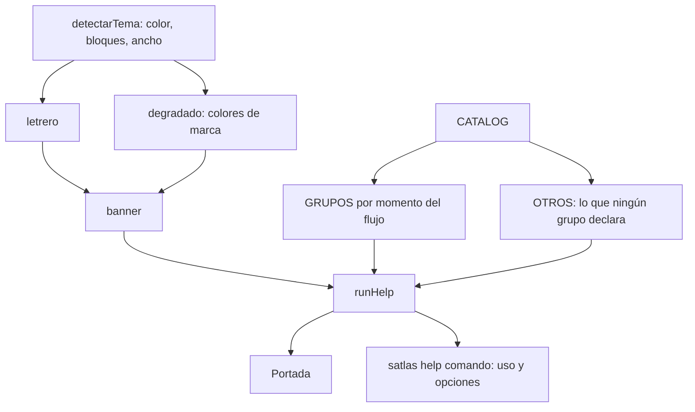

# Plan — La ayuda es la portada de la herramienta

## 1. Contexto AS-IS

`runHelp` en `packages/cli/src/commands/help.ts` recorría `CATALOG` en su orden de declaración y escribía una línea por comando: nombre y descripción, los 39 seguidos, sin agrupación ni jerarquía. La respuesta no identificaba la herramienta ni su versión, y no destacaba ninguna acción.

Dos defectos de enrutado convivían con eso: `cli.ts` despachaba `help: (ctx) => runHelp(ctx)` sin pasar el positional, así que `satlas help verify` devolvía el catálogo entero en vez de la ayuda de `verify` (el camino de `--help` sí lo pasaba, y por eso el defecto no se notaba). Y las descripciones del catálogo son largas: en una ventana de 80 columnas se partían.

`ui.ts` ya concentraba la presentación (tema, color, símbolos, alineación) desde REQ-CLI-004 y REQ-CLI-005, pero no sabía nada de la marca.

## 2. Enfoque técnico

La portada se arma con dos piezas nuevas en `ui.ts`, que sigue sin conocer ningún comando:

- **El letrero**: el nombre escrito con bloques, cinco filas de cinco columnas por letra. Cinco filas y no dos porque con dos la `E` y la `C` comparten glifo y el nombre se lee «SPCCATLAS». `letrero()` devuelve nada cuando la consola no dibuja bloques o la ventana es más estrecha que el letrero, y entonces la portada escribe el nombre normal.
- **El degradado de marca**: `MARCA`, `colorMarca`, `pintaRGB` y `degradado` interpolan los tres colores de `BRAND.md` (`#14B8A6` → `#2563EB` → `#7C3AED`). Se aplica por columna, así que las cinco filas del letrero casan en color. Sin 24 bits el degradado cae a un color plano, no a texto sin color.

`help.ts` pasa a agrupar el catálogo por el momento del flujo en que se usa cada comando. Los grupos son una tabla de nombres, no una propiedad del catálogo: así se reordenan sin tocar la definición de los comandos. Un bloque final recoge lo que ningún grupo declara, de modo que un comando nuevo aparece aunque nadie actualice la tabla.

Las descripciones se recortan con `truncar`, al ancho que queda de ventana y por la última palabra entera.

Alternativas descartadas:

- **Un dibujo del logotipo en caracteres**: se probó el rombo con la ruta de tres nodos de `media/atlas.svg`. A la resolución de una celda de terminal el símbolo no se reconoce como el de la marca, y el nombre se lee mejor que cualquier aproximación del dibujo.
- **Declarar el grupo en cada comando del catálogo**: obligaría a tocar 39 entradas para reordenar la ayuda.
- **Una dependencia de banners** (`figlet` y similares): el CLI se distribuye como un artefacto único y aquí hacen falta siete letras.

## 3. Diagramas

## 4. Diseño por capa / módulos

| Módulo | Responsabilidad |
|---|---|
| `cli/src/ui.ts` | Letrero del nombre, colores de marca, degradado, recorte al ancho |
| `cli/src/commands/help.ts` | Grupos por momento del flujo, línea destacada, ayuda de un comando, pie |
| `cli/src/cli.ts` | Pasar el comando pedido a la ayuda |

## 5. Matriz de trazabilidad (REQ → tareas)

| Requisito | Tareas |
|---|---|
| REQ-CLI-006 | T1.1, T1.2, T1.3, T1.4 |

## 6. Matriz de paridad AS-IS → TO-BE

| Antes | Después |
|---|---|
| Sin identificación: se entraba directo a la lista | Nombre en grande, versión y para qué sirve |
| 39 comandos en orden de catálogo | Seis grupos por momento del flujo, cada uno con su propósito |
| Nada destacado | `satlas next` antes del catálogo |
| `satlas help verify` devolvía todo el catálogo | Uso y opciones de ese comando |
| Descripciones partidas en ventanas estrechas | Recortadas por la última palabra entera |
| Sin cierre | Códigos de salida y dónde consultar más |

## 7. Tareas (ver tasks.md)

## 8. Riesgos y mitigaciones

| Riesgo | Mitigación |
|---|---|
| Un comando nuevo se queda fuera de los grupos | Bloque final con lo no declarado y una prueba que recorre todo el catálogo |
| Los bloques no se dibujan en consolas antiguas | `letrero` devuelve nada y la portada escribe el nombre normal |
| El letrero no cabe en una ventana estrecha | Se compara el ancho de la ventana con el del letrero antes de dibujarlo |
| Dos letras comparten glifo y el nombre se lee mal | Prueba que compara los glifos letra a letra |
| El degradado ensucia terminales sin 24 bits | Se detecta el soporte y se cae a un color plano |

## 9. Rollback

Revertir el commit: la ayuda vuelve a la lista plana. No cambia ningún artefacto ni ningún dato del proyecto.

## 10. Dependencias y supuestos

- Sin dependencias nuevas: bloques Unicode y secuencias ANSI.
- Los colores salen de `BRAND.md`; si la marca cambia, se cambia `MARCA`.
- `--json` sigue sin adornos: la portada es solo para la salida de texto.
