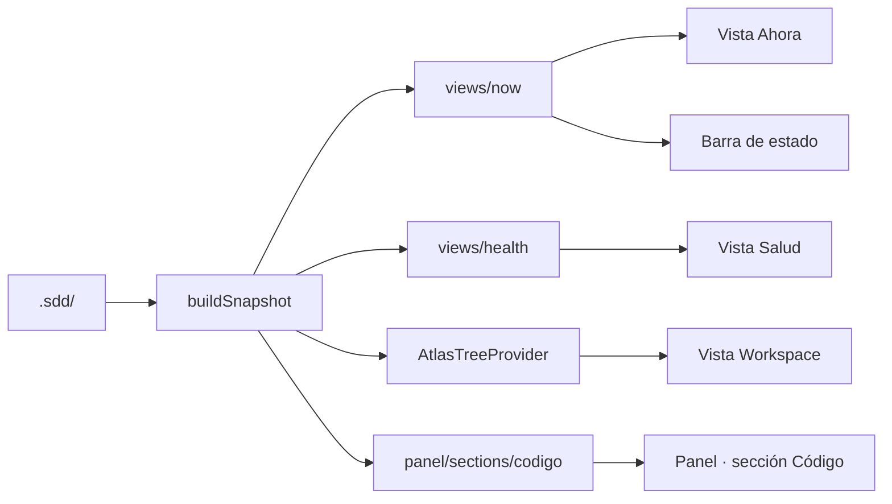

<!-- specatlas:generado:inicio -->
# Documentación técnica — Rediseño del panel lateral y la extensión

> **Cambio**: `rediseno-editor` · **Dominio**: editor · **Carril**: full · **Tareas**: 7/7 · **Actualizado**: 2026-09-21

## 1. Resumen del cambio

Este documento describe **Rediseño del panel lateral y la extensión** (cambio `rediseno-editor`), del dominio **editor** y carril **full**. Recoge el porqué, el estado anterior, el enfoque técnico, los diagramas, el mapa de archivos, la trazabilidad completa y la evidencia con la que se dio por terminado.

| Dato | Valor |
|---|---|
| Requisitos del cambio | 4 (3 nuevos, 1 modificados) |
| Escenarios especificados | 20 |
| Tareas | 7 hechas de 7 · 2 bloque(s) |
| Evidencia | 20 / 20 escenarios |
| Archivos tocados | 10 |
| Mockups | 0 pantalla(s) |
| Carril y dominio | full · editor |

## 2. Qué es y por qué

Como desarrollador que trabaja con el flujo todos los días, quiero abrir el editor y ver de inmediato qué me toca hacer, para no perder tiempo recordando en qué fase quedó cada cambio ni recorriendo el árbol del proyecto.

Hoy el panel lateral muestra el proyecto como un árbol: para llegar a la acción que toca hay que abrir el nodo del proyecto, luego el grupo de cambios, luego el cambio. La información más útil —qué sigue, qué está bloqueado, qué detiene el avance— queda a tres niveles de profundidad. Los hallazgos llegan como una lista plana donde un aviso menor pesa lo mismo que algo que detiene el trabajo. Y lo que el flujo aprendió a comprobar recientemente —si el código se movió por debajo de las specs vivas y si la revisión quedó cerrada— no se ve en ninguna parte del editor.

## 3. Qué cambia, en lenguaje de negocio

### REQ-EDITOR-012 — El panel lateral abre con lo que toca hacer ahora

Al abrir el editor, el equipo necesita saber en un vistazo qué le toca hacer, sin recorrer el árbol del proyecto ni recordar en qué fase quedó cada cambio. La primera sección del panel lateral responde a esa única pregunta y deja la acción a un clic.

**Reglas de negocio**

- `BR-EDITOR-012` — La primera sección del panel lateral muestra los cambios en curso, el más urgente desplegado, y su primer elemento es siempre la siguiente acción del cambio.
- `BR-EDITOR-013` — Cada siguiente acción declara quién la ejecuta —el asistente, una persona o la propia herramienta— y se lanza desde el mismo elemento.
- `BR-EDITOR-014` — Junto a la acción se muestran los bloqueos vigentes, los hallazgos que detienen el avance, el avance de tareas y evidencia, y el estado de la revisión y de los mockups cuando el cambio los declara.
- `BR-EDITOR-015` — Sin cambios en curso, la sección ofrece por dónde empezar: crear un cambio, adoptar un proyecto existente o abrir el panel principal.

**Escenarios**: 5 · 3 de uso · 1 de estado vacío · 1 de error o aviso.

### REQ-EDITOR-013 — Una sección de salud agrupa lo que hay que resolver

Los hallazgos llegan hoy como una lista plana en la que todo pesa igual. El equipo necesita distinguir lo que detiene el trabajo de lo que solo avisa, y ver aparte cuándo el código se movió por debajo de las specs vivas.

**Reglas de negocio**

- `BR-EDITOR-016` — La sección de salud agrupa los hallazgos en los que bloquean el avance y los que solo avisan, con el conteo de cada grupo.
- `BR-EDITOR-017` — La deriva entre las specs vivas y el código es un grupo propio, que indica el modo configurado y qué ancla dejó de existir.
- `BR-EDITOR-018` — Cada hallazgo abre el archivo y la línea donde ocurre, y permite consultar la explicación de su código.
- `BR-EDITOR-019` — Sin hallazgos ni deriva, la sección lo dice en una línea en vez de quedarse vacía.
- `BR-EDITOR-020` — El número de hallazgos que bloquean se anuncia en la propia sección, sin abrirla.

**Escenarios**: 5 · 2 de uso · 2 de estado vacío · 1 de error o aviso.

### REQ-EDITOR-014 — El estado del trabajo acompaña sin estorbar

El equipo trabaja en el código, no en el panel. Necesita saber en qué punto está el cambio sin cambiar de ventana, y encontrar la puerta de entrada cuando el proyecto todavía no usa el flujo.

**Reglas de negocio**

- `BR-EDITOR-021` — La barra de estado del editor muestra el cambio en foco y el paso que toca, y llevar al panel lateral desde ahí es un solo gesto.
- `BR-EDITOR-022` — Cuando el cambio está bloqueado, la barra de estado lo distingue visualmente.
- `BR-EDITOR-023` — Si el proyecto todavía no usa el flujo, el panel lateral explica qué es y ofrece inicializarlo o adoptar el proyecto existente.

**Escenarios**: 4 · 1 de uso · 2 de estado vacío · 1 de error o aviso.

### REQ-EDITOR-001 — Un único panel principal reúne el trabajo

El equipo necesita un solo punto de entrada en el editor: hoy el estado, el flujo de los cambios, la trazabilidad y las métricas viven en ventanas separadas, hay que abrir una para cada tema y el trabajo queda disperso. Un panel principal único, con secciones internas, reúne la información y las acciones en un mismo lugar. Entre esas secciones está la que relaciona las specs vivas con el código: dónde vive cada requisito, si alguna de esas referencias dejó de existir y en qué estado quedó la revisión del cambio.

**Reglas de negocio**

- `BR-EDITOR-001` — El panel principal es el único punto de entrada de la herramienta en el editor y reúne, en secciones internas, el resumen, el flujo de los cambios, la trazabilidad, la relación con el código, las métricas, los documentos y las acciones; cambiar de sección no abre ventanas nuevas.
- `BR-EDITOR-002` — El panel principal es único: si ya está abierto, pedirlo de nuevo lo reutiliza y activa la sección pedida; nunca se duplica.
- `BR-EDITOR-003` — Las ventanas independientes de matriz, tablero y métricas dejan de existir; su información se consulta en el panel principal.
- `BR-EDITOR-024` — La sección que relaciona las specs con el código declara cuántas referencias se comprobaron, cuáles dejaron de existir y el estado de la revisión del cambio en curso.

**Escenarios**: 6 · 4 de uso · 2 de estado vacío · 0 de error o aviso.

## 4. Cómo estaba antes (AS-IS)

La extensión (`packages/vscode/`) contribuye hoy dos vistas en su contenedor de la barra de actividad: `specatlas.explorer` (árbol del workspace, `AtlasTreeProvider`) y `specatlas.tools` (lista de comandos, `ToolsProvider`). El árbol anida todo bajo un nodo con el nombre del proyecto, y dentro de él los grupos Specs vivas → Cambios → Fixes → Histórico: llegar a la siguiente acción exige tres aperturas.

`buildSnapshot` (`src/logic.ts`) ya calcula por cambio el estado derivado, el progreso, los bloqueos y los hallazgos, y el panel principal (`src/panel/`) los pinta en seis secciones. Lo que el núcleo aprendió a comprobar hace poco —`checkDrift` sobre las anclas de las specs vivas y el estado de `review.md`— no llega al snapshot y, por tanto, no se ve en el editor.

La barra de estado existe pero muestra un recuento (`N cambios · N errores`) que no dice qué hacer.

## 5. Enfoque técnico y decisiones

Separar **modelo** de **presentación**: cada vista nueva se construye en un módulo puro y testeable (`src/views/*.ts`) que recibe el `Snapshot` y devuelve nodos; `extension.ts` se limita a traducir esos nodos a `TreeItem`. Así la lógica de la interfaz se prueba con `vitest` sin arrancar VS Code, igual que ya se hace con el panel.

Un único `ModelTreeProvider` genérico sirve a las dos vistas nuevas: el contrato del nodo (id, etiqueta, descripción, icono, tono, comando, hijos) es el mismo, y evita duplicar el proveedor.

Alternativas descartadas:
- **Un webview para la barra lateral**: daría más libertad visual, pero pierde la integración nativa (menús contextuales, badges, teclado, temas) y encarece el mantenimiento.
- **Reescribir `AtlasTreeProvider`**: el árbol del workspace funciona y tiene detalle rico (requisitos, tareas, mockups); se cambia solo su raíz.

## 6. Diagramas

## 7. Diseño por capas y componentes

| Módulo | Responsabilidad |
|---|---|
| `src/logic.ts` | Suma al snapshot la deriva de anclas (`checkDrift`) y el estado de la revisión por cambio |
| `src/views/now.ts` | Modelo de la vista «Ahora»: cambio en foco, acción, actor, bloqueos, progreso; texto de la barra de estado |
| `src/views/health.ts` | Modelo de la vista «Salud»: grupos por severidad, deriva, badge |
| `src/extension.ts` | `ModelTreeProvider`, alta de vistas, barra de estado, comandos nuevos, raíz del árbol aplanada |
| `src/panel/sections/codigo.ts` | Sección «Código» del panel principal |
| `package.json` | Vistas, bienvenida, comandos y menús |

## 8. Mapa de archivos

Cada archivo, la tarea que lo tocó y el requisito al que responde.

| Archivo | Tareas | Requisitos que cubre |
|---|---|---|
| `packages/vscode/package.json` | T1.4 | REQ-EDITOR-014 |
| `packages/vscode/src/extension.ts` | T1.3 | REQ-EDITOR-013 |
| `packages/vscode/src/logic.ts` | T2.2 | REQ-EDITOR-001 |
| `packages/vscode/src/panel/panel.ts` | T2.1 | REQ-EDITOR-001 |
| `packages/vscode/src/panel/sections/codigo.ts` | T2.1 | REQ-EDITOR-001 |
| `packages/vscode/src/views/health.ts` | T1.2 | REQ-EDITOR-013 |
| `packages/vscode/src/views/now.ts` | T1.1 | REQ-EDITOR-012 |
| `packages/vscode/test/panel-scenarios.test.ts` | T2.3 | REQ-EDITOR-001 |
| `packages/vscode/test/panel.test.ts` | T2.3 | REQ-EDITOR-001 |
| `packages/vscode/test/views.test.ts` | T1.1 | REQ-EDITOR-012 |

## 9. Trazabilidad requisito → escenario → tarea → evidencia

4 requisito(s) · 20 escenario(s) · 20 con tarea · 20 con evidencia favorable · **0 hueco(s)**.

| Requisito | Escenario | Tareas | Evidencia |
|---|---|---|---|
| REQ-EDITOR-012 | `REQ-EDITOR-012-S1` Un cambio en curso | T1.1 | pass |
| REQ-EDITOR-012 | `REQ-EDITOR-012-S2` Varios cambios a la vez | T1.1 | pass |
| REQ-EDITOR-012 | `REQ-EDITOR-012-S3` La acción la firma una persona | T1.1 | pass |
| REQ-EDITOR-012 | `REQ-EDITOR-012-S4` El cambio está bloqueado | T1.1 | pass |
| REQ-EDITOR-012 | `REQ-EDITOR-012-S5` Sin cambios en curso | T1.1 | pass |
| REQ-EDITOR-013 | `REQ-EDITOR-013-S1` Hallazgos de distinto peso | T1.2 | pass |
| REQ-EDITOR-013 | `REQ-EDITOR-013-S2` Abrir un hallazgo | T1.2 | pass |
| REQ-EDITOR-013 | `REQ-EDITOR-013-S3` El código se movió | T1.2 | pass |
| REQ-EDITOR-013 | `REQ-EDITOR-013-S4` Proyecto sano | T1.2 | pass |
| REQ-EDITOR-013 | `REQ-EDITOR-013-S5` Explicar un código | T1.3 | pass |
| REQ-EDITOR-014 | `REQ-EDITOR-014-S1` Trabajo en curso | T1.4 | pass |
| REQ-EDITOR-014 | `REQ-EDITOR-014-S2` Trabajo bloqueado | T1.4 | pass |
| REQ-EDITOR-014 | `REQ-EDITOR-014-S3` Proyecto sin el flujo | T1.4 | pass |
| REQ-EDITOR-014 | `REQ-EDITOR-014-S4` Sin cambios en curso | T1.4 | pass |
| REQ-EDITOR-001 | `REQ-EDITOR-001-S1` Abrir el panel principal | T2.3 | pass |
| REQ-EDITOR-001 | `REQ-EDITOR-001-S2` Cambiar de sección | T2.3 | pass |
| REQ-EDITOR-001 | `REQ-EDITOR-001-S3` El panel ya estaba abierto | T2.2 | pass |
| REQ-EDITOR-001 | `REQ-EDITOR-001-S4` Proyecto sin inicializar | T2.2 | pass |
| REQ-EDITOR-001 | `REQ-EDITOR-001-S5` Sin proyecto abierto | T2.3 | pass |
| REQ-EDITOR-001 | `REQ-EDITOR-001-S6` La relación con el código | T2.1 | pass |

## 10. Pruebas y evidencia

20 de 20 escenario(s) con evidencia favorable (20 ejecutable). Registrada por Alonso Anchante entre el 2026-09-21 y el 2026-09-21.

| Escenario | Qué se comprobó | Método | Resultado | Fecha |
|---|---|---|---|---|
| `REQ-EDITOR-012-S1` | Un cambio en curso | executable | pass | 2026-09-21 12:44 |
| `REQ-EDITOR-012-S2` | Varios cambios a la vez | executable | pass | 2026-09-21 12:44 |
| `REQ-EDITOR-012-S3` | La acción la firma una persona | executable | pass | 2026-09-21 12:44 |
| `REQ-EDITOR-012-S4` | El cambio está bloqueado | executable | pass | 2026-09-21 12:44 |
| `REQ-EDITOR-012-S5` | Sin cambios en curso | executable | pass | 2026-09-21 12:44 |
| `REQ-EDITOR-013-S1` | Hallazgos de distinto peso | executable | pass | 2026-09-21 12:44 |
| `REQ-EDITOR-013-S2` | Abrir un hallazgo | executable | pass | 2026-09-21 12:44 |
| `REQ-EDITOR-013-S3` | El código se movió | executable | pass | 2026-09-21 12:45 |
| `REQ-EDITOR-013-S4` | Proyecto sano | executable | pass | 2026-09-21 12:45 |
| `REQ-EDITOR-013-S5` | Explicar un código | executable | pass | 2026-09-21 12:45 |
| `REQ-EDITOR-014-S1` | Trabajo en curso | executable | pass | 2026-09-21 12:45 |
| `REQ-EDITOR-014-S2` | Trabajo bloqueado | executable | pass | 2026-09-21 12:45 |
| `REQ-EDITOR-014-S3` | Proyecto sin el flujo | executable | pass | 2026-09-21 12:45 |
| `REQ-EDITOR-014-S4` | Sin cambios en curso | executable | pass | 2026-09-21 12:45 |
| `REQ-EDITOR-001-S1` | Abrir el panel principal | executable | pass | 2026-09-21 12:45 |
| `REQ-EDITOR-001-S2` | Cambiar de sección | executable | pass | 2026-09-21 12:45 |
| `REQ-EDITOR-001-S3` | El panel ya estaba abierto | executable | pass | 2026-09-21 12:45 |
| `REQ-EDITOR-001-S4` | Proyecto sin inicializar | executable | pass | 2026-09-21 12:45 |
| `REQ-EDITOR-001-S5` | Sin proyecto abierto | executable | pass | 2026-09-21 12:46 |
| `REQ-EDITOR-001-S6` | La relación con el código | executable | pass | 2026-09-21 12:46 |

### 10.1 Cómo se reproduce la evidencia

Comandos con los que se obtuvo la evidencia ejecutable:

- `npx vitest run packages/vscode/test/views.test.ts` — 9 escenario(s)
- `npx vitest run packages/vscode/test/panel.test.ts packages/vscode/test/panel-scenarios.test.ts` — 6 escenario(s)
- `npx vitest run packages/cli/test/dx-ola3.test.ts packages/vscode/test/views.test.ts` — 5 escenario(s)

## 11. Riesgos y mitigaciones

| Riesgo | Mitigación |
|---|---|
| `checkDrift` recorre el repositorio en cada refresco del snapshot | El listado de archivos se calcula una sola vez por llamada y solo cuando hay anclas declaradas |
| Un snapshot de una versión anterior no trae la deriva | Los modelos la tratan como opcional y asumen «sin anclas» |
| Demasiadas vistas compiten por el espacio | «Salud» y «Acciones» nacen plegadas; «Ahora» y «Workspace», abiertas |

## 12. Cómo se revierte

Revertir el commit del rediseño: las vistas nuevas y la sección del panel desaparecen, y el árbol vuelve a su raíz anterior. No hay cambios en los artefactos de `.sdd/`, así que no hay estado que migrar.

## 13. Pendientes y deuda conocida

El informe de consistencia del cambio está en `analyze.md`: explica qué se comprobó antes de dar el cambio por cerrado.
<!-- specatlas:generado:fin -->

## Notas

(Escribe aquí lo que quieras conservar entre regeneraciones.)
