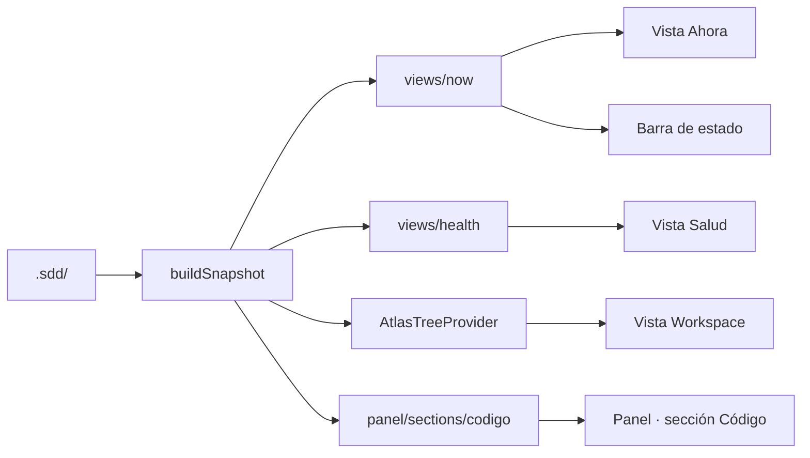

# Plan — Rediseño del panel lateral y la extensión

## 1. Contexto AS-IS

La extensión (`packages/vscode/`) contribuye hoy dos vistas en su contenedor de la barra de actividad: `specatlas.explorer` (árbol del workspace, `AtlasTreeProvider`) y `specatlas.tools` (lista de comandos, `ToolsProvider`). El árbol anida todo bajo un nodo con el nombre del proyecto, y dentro de él los grupos Specs vivas → Cambios → Fixes → Histórico: llegar a la siguiente acción exige tres aperturas.

`buildSnapshot` (`src/logic.ts`) ya calcula por cambio el estado derivado, el progreso, los bloqueos y los hallazgos, y el panel principal (`src/panel/`) los pinta en seis secciones. Lo que el núcleo aprendió a comprobar hace poco —`checkDrift` sobre las anclas de las specs vivas y el estado de `review.md`— no llega al snapshot y, por tanto, no se ve en el editor.

La barra de estado existe pero muestra un recuento (`N cambios · N errores`) que no dice qué hacer.

## 2. Enfoque técnico

Separar **modelo** de **presentación**: cada vista nueva se construye en un módulo puro y testeable (`src/views/*.ts`) que recibe el `Snapshot` y devuelve nodos; `extension.ts` se limita a traducir esos nodos a `TreeItem`. Así la lógica de la interfaz se prueba con `vitest` sin arrancar VS Code, igual que ya se hace con el panel.

Un único `ModelTreeProvider` genérico sirve a las dos vistas nuevas: el contrato del nodo (id, etiqueta, descripción, icono, tono, comando, hijos) es el mismo, y evita duplicar el proveedor.

Alternativas descartadas:
- **Un webview para la barra lateral**: daría más libertad visual, pero pierde la integración nativa (menús contextuales, badges, teclado, temas) y encarece el mantenimiento.
- **Reescribir `AtlasTreeProvider`**: el árbol del workspace funciona y tiene detalle rico (requisitos, tareas, mockups); se cambia solo su raíz.

## 3. Diagramas

## 4. Diseño por capa / módulos

| Módulo | Responsabilidad |
|---|---|
| `src/logic.ts` | Suma al snapshot la deriva de anclas (`checkDrift`) y el estado de la revisión por cambio |
| `src/views/now.ts` | Modelo de la vista «Ahora»: cambio en foco, acción, actor, bloqueos, progreso; texto de la barra de estado |
| `src/views/health.ts` | Modelo de la vista «Salud»: grupos por severidad, deriva, badge |
| `src/extension.ts` | `ModelTreeProvider`, alta de vistas, barra de estado, comandos nuevos, raíz del árbol aplanada |
| `src/panel/sections/codigo.ts` | Sección «Código» del panel principal |
| `package.json` | Vistas, bienvenida, comandos y menús |

## 5. Matriz de trazabilidad (REQ → tareas)

| Requisito | Tareas |
|---|---|
| REQ-EDITOR-012 | T1.1, T1.4 |
| REQ-EDITOR-013 | T1.2, T1.3 |
| REQ-EDITOR-014 | T1.4 |
| REQ-EDITOR-001 | T2.1, T2.2, T2.3 |

## 6. Matriz de paridad AS-IS → TO-BE

| Antes | Después |
|---|---|
| Árbol con nodo de proyecto y grupos anidados | Grupos en la raíz con un solo workspace; Cambios primero |
| Siguiente acción dentro del cambio, a tres aperturas | Primera sección del panel lateral, visible al abrir |
| Hallazgos en lista plana | Agrupados: bloquean / avisan / deriva |
| Deriva y revisión solo en la terminal | Vista de salud y sección Código del panel |
| Barra de estado con recuentos | Cambio en foco y paso que toca, con aviso visual si bloquea |

## 7. Tareas (ver tasks.md)

## 8. Riesgos y mitigaciones

| Riesgo | Mitigación |
|---|---|
| `checkDrift` recorre el repositorio en cada refresco del snapshot | El listado de archivos se calcula una sola vez por llamada y solo cuando hay anclas declaradas |
| Un snapshot de una versión anterior no trae la deriva | Los modelos la tratan como opcional y asumen «sin anclas» |
| Demasiadas vistas compiten por el espacio | «Salud» y «Acciones» nacen plegadas; «Ahora» y «Workspace», abiertas |

## 9. Rollback

Revertir el commit del rediseño: las vistas nuevas y la sección del panel desaparecen, y el árbol vuelve a su raíz anterior. No hay cambios en los artefactos de `.sdd/`, así que no hay estado que migrar.

## 10. Dependencias y supuestos

- `@specatlas/core` ya expone `checkDrift`, `loadAllAnchors`, `pruneAnchors`, `reviewPassed`, `openBlockingFindings`, `explainDiagnostic` e `impactOf*`.
- La lógica de la interfaz se prueba con `vitest` sobre los módulos puros; no se requiere `@vscode/test-electron` para este cambio.
