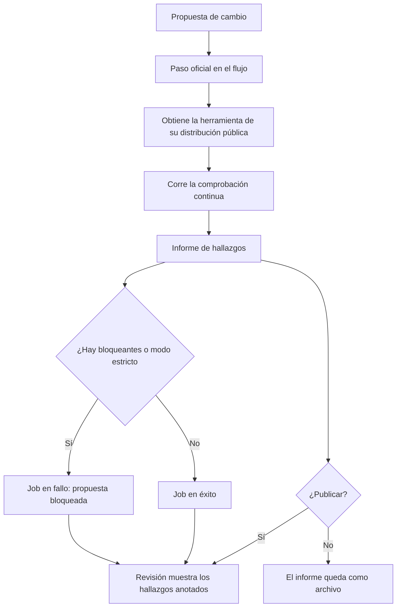
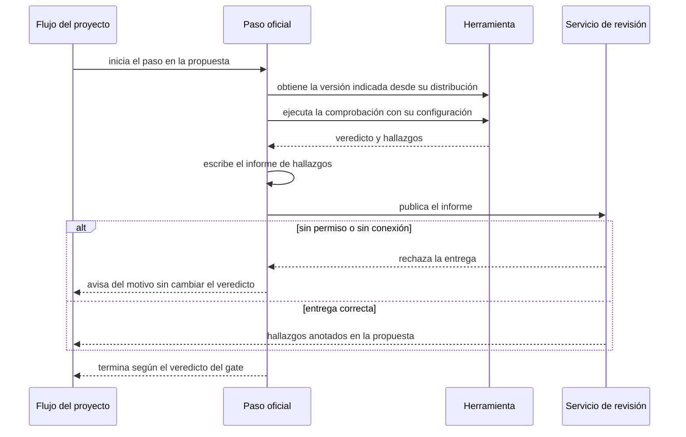
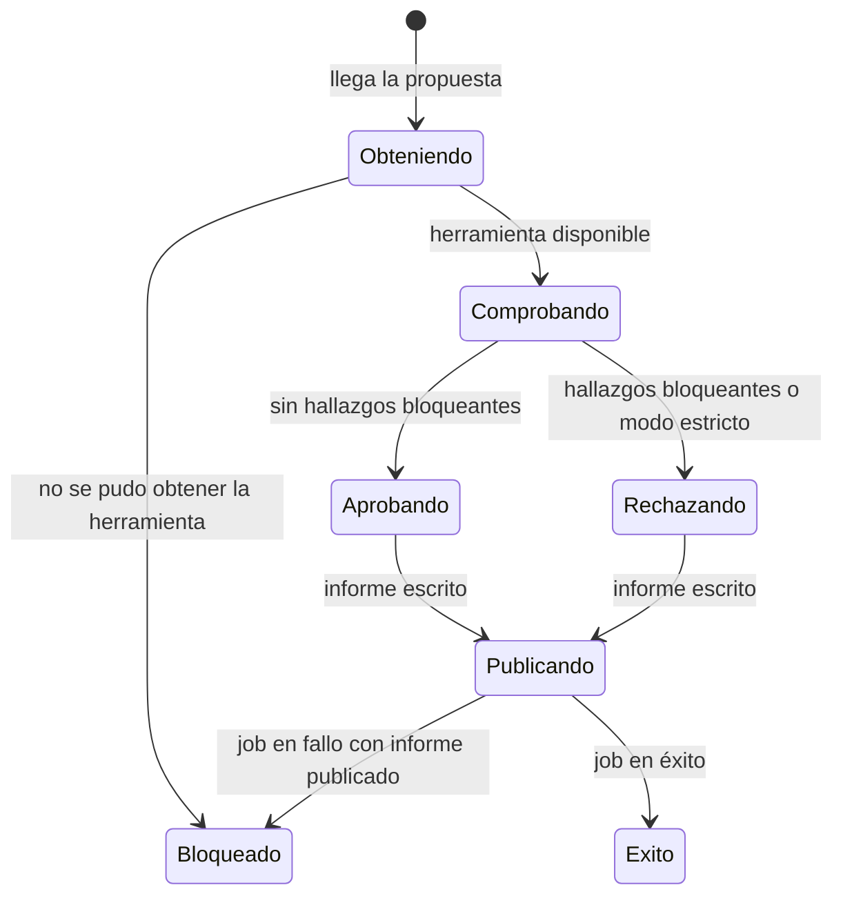

# Plan — Ver los hallazgos en GitHub y ejecutar el gate en cada PR

## 1. Contexto AS-IS

Inventario real del repo (anclas al código):

- **El gate ya existe**: `runCiGate` (`packages/core/src/gate.ts:56`) agrega specs vivas, cambios (lint + trace + waves + mockups + packs), doctor y comprobaciones extra (adaptadores), y devuelve `CiResult { checks, diagnostics, errors, warnings, failed }`. `satlas ci` (`packages/cli/src/commands/ci.ts`) lo expone con `--strict` y `--json`; exit 1 si bloquea.
- **No existe informe SARIF ni Action**: cero coincidencias de `sarif` en el repo; no hay `action.yml`. Solo hay workflows propios del repo (`.github/workflows/ci.yml` y `release.yml`).
- **El diagnóstico es rico y uniforme**: `Diagnostic { code, severity: error|warning|info, message, path?, line?, suggestion? }` (`diagnostics.ts:3`). `path` suele ser absoluto (los comandos lo relativizan al imprimir). Suficiente para mapear a SARIF 2.1.0 sin tocar los productores.
- **Familias de códigos documentadas**: `LINT-STR/BIZ/DLT/EVD/TSK/PLN/MKP`, `MKP-STALE`, `TRACE`, `ATLAS`, `PACK`, `ATLAS-UPGRADE` (tabla en `docs/tutorial/TUTORIAL.md`). Sirven de catálogo de descripciones para las reglas del informe.
- **Versión de la herramienta**: `cliVersion()` (`packages/cli/src/version.ts`) lee el `package.json` del CLI; es la que debe declarar el informe.
- **Flags**: el catálogo (`catalog.ts`) declara los flags por comando y `cli.ts` rechaza los desconocidos; `--sarif` debe registrarse ahí.
- **La Action no puede probarse contra GitHub en este repo** (haría falta un PR real y permisos de seguridad); su contrato (entradas, pasos, `continue-on-error` en la entrega) se fija con una prueba mecánica sobre `action.yml` y simulando el paso localmente.

## 2. Enfoque técnico

- **Conversión pura a SARIF 2.1.0** en `packages/core/src/sarif.ts`:
  - `toSarifReport({ diagnostics, root, version, failed? })` → objeto SARIF (`$schema`, `version: '2.1.0'`, `runs[0].tool.driver` con `name: 'SpecAtlas'`, `version`, y `rules`).
  - **Reglas**: una por código, ordenadas, con `id` = código y `shortDescription` desde un catálogo por prefijo (`ruleDescription(code)`: `LINT-BIZ-*` → «Lenguaje de negocio», `TRACE-*` → «Trazabilidad», `ATLAS-*` → «Workspace», …) y `help.text` con la sugerencia del primer hallazgo cuando exista.
  - **Resultados**: `ruleId`, `level` (`error→error`, `warning→warning`, `info→note`), `message.text`, y `locations` solo si hay archivo: `artifactLocation.uri` relativo y en posix (`toPosix(path.relative(root, path))`) y `region.startLine` si hay línea. Hallazgo del proyecto sin archivo → sin `locations` (la revisión lo muestra en la sección general).
  - `invocations[0].executionSuccessful = !failed` para que el consumidor vea el veredicto.
  - Serialización con `JSON.stringify(report, null, 2)`; nada de contenido de archivos ni de variables de entorno (solo los campos del diagnóstico).
- **`satlas ci --sarif <ruta>`** (`packages/cli/src/commands/ci.ts`):
  - Corre el gate igual que hoy; si se pidió `--sarif`, escribe el informe con `writeText` (crea directorios). Si la escritura falla (ruta no escribible), **aviso** `ATLAS-CI-SARIF-001` (warning) y el veredicto/exit code no cambian (REQ-CI-001-S4).
  - El informe se escribe con hallazgos o vacío (REQ-CI-001-S2). `--json` sigue funcionando y añade `data.sarif` con la ruta escrita.
  - Registrar `sarif` en el catálogo (`catalog.ts`).
- **Action compuesta en la raíz** (`action.yml`, usable como `AlonsoAM/specatlas@v1`):
  - Entradas: `version` (por defecto `latest`), `path` (por defecto `.`), `strict` (por defecto `false`), `sarif-file` (por defecto `specatlas.sarif`), `upload` (por defecto `true`), `upload-sarif` no: se usa `github/codeql-action/upload-sarif@v3`.
  - Pasos: (1) `npm install -g specatlas@<version>`; (2) `satlas ci --sarif <sarif-file> [--strict]` en `path` — si el gate falla, el paso falla y con él el job; (3) `if: always()` + `continue-on-error: true` → `github/codeql-action/upload-sarif` solo si `upload == 'true'`. Así: publicar el informe es opcional y su fallo (permiso, red) no altera el veredicto (REQ-CI-001-S3, REQ-CI-005-S3).
  - La Action no lee secretos ni pide más que `contents: read` (+ `security-events: write` para publicar, documentado en el README).
- **Alternativas descartadas**:
  - Comando propio `satlas sarif` (decisión del usuario: bandera del gate; un solo paso en CI).
  - Action en repo aparte o plantilla copiable (decisión del usuario: acción compuesta aquí, `uses: AlonsoAM/specatlas@v1`).
  - Acción JavaScript/Docker: sumaría build y publicación de dist para la Action; la compuesta con `npm i -g` es suficiente y no añade artefactos nuevos.
  - Escribir SARIF siempre (sin bandera): ensuciaría el workspace de quien solo quiere el veredicto; la bandera lo hace explícito.
  - Publicar el informe desde el núcleo: publicar es responsabilidad del flujo del consumidor (`upload-sarif`), no del kernel local-first.

## 3. Diagramas

### 3.1 Del PR al veredicto (flowchart)

### 3.2 Publicación del informe (sequence)

### 3.3 Estados del paso (stateDiagram-v2)

## 4. Diseño por capa / módulos

| Módulo | Capa | Responsabilidad |
|---|---|---|
| `packages/core/src/sarif.ts` | Núcleo | Conversión pura de diagnósticos a SARIF 2.1.0 (reglas, niveles, ubicaciones) |
| `packages/core/src/index.ts` | Núcleo | Exportar `sarif` |
| `packages/cli/src/commands/ci.ts` | CLI | Bandera `--sarif`: escribe el informe, avisa si no puede, veredicto intacto |
| `packages/cli/src/catalog.ts` | CLI | Registrar el flag `sarif` en el comando `ci` |
| `action.yml` | Distribución | Action compuesta oficial (instala, corre el gate, publica el informe) |
| `packages/core/test/sarif.test.ts` | Pruebas | Mapeo: reglas deduplicadas, niveles, rutas relativas, sin archivo, informe vacío |
| `packages/cli/test/ci-sarif.test.ts` | Pruebas | Bandera `--sarif` de punta a punta, aviso de ruta no escribible, contrato de `action.yml`, informe sin secretos, veredicto sin conexión |
| `README.md`, `ARQUITECTURA.md` | Docs | Ejemplo de workflow, permisos, sección de la Action |

## 5. Matriz de trazabilidad (REQ → tareas)

| Requisito | Escenarios | Tareas |
|---|---|---|
| REQ-CI-001 — Informe junto a la comprobación | S1…S4 | T1.1, T2.1, T2.2 |
| REQ-CI-002 — Informe por archivo y regla | S1…S3 | T1.1, T1.2, T2.3 |
| REQ-CI-003 — Veredicto que bloquea | S1…S3 | T2.1, T2.3 |
| REQ-CI-004 — Paso listo para cualquier proyecto | S1…S4 | T2.2, T2.3 |
| REQ-CI-005 — Sin secretos ni permisos de más | S1…S3 | T1.1, T2.2, T2.3 |

## 6. Matriz de paridad AS-IS → TO-BE

Es aditivo: el gate, sus checks y su veredicto no cambian.

| Elemento | Conservar | Descartar | Nuevo |
|---|---|---|---|
| `runCiGate` (núcleo) | Se conserva íntegro como fuente del veredicto | — | — |
| `satlas ci` | Flags y salida actuales | — | Bandera `--sarif <ruta>` |
| Catálogo de comandos | Se conserva | — | Flag `sarif` en `ci` |
| Workflows del repo | Se conservan (`ci.yml`, `release.yml`) | — | `action.yml` (Action oficial para otros proyectos) |
| Diagnósticos | Se conservan tal cual | — | Lectura para el informe (sin tocar productores) |

## 7. Tareas

Ver `tasks.md`: 7 tareas en 2 bloques.

## 8. Riesgos y mitigaciones

| Riesgo | Mitigación |
|---|---|
| Rutas absolutas en el informe rompen los consumidores o filtran la máquina | Relativización obligatoria contra la raíz; prueba con workspace en directorio temporal |
| `upload-sarif` exige `security-events: write` y falla sin él | Paso de entrega con `continue-on-error: true`; el veredicto no cambia; permisos documentados con ejemplo de workflow |
| Niveles SARIF incorrectos (info no es válido) | Mapeo `error→error`, `warning→warning`, `info→note`; prueba por cada severidad |
| La Action no se puede ejecutar de verdad en CI de este repo | Prueba de contrato sobre `action.yml` (YAML válido, entradas, pasos, `continue-on-error`) + simulación local del comando exacto del paso; la prueba real queda como verificación manual documentada |
| `npm i -g specatlas@latest` tarda o falla | El paso falla con mensaje claro y **no** publica un informe vacío (REQ-CI-004-S4); versión fijable por entrada |
| Informe enorme en workspaces grandes | Solo se serializan campos del diagnóstico (sin contenido); sin cambios de rendimiento en el gate |
| El flag nuevo rompe el rechazo de flags desconocidos | Se registra en `catalog.ts`; prueba e2e del comando con `--sarif` |

Talla y confianza: mapeo SARIF S (confianza alta: transformación pura); CLI S (confianza alta); Action S (confianza media: sin ejecución real en GitHub, se fija con contrato + simulación); pruebas M. Sin estimaciones de horas.

## 9. Rollback

Aditivo y sin migraciones: quitar `sarif.ts` y su exportación, quitar la bandera `--sarif` del comando y del catálogo, eliminar `action.yml`, y revertir las secciones de documentación. En construcción: `git revert` del commit.

## 10. Dependencias y supuestos

- Dependencia entre bloques (documentada aquí, no en las tareas — el planificador de olas exige dependencias intra-bloque): el Bloque 2 consume el módulo del Bloque 1; se construyen en orden.
- Sin dependencias npm nuevas; Node ≥ 20 (el CLI ya usa `fetch`/fs built-ins).
- Supuesto: el consumidor del informe es GitHub Code Scanning (SARIF 2.1.0); el formato es estándar y reutilizable por otros consumidores.
- Supuesto: la Action se publica desde este repo en la rama principal y se referencia por versión (`@v1` o un tag); en esta entrega queda el `action.yml` y el ejemplo de workflow.
- La publicación del informe en el flujo del consumidor usa `github/codeql-action/upload-sarif@v3` (acción pública mantenida por GitHub).
