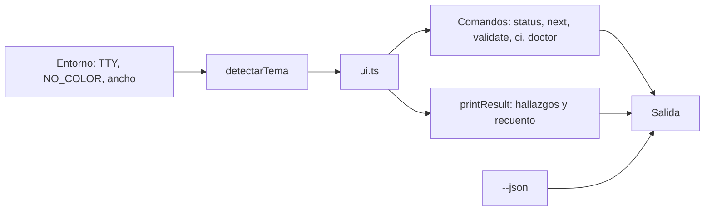

# Plan — La terminal se lee de un vistazo

## 1. Contexto AS-IS

Cada comando arma su salida como un arreglo de cadenas (`CommandResult.text`) y `printResult` en `cli.ts` la escribe tal cual, añadiendo los hallazgos con un formato fijo: `ERROR  CÓDIGO ruta:línea — mensaje` y el recuento `N errores, N avisos, N notas`. No hay color, ni marcas, ni adaptación al ancho de la terminal.

El proyecto evita dependencias en el núcleo y el CLI, así que la presentación se resuelve con lo que trae Node.

`doctor` además imprimía sus hallazgos dos veces: en su propio texto y otra vez a través de `printResult`, que ya recibe los mismos diagnósticos.

## 2. Enfoque técnico

Un módulo único, `cli/src/ui.ts`, que concentra todo lo visual y no conoce ningún comando: detección del entorno (color, símbolos, ancho), pintado con secuencias ANSI, marcas por severidad, barra de progreso, alineación de columnas y los bloques repetidos (encabezado, hallazgo, recuento, siguiente acción). Los comandos piden piezas a ese módulo; nadie escribe una secuencia de color a mano.

La decisión de pintar o no se toma **una vez, al construir el tema**, mirando si la salida es una terminal y respetando `NO_COLOR`, `FORCE_COLOR` y `TERM=dumb`. Como los tests no corren en una terminal, la salida que comparan sigue siendo texto plano.

Los símbolos tienen dos juegos: uno ampliado y otro simple para consolas que no dibujan el primero, con `SPECATLAS_ASCII=1` para forzarlo. La alineación mide el **ancho visible**, descontando las secuencias de color, para que las columnas no se descoloquen.

Alternativas descartadas:

- **Una dependencia de estilos** (`chalk`, `picocolors`): el CLI se distribuye como un único artefacto y la superficie que se necesita son doce códigos ANSI.
- **Pintar dentro de cada comando**: repetiría la detección de entorno y haría imposible cambiar la presentación de una vez.
- **Cajas y marcos de ancho fijo**: se rompen al redimensionar la ventana y estorban al copiar texto.

## 3. Diagramas

## 4. Diseño por capa / módulos

| Módulo | Responsabilidad |
|---|---|
| `cli/src/ui.ts` | Tema, pintado, símbolos, ancho visible, barra, encabezado, hallazgo, recuento |
| `cli/src/cli.ts` | Presenta los hallazgos y el recuento de cualquier comando |
| `cli/src/commands/status.ts` | Marca de fase, avance proporcional y siguiente acción |
| `cli/src/commands/next.ts` | Acción destacada con su actor |
| `cli/src/commands/validate.ts` | Una línea por cambio con su marca y su archivo |
| `cli/src/commands/ci.ts` | Una línea por comprobación y veredicto final |
| `cli/src/commands/doctor.ts` | Cierre en conformidad; deja los hallazgos a la capa de presentación |

## 5. Matriz de trazabilidad (REQ → tareas)

| Requisito | Tareas |
|---|---|
| REQ-CLI-004 | T1.1, T1.2, T1.3 |
| REQ-CLI-005 | T2.1, T2.2 |

## 6. Matriz de paridad AS-IS → TO-BE

| Antes | Después |
|---|---|
| Todo con el mismo peso | Marca y color por severidad |
| «0 errores, 1 avisos, 0 notas» | Recuento con marcas, en singular o plural |
| Avance solo numérico | Barra proporcional junto al número |
| Siguiente acción como una línea más | Destacada, con su actor |
| La misma salida en todas partes | Texto plano fuera de la terminal |
| `doctor` repetía cada hallazgo | Una sola vez |

## 7. Tareas (ver tasks.md)

## 8. Riesgos y mitigaciones

| Riesgo | Mitigación |
|---|---|
| El color ensucia registros y tuberías | La detección apaga el color salvo en terminal interactiva; se respeta `NO_COLOR` |
| Los símbolos no se dibujan en consolas antiguas | Juego alternativo simple y `SPECATLAS_ASCII=1` |
| Las columnas se descolocan con color | La alineación mide el ancho visible, no la longitud de la cadena |
| Las pruebas dependen del formato exacto | Comprueban el comportamiento (qué aparece), no la maquetación |

## 9. Rollback

Revertir el commit: los comandos vuelven a su salida plana. No cambia ningún artefacto ni ningún dato del proyecto.

## 10. Dependencias y supuestos

- Sin dependencias nuevas: solo secuencias ANSI y `process.stdout`.
- `--json` sigue siendo la vía para otros programas y no lleva adornos.
- Los tests corren sin terminal, así que comparan texto plano.
