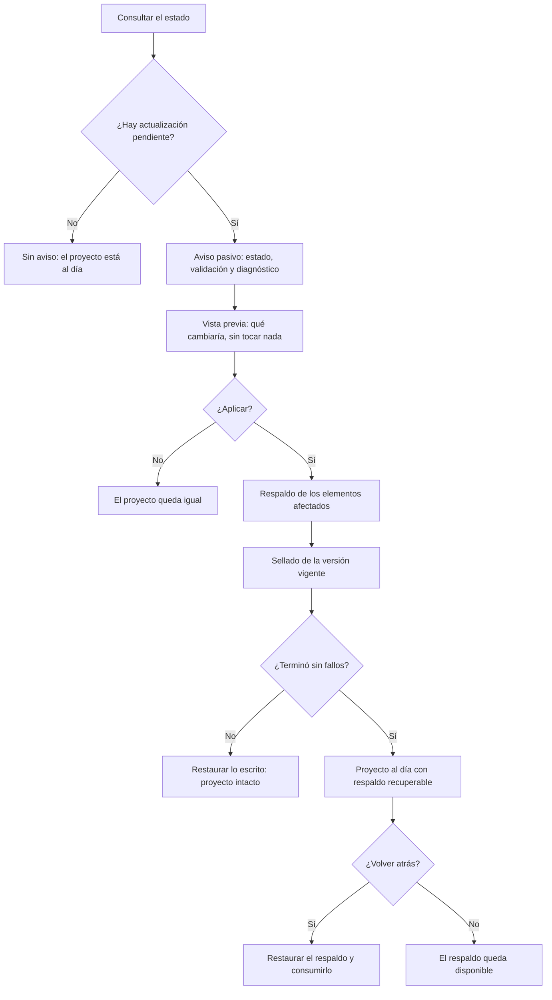
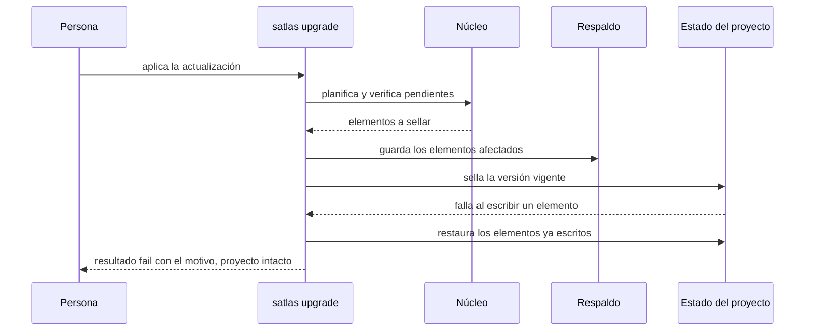
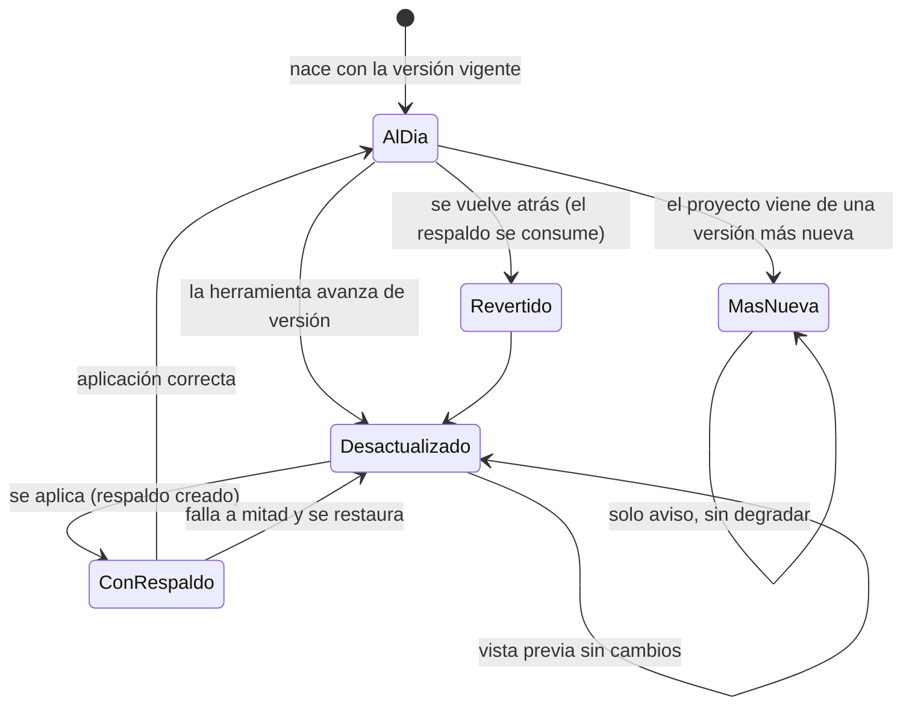

# Plan — Actualizar el estado del proyecto a la versión vigente

## 1. Contexto AS-IS

Inventario real del repo (anclas al código):

- **No existe motor de migraciones**: no hay `migrations.ts` en `packages/core/src/`; `ARQUITECTURA.md` §5.16 y ADR-011 lo prometen, y el roadmap lo prioriza. `satlas upgrade` no existe en `catalog.ts`.
- **La versión de esquema ya se declara, pero se ignora**: `schema_version` está en `config.yaml` (`config.ts:12`), `meta.yaml` (`parse/meta.ts:8`), `approvals.yaml` (`parse/meta.ts:62`), manifiesto de mockups (`mockups.ts:13`) y `profiles/detected.yaml` (`profiles.ts:152`). Los esquemas la leen con `.default(1)`: un archivo **sin** la clave se interpreta como v1 y nadie lo nota ni lo sella. Eso define el hueco real v0 → v1.
- **Caminos de escritura al día**: `init` escribe config con `schema_version: 1` (`configToYaml`), `createChange` (`new.ts:58`), `approvals.ts:73`, `mockups.ts:227/240` y `profiles.ts:152` ya emiten 1. REQ-ESQUEMA-005 se cumple hoy; se fija con pruebas.
- **Puntos de aviso pasivo**: `runStatus` (`packages/cli/src/commands/status.ts`) devuelve `workspace.diagnostics`; `runValidate` (`validate.ts`) arma su propio array; `runDoctor` (`packages/core/src/doctor.ts`) agrega hallazgos. Los tres son el lugar del aviso; ninguno escribe.
- **Comando nuevo**: el CLI registra comandos en `catalog.ts` + `HANDLERS` (`cli.ts:66`); los flags desconocidos se rechazan contra `command.flags` (`cli.ts:169`). Patrón de resultado: `CommandResult` → `printResult`, envelope JSON con `schemaVersion: 1`.
- **Utilidades disponibles**: `fsx.ts` (`readTextIfExists`, `writeText`, `exists`, `listDirs`), `time.ts` (`localIso`, `localDate`), `diagnostics.ts` (`diag`, `countBySeverity`). No se necesitan dependencias nuevas (CLI sin runtime deps; ADR-010 sin red).
- **Riesgo de escritura ya conocido**: EPERM intermitente en Windows/OneDrive; `archive.ts` resolvió el movimiento con reintentos + fallback. La aplicación de este cambio debe dejar el proyecto intacto ante cualquier fallo.
- **`.gitignore` del repo no excluye `.sdd/.backup/`**: hoy no existe ese directorio; hay que excluirlo para no versionar respaldos.

## 2. Enfoque técnico

- **Núcleo `packages/core/src/migrations.ts`** (puro salvo I/O de archivos, sin CLI dentro):
  - `SCHEMA_VERSION = 1` y catálogo de elementos versionados: `.sdd/config.yaml`, `.sdd/approvals.yaml`, `.sdd/profiles/detected.yaml`, `.sdd/changes/*/meta.yaml`, `.sdd/changes/archive/*/meta.yaml`, `.sdd/changes/*/mockups/manifest.yaml`.
  - Migración registrada `0001-sellar-version-de-esquema` (v0 → v1): los archivos **sin** `schema_version` son v0; se sella añadiendo la línea `schema_version: 1` tras el bloque de comentarios inicial. Edición **por líneas** (no parsear + volcar): preserva comentarios, claves y formato de `config.yaml`/`meta.yaml`; respeta BOM y el fin de línea dominante del archivo. Si la raíz no es un mapa YAML o el archivo no se puede interpretar, se reporta como ilegible y **no se toca**.
  - `planUpgrade(root)` → `{ currentVersion, pending[], newer[], unreadable[], upToDate }`: `pending` con elemento, ruta, versión actual y destino; `newer` para lo producido por una versión más nueva (nunca se degrada); `unreadable` con motivo.
  - `applyUpgrade(root)` → respaldo en `.sdd/.backup/<marca-de-tiempo>/`: copia solo los elementos afectados con sus rutas relativas + `backup.yaml` (fecha, versiones, archivos) + puntero `.latest`. **Todo-o-nada**: escribe archivo por archivo llevando el contenido previo en memoria y el respaldo ya en disco; si algo falla, restaura lo escrito y devuelve `failed` sin tocar el resto. Sin pendientes: no escribe ni crea respaldo. Al aplicar, poda respaldos anteriores (a lo sumo uno vigente). Como el sellado hace explícita la versión, la segunda ejecución no encuentra pendientes: idempotencia natural.
  - `rollbackUpgrade(root)` → lee el puntero `.latest`; si no hay, `no-backup` sin tocar nada; si hay, restaura los elementos del respaldo, elimina el respaldo y el puntero (**se consume**: la segunda reversión de la misma aplicación no encuentra nada). El trabajo en curso anterior a la aplicación vuelve tal cual porque está entre los elementos respaldados; lo creado después no se toca.
  - `upgradeAdvisory(root)` → `Diagnostic[]` reutilizable: `ATLAS-UPGRADE-001` (warning, pendiente), `ATLAS-UPGRADE-002` (warning, versión más nueva), `ATLAS-UPGRADE-003` (warning, ilegible). Solo lectura.
- **CLI `satlas upgrade`** (`packages/cli/src/commands/upgrade.ts`):
  - Sin flags: **vista previa** (dry-run por defecto, ADR-011). `--apply` aplica. `--rollback` revierte. `--json` con envelope. Exit codes: 0 en vista previa/aplicación correcta; 1 en fallo de aplicación o reversión sin respaldo; 2 sin workspace (`requireWorkspace`).
  - El texto muestra por elemento: ruta, versión actual → destino y resumen de la migración; en `--apply`, resultado + ubicación del respaldo; en `--rollback`, qué se restauró.
- **Aviso pasivo** (nunca escribe): `status` suma `upgradeAdvisory` a sus diagnósticos y a `data.upgrade`; `validate` lo suma cuando no filtra por un cambio; `doctor` lo agrega como finding. Ninguno cambia el exit code por un aviso (severidad warning).
- **Alternativas descartadas**:
  - Parsear y volcar YAML para migrar: perdería comentarios y formato de `config.yaml` y `meta.yaml` (los archivos se editan a mano). Se descarta.
  - `Migration.rollback()` por migración (interface literal de ARQUITECTURA §5.16): la spec pide restaurar el respaldo y consumirlo (BR-ESQUEMA-007); la restauración completa es más simple, cubre el trabajo en curso (REQ-ESQUEMA-004-S3) y evita reversiones parciales. El respaldo es la única fuente de reversión.
  - Migrar `.sdd/.generated/manifest.json` (manifiesto de adaptadores): es regenerable con `satlas adapters`; migrarlo duplicaría responsabilidades. Queda fuera de alcance y el plan lo documenta.
  - Comando `satlas migrate` como alias: decisión del usuario, un solo verbo (`upgrade`); ARQUITECTURA §16 se actualiza.
  - Respaldar todo `.sdd/` (presentaciones, mockups, runs): innecesario y pesado; se respaldan solo los elementos que la migración toca (REQ-ESQUEMA-003-S6).

## 3. Diagramas

### 3.1 Proceso de actualización (flowchart)

### 3.2 Aplicación con fallo a mitad (sequence)

### 3.3 Estado del proyecto frente a la versión (stateDiagram-v2)

## 4. Diseño por capa / módulos

| Módulo | Capa | Responsabilidad |
|---|---|---|
| `packages/core/src/migrations.ts` | Núcleo | Registro de elementos versionados, detección, vista previa, aplicación con respaldo, reversión y aviso reutilizable |
| `packages/core/src/index.ts` | Núcleo | Exportar `migrations` |
| `packages/cli/src/commands/upgrade.ts` | CLI | Comando: vista previa por defecto, `--apply`, `--rollback`, `--json` |
| `packages/cli/src/catalog.ts`, `packages/cli/src/cli.ts` | CLI | Registro del comando `upgrade` en catálogo y despachador |
| `packages/cli/src/commands/status.ts` | CLI | Aviso pasivo + `data.upgrade` |
| `packages/cli/src/commands/validate.ts` | CLI | Aviso pasivo (sin filtro por cambio) |
| `packages/cli/src/commands/doctor.ts` | CLI | Finding del diagnóstico |
| `packages/core/test/migrations.test.ts` | Pruebas | Detección, sellado, respaldo, todo-o-nada, reversión, idempotencia, nacimiento al día |
| `packages/cli/test/upgrade.test.ts` | Pruebas | E2E del comando y de los avisos pasivos |
| `packages/cli/test/cli.test.ts` | Pruebas | Ajuste del e2e existente (workspaces v1: sin avisos nuevos) |
| `README.md`, `ARQUITECTURA.md`, `.gitignore` | Docs/Infra | Comando documentado, §5.16/§16 alineadas y respaldo fuera del control de versiones |

## 5. Matriz de trazabilidad (REQ → tareas)

| Requisito | Escenarios | Tareas |
|---|---|---|
| REQ-ESQUEMA-001 — Saber si el proyecto está al día | S1…S5 | T1.1, T1.4, T2.3, T2.4, T2.5, T2.6 |
| REQ-ESQUEMA-002 — Previsualizar sin tocar | S1…S4 | T1.1, T2.2, T2.6 |
| REQ-ESQUEMA-003 — Aplicar con respaldo | S1…S6 | T1.2, T1.5, T2.2, T2.6 |
| REQ-ESQUEMA-004 — Volver al estado anterior | S1…S4 | T1.3, T2.2, T2.6 |
| REQ-ESQUEMA-005 — El proyecto nuevo nace al día | S1, S2 | T1.5, T2.6 |

## 6. Matriz de paridad AS-IS → TO-BE

No es un refactor sustitutivo: se añade el motor de actualización sin reemplazar componentes existentes.

| Elemento | Conservar | Descartar | Nuevo |
|---|---|---|---|
| `schema_version` en los esquemas | Se conserva (`default(1)` sigue aceptando archivos viejos) | — | Sellado explícito v0 → v1 |
| `runStatus` / `runValidate` / `runDoctor` | Se conservan como fuente de estado/hallazgos | — | Suma del aviso pasivo |
| Catálogo `CATALOG` + `HANDLERS` | Se conserva | — | Entrada `upgrade` |
| Escritura de artefactos (`init`, `new`, `approve`) | Se conserva (ya emite 1) | — | Pruebas que lo fijan |
| Respaldos | — | — | `.sdd/.backup/` (fuera de control de versiones) |

## 7. Tareas

Ver `tasks.md`: 13 tareas en 2 bloques.

## 8. Riesgos y mitigaciones

| Riesgo | Mitigación |
|---|---|
| La edición por líneas asume raíz YAML tipo mapa; un archivo raro podría corromperse | Antes de sellar se verifica que la raíz sea un mapa y que la clave no exista; si no, el elemento se reporta `unreadable` y no se toca (REQ-ESQUEMA-002-S3) |
| Pérdida de formato (comentarios, BOM, CRLF) al migrar | Sellado por inserción de línea: se conserva el contenido byte a byte; BOM y fin de línea dominante se preservan; pruebas con `config.yaml` comentado y archivo CRLF |
| EPERM intermitente en Windows/OneDrive a mitad de la aplicación | Todo-o-nada con respaldo previo y restauración en el fallo; pruebas que simulan el fallo (directorio de solo lectura / escritura forzada) |
| Avisos nuevos rompen pruebas existentes o el e2e del CLI | Los workspaces de prueba ya nacen v1: no hay pendientes y el aviso no aparece; se ajusta `cli.test.ts` si algún fixture resultara v0 |
| Reversión ambigua con varios respaldos | Puntero `.latest` + poda al aplicar: a lo sumo un respaldo vigente; revertir lo consume (REQ-ESQUEMA-004-S2/S4) |
| El aviso pasivo cambia el exit code de `status`/`validate` | Severidad `warning`: no altera exit codes (solo errores lo hacen); `validate --strict` sigue fallando solo por hallazgos reales |
| Desactualización del CLI frente al núcleo (tipos) | Compilar `@specatlas/core` antes del typecheck del CLI (lección del cambio MCP) |

Talla y confianza: núcleo M (confianza alta: edición de texto + fs, sin dependencias); CLI S (confianza alta: patrón de comando ya establecido); pruebas M (confianza media-alta: simular fallos de escritura requiere cuidado). Sin estimaciones de horas.

## 9. Rollback

Todo el cambio es aditivo: eliminar `upgrade.ts`, quitar la entrada `upgrade` del catálogo y el despachador, quitar la suma del aviso en estado/validación/diagnóstico, eliminar `migrations.ts` y su exportación, y revertir las secciones de documentación. No hay cambios destructivos: `.sdd/.backup/` es estado de ejecución y puede borrarse. En construcción: `git revert` del commit.

## 10. Dependencias y supuestos

- Dependencia entre bloques (documentada aquí, no en las tareas — el planificador de olas exige dependencias intra-bloque): el Bloque 2 consume el núcleo del Bloque 1; se construyen en orden.
- Sin dependencias npm nuevas; Node ≥ 20.
- Supuesto: `schema_version` ausente = v0 (los esquemas actuales lo interpretan como 1 por defecto; sellarlo es la migración real y no cambia comportamiento).
- Supuesto: los elementos versionados son los del catálogo del núcleo; un elemento fuera del catálogo no se migra ni se respalda.
- Supuesto: la marca de tiempo del respaldo usa hora local (`time.ts`) y `.sdd/.backup/` se excluye del control de versiones.
- El comando se ejecuta desde cualquier subdirectorio del proyecto: el workspace se localiza con `findWorkspaceRoot` (misma semántica que el resto del CLI).
