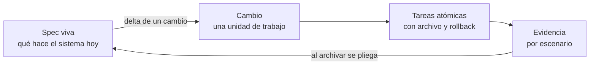
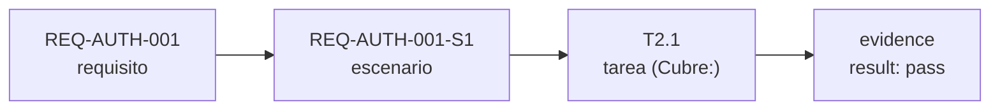
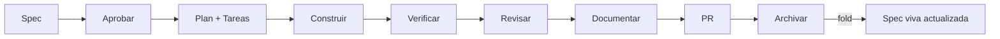

# Tutorial de SpecAtlas

**El kernel determinista del Spec-Driven Development.** Specs vivas, trazabilidad ejecutable y gates reales para cualquier stack, cualquier agente y cualquier proyecto — incluido el que ya existe.

> Este tutorial asume que **no conoces la herramienta**. Está pensado para leerse de arriba a abajo una vez, y después usarse como referencia por secciones.
> Tiempo de lectura: ~35 minutos. Tiempo hasta tu primer cambio archivado: ~15 minutos.

---

## 1. Qué problema resuelve

Cuando un equipo desarrolla con IA pasan tres cosas:

1. El agente escribe código sin que nadie haya acordado **qué** se va a construir.
2. El acuerdo vive en un chat que nadie puede auditar, y la documentación se escribe (si se escribe) después.
3. “Está terminado” es una opinión: no hay evidencia de que el comportamiento pedido sea el comportamiento entregado.

**Spec-Driven Development (SDD)** invierte el orden: primero se acuerda el comportamiento en lenguaje de negocio, esa especificación se **aprueba**, y recién entonces se planifica, se construye y se evidencia.

SpecAtlas aporta la parte que casi ninguna herramienta resuelve: **el proceso se verifica con código, no con buena voluntad**.

| Sin SpecAtlas | Con SpecAtlas |
|---|---|
| El prompt describe la feature | La spec funcional describe el comportamiento y se firma |
| Nadie sabe qué quedó por hacer | Las tareas son atómicas y trazables al requisito |
| “Ya funciona” | Cada escenario tiene evidencia registrada (comando + resultado + hash) |
| La documentación se pudre | La spec viva es la fuente de verdad; los cambios se pliegan al archivar |
| El bugfix entra por el flujo grande | Carril `fix`: un solo artefacto, sin ceremonia |

Tres ideas guían todo el diseño:

- **El kernel no sabe de IA.** Todo lo verificable (esquemas, trazabilidad, dependencias, gates) es código determinista. El agente solo escribe contenido y ejecuta tareas.
- **Las specs son de negocio.** Lo que se aprueba no tiene una línea de tecnología. El plan técnico es otro artefacto, interno.
- **Español por defecto.** Todos los artefactos y mensajes salen en español; `language: en` para inglés.

---

## 2. Los cinco conceptos



| Concepto | Qué es | Dónde vive |
|---|---|---|
| **Spec viva** | El comportamiento acordado del sistema, por dominio. Es la fuente de verdad | `.sdd/specs/<dominio>/spec.md` |
| **Cambio** | Una unidad de trabajo con su spec (delta), plan, tareas y evidencia | `.sdd/changes/<slug>/` |
| **Delta** | Solo lo que cambia: `ADDED`, `MODIFIED`, `REMOVED`, `RENAMED` | `changes/<slug>/spec.md` |
| **Tarea** | Paso atómico: qué se hace, en qué archivo, qué requisito cubre, cómo se revierte | `changes/<slug>/tasks.md` |
| **Evidencia** | Prueba real de que un escenario funciona: comando, resultado, hash y fecha | `changes/<slug>/verify.md` |

### La cadena de trazabilidad

Todo cuelga de identificadores estables:



- `REQ-<DOMINIO>-NNN` — requisito. **Nunca se renumera.**
- `REQ-<DOMINIO>-NNN-S<n>` — escenario del requisito.
- `BR-<DOMINIO>-NNN` — regla de negocio.
- `T<bloque>.<secuencia>` — tarea (ej. `T2.1`).

`satlas trace` recorre esa cadena y falla si hay huecos: un escenario sin tarea, una tarea que cubre algo inexistente, un escenario sin evidencia cuando ya se construyó.

### Carriles: el proceso se adapta al tamaño

| Carril | Para qué | Artefactos | Gates |
|---|---|---|---|
| `fix` | Incidentes, hotfix, configuración | `fix.md` (uno solo) | Evidencia (puede ser manual) + archivo |
| `standard` | Features normales | spec + plan + tasks + verify | Aprobación, trazabilidad, evidencia |
| `full` | Riesgo alto o regulado | Todo lo anterior + analyze + review + docs | Todo, más analyze y review bloqueantes |

El carril se elige al crear el cambio y se puede **promover** (nunca degradar a ciegas).

### Gates: quién decide y cuándo

Un *gate* es una puerta que no se abre sola. En SpecAtlas son verificables:

| Gate | Qué comprueba | Cómo se satisface |
|---|---|---|
| Aprobación | Que una persona firmó la spec | `satlas approve` (o etiqueta en GitHub) |
| Trazabilidad | Que requisito → tarea → evidencia cierran | `satlas trace --check` |
| Verificación | Que cada escenario tiene evidencia `pass` | `satlas verify --record` |
| Analyze / Review | Consistencia cruzada y calidad (carril `full`) | `satlas analyze` / `/satlas-review` |
| Packs | Controles de cumplimiento del dominio | `satlas packs --check` |
| CI | Todos los anteriores, sin agente | `satlas ci` |

---

## 3. Instalación

**Requisitos:** Node ≥ 20 y pnpm ≥ 9.

```bash
# Desde el repositorio (mientras el paquete no esté publicado)
pnpm install
pnpm -r build

# Cuando esté publicado (ver RELEASING.md)
npx specatlas@latest version
npm i -g specatlas        # bins: specatlas y satlas
```

El binario se llama `specatlas` y tiene el alias corto **`satlas`**. En este tutorial usamos `satlas`.

**Extensión de VS Code:**

- Marketplace / Open VSX: busca **SpecAtlas** (publisher `specatlas`).
- `.vsix` local:

```bash
pnpm --filter specatlas-vscode build
pnpm --filter specatlas-vscode exec vsce package --no-dependencies
code --install-extension packages/vscode/specatlas-vscode-<versión>.vsix
```

**Verifica tu entorno** en cualquier momento:

```bash
satlas doctor      # salud del workspace
satlas version
```

---

## 4. Tu primer proyecto, paso a paso

### 4.1 Inicializar

```bash
cd mi-proyecto
satlas init --name mi-proyecto
```

Salida esperada (resumida):

```text
Inicialización

Workspace SDD creado.
  + .sdd/config.yaml
  + .sdd/constitution.md
  + .sdd/glossary.md
  + .sdd/profiles/detected.yaml
  + .sdd/INDEX.md
  + .opencode/command/satlas-specify.md   ← adaptadores del agente
  ...

NOTA  ATLAS-INIT-002 — Stack detectado: Node + TypeScript (7 puntos)
```

Qué acaba de pasar:

- Se creó `.sdd/` con la configuración, la **constitución** (reglas inmutables del proyecto) y el **glosario** de negocio.
- Se detectó tu stack y se escribió el perfil activo (el CLI usa scoring por archivos y manifiestos; si no reconoce el stack, usa `generic` y lo dice).
- Se **compilaron los adaptadores** para que tu agente tenga los comandos `/satlas-*`.
- `.sdd/` se versiona con git (usa `--local` si prefieres ignorarlo).

### 4.2 Crear un cambio

```bash
satlas new reset-password --lane standard --domain auth --title "Restablecer contraseña"
```

Crea:

```text
.sdd/changes/reset-password/
├── meta.yaml       ← carril, dominio, riesgo, pausas, overrides
├── proposal.md     ← el porqué y el alcance (lenguaje de negocio)
└── spec.md         ← el delta (lo que cambia en la spec viva)
```

`meta.yaml` guarda **hechos**; el estado del cambio (borrador, esperando aprobación, construyendo…) se **deriva** de los artefactos. Nunca tienes que mantener un “estado” a mano.

### 4.3 Escribir la spec funcional

Aquí trabaja el agente (o tú mismo). La regla es tajante: **cero tecnología**.

```markdown
## Requisitos agregados

### Requisito: REQ-AUTH-001 — Restablecer contraseña
El sistema DEBE permitir restablecer la contraseña por email.

- Regla BR-AUTH-001: El enlace es de un solo uso y vence a los 30 minutos.

#### Escenario: REQ-AUTH-001-S1 — Solicitud con correo registrado
- **CUANDO** el usuario solicita restablecer con un correo registrado
- **ENTONCES** recibe un enlace de un solo uso

#### Escenario: REQ-AUTH-001-S2 — Correo no registrado
- **CUANDO** el usuario solicita restablecer con un correo no registrado
- **ENTONCES** el sistema responde el mismo mensaje sin revelar si existe
```

Valida siempre antes de seguir:

```bash
satlas validate --change reset-password
```

El validador comprueba la estructura **y** el lenguaje: jerga técnica, palabras vagas (“rápido”, “varios”), criterios sin valor observable, escenarios sin `ENTONCES`, requisitos sin escenario. Si algo se sale del carril de negocio, te lo dice con código y ubicación.

> **Consejo:** incluye siempre escenarios de error, caso vacío, falta de permiso y límites. Son los que suelen romperse en producción.

### 4.4 Aprobar y presentar

La aprobación es un acto humano y nominal, con **hash** del artefacto:

```bash
satlas present reset-password --by "María Pérez"    # 1. firma la spec (hash + autor)
satlas present reset-password                       # 2. genera el paquete para el stakeholder
```

`satlas present` produce `changes/<slug>/presentation/index.html`: una propuesta navegable con la spec de negocio, los criterios de aceptación (con su estado de evidencia), los mockups si los hay y el comando de aprobación. Se abre en cualquier navegador, sin red.

Si la spec cambia después de firmarla, **la firma queda obsoleta automáticamente** (el hash deja de coincidir) y el gate vuelve a pendiente. Así, lo aprobado no se edita en silencio.

Para ver dónde estás parado:

```bash
satlas status
```

```text
  reset-password  auth       standard  esperando aprobación
    tareas 0/0 · evidencia 0/2
    siguiente: satlas present reset-password — Presentar la propuesta y firmar
```

`satlas next` da la siguiente acción concreta (y la copia si requiere agente).

### 4.5 Plan técnico y tareas

Con la spec aprobada, el agente (o tú) escribe el **plan técnico** — aquí sí hablamos de tecnología y arquitectura — y las tareas.

El plan tiene secciones canónicas e incluye **diagramas** cuando el cambio los necesita (`erDiagram` si toca datos, `sequenceDiagram` si hay integraciones, `flowchart` si hay procesos, etc.):

```markdown
# Plan — Restablecer contraseña

## 1. Contexto AS-IS
## 2. Enfoque técnico
## 3. Diagramas        ← aquí van los bloques mermaid que el cambio necesite
## 4. Diseño por capa / módulos
## 5. Matriz de trazabilidad (REQ → tareas)
## 6. Matriz de paridad AS-IS → TO-BE (solo refactors)
## 7. Tareas (ver tasks.md)
## 8. Riesgos y mitigaciones
## 9. Rollback
## 10. Dependencias y supuestos
```

Y las tareas usan una gramática estricta, hecha para ser procesada:

```markdown
## Bloque 1 — Base de datos

- [ ] T1.1 Crear tabla de tokens · Archivos: db/migrations/003.sql · Cubre: REQ-AUTH-001-S1 · Reversión: DROP TABLE
- [ ] T1.2 Índice por usuario · Archivos: db/migrations/003.sql · Depende de: T1.1 · Infra

## Bloque 2 — API

- [ ] T2.1 Endpoint de solicitud · Archivos: src/auth/reset.ts · Cubre: REQ-AUTH-001-S1, REQ-AUTH-001-S2 · Depende de: T1.1
```

Claves (se aceptan con o sin acentos): `Archivos`/`Files`, `Cubre`/`Covers`, `Depende de`/`Depends`, `Reversión`/`Rollback`, e `Infra` para trabajo sin requisito.

Qué chequea el kernel con esto:

```bash
satlas trace --change reset-password    # cobertura escenario → tarea
satlas waves --change reset-password    # orden de construcción
```

`trace` falla si algún escenario no está cubierto. `waves` calcula **olas**: grupos de tareas que pueden ir en paralelo — nunca dos que toquen el mismo archivo — y degrada las que chocan.

```text
  Bloque 1 — Base de datos
    ola 1: T1.1
    ola 2: T1.2
  Bloque 2 — API
    ola 1: T2.1
Resumen: 2 bloque(s), 3 ola(s), 3 tarea(s), máx. paralelo 3
```

### 4.6 Construir

Con el agente:

```text
/satlas-build reset-password
```

El prompt compilado indica: ejecutar bloque por bloque y ola por ola, marcar `[x]` en `tasks.md`, no tocar la spec aprobada ni el plan, commitear solo código y detenerse ante fallos. Si no usas agente, implementa las tareas a mano y marca los checkboxes: el progreso vive en `tasks.md`.

### 4.7 Verificar con evidencia

La verificación no es “corrí los tests”. Es **evidencia por escenario**:

```bash
satlas verify reset-password --scenario REQ-AUTH-001-S1 --command "npm test -- reset" --by "Ana"
```

```text
Evidencia registrada — REQ-AUTH-001-S1

  método:  executable
  comando: npm test -- reset
  resultado: pass
  hash:    sha256:9f2c1a4b…
  archivo: .sdd/changes/reset-password/verify.md
```

- El comando se ejecuta **sin shell** (metacaracteres rechazados) y solo se permiten comandos declarados en el perfil del stack (o `--allow-command`).
- `result` se deriva del código de salida; el `output_hash` deja rastro de lo que salió.
- Para casos no automatizables: `--method manual --result pass --by "…" --notes "…"`. Queda registrado que fue manual: algunos packs de cumplimiento lo penalizan.
- `satlas verify reset-password` sin `--scenario` lista los huecos de evidencia y sale con código 1 si faltan.

### 4.8 Analizar, revisar y archivar

```bash
satlas analyze reset-password     # lint + trace + waves + mockups + packs → analyze.md
satlas ci                         # el gate de pipeline completo (sin agente)
```

`analyze` escribe `changes/<slug>/analyze.md` con estado `passed`, `passed_with_debt` o `blocked`. `ci` es lo que corres en el pipeline: specs vivas, cambios, doctor y adaptadores; exit 1 si algo bloquea.

Cuando todo está verde:

```bash
satlas archive reset-password --dry-run    # revisa el plegado
satlas archive reset-password --yes        # pliega y archiva
```

El delta se **pliega** en la spec viva: los `ADDED` se agregan, los `MODIFIED` reemplazan el bloque completo, los `REMOVED` se eliminan (con motivo y migración) y los `RENAMED` se retitulan. El cambio se mueve a `changes/archive/AAAA-MM-<slug>/` y el `INDEX.md` se regenera. Todo el plegado es determinista y ocurre **todo-o-nada**: si algo no cuadra, no se escribe nada.

### 4.9 El ciclo completo



En carril `standard` el flujo es `spec → aprobar → plan → construir → verificar → archivar`. En `full` se suman `analyze`, `review` y `docs`. En `fix` solo hay `fix.md` y evidencia.

---

### 4.10 Dónde vive cada requisito (anclas y deriva)

Al archivar, cada requisito se queda con los archivos que declararon sus tareas. Eso vive en `.sdd/specs/<dominio>/anchors.yaml` — fuera de la spec, que es de negocio y no nombra tecnología:

```yaml
anchors:
  - requirement: REQ-AUTH-001
    files:
      - src/auth/reset.ts
      - src/auth/reset.ts#pedirReset
```

Con eso, la herramienta puede responder dos preguntas que antes no podía:

```bash
satlas impact src/auth/reset.ts   # ¿qué requisitos toca este archivo?
satlas drift                      # ¿alguna ancla dejó de existir en el código?
```

`satlas drift` es el aviso de que el código se movió debajo de la especificación. Si solo cambió la ruta, `satlas drift --prune` limpia las anclas rotas; si cambió el comportamiento, lo que toca es especificar un cambio. En CI lo decide `ci.drift`: `advisory` avisa, `strict` bloquea.

### 4.11 Cuando el trabajo se interrumpe

El trabajo real se corta: negocio no responde, entra un incidente, cambia la prioridad. La pausa es un hecho del cambio y se registra:

```bash
satlas pause reset-password --reason "esperando definición de negocio" --by "Nombre Apellido"
satlas resume reset-password
```

Mientras está pausado, el cambio aparece como **pausado** (con su motivo y quién lo pausó) y su siguiente acción es reanudarlo. Al reanudar, SpecAtlas recalcula el estado desde los artefactos y te dice el paso real: no hace falta recordar dónde quedaste.

---

## 5. El carril express (`fix`)

Para incidentes no hay ceremonia: un solo artefacto.

```bash
satlas new hotfix-login --lane fix --domain auth
satlas verify hotfix-login --file fix --scenario REQ-FIX-001-S1 --method manual --result pass --by "Ana" --notes "verificado en staging"
satlas archive hotfix-login --yes
```

`fix.md` tiene cinco secciones: **Síntoma**, **Causa raíz** (con `archivo:línea`), **Cambio** (mínimo), **Rollback** y **Evidencia**. Si el arreglo revela alcance de feature, `satlas new` normal y se pasa a especificación: el carril se promueve, nunca se fuerza.

---

## 6. Adoptar un proyecto que ya existe

No empiezas de cero: recuperas las specs del código.

```bash
satlas adopt
```

```text
Adopción (brownfield)

  stack detectado: node-ts (7 puntos)

  Dominios:
    auth                  12 archivos  spec creada
    billing                8 archivos  spec creada

  Informe: .sdd/adopt-report.md
```

Qué hace:

1. Inventaría los archivos **de código** (no tests ni artefactos) y agrupa por dominio (`src/<módulo>`, `app/`, `packages/`…).
2. Crea `.sdd/specs/<dominio>/spec.md` como **baseline**, con su frontmatter y la sección **Anclas de implementación** (los archivos reales que respaldan cada dominio).
3. Escribe `.sdd/adopt-report.md` con el inventario y el plan sugerido.

Después, con el agente (`/satlas-adopt`), por cada dominio:

```bash
satlas new adopt-auth --domain auth
# el agente lee las anclas, entrevista al usuario y redacta los requisitos AS-IS
satlas validate --change adopt-auth
satlas archive adopt-auth --yes
```

La adopción **documenta lo que existe**: no requiere tareas ni verificación. A partir de ahí, cualquier cambio al sistema usa el ciclo normal y la spec viva va creciendo con deltas.

---

## 7. Trabajar con agentes

SpecAtlas es agnóstico: los prompts viven una sola vez en `workflow/` y se **compilan** al formato de cada agente.

```bash
satlas adapters                                    # usa lo configurado (por defecto opencode + generic)
satlas adapters --targets cursor,copilot,gemini,codex
satlas adapters --check                            # falla si están desactualizados (para CI)
```

| Agente | Artefactos | Invocación |
|---|---|---|
| opencode | `.opencode/command/satlas-*.md` + `.opencode/skills/satlas-*/SKILL.md` | `/satlas-specify` |
| Claude Code | `.claude/commands/satlas/*.md` + skills | `/satlas:specify` |
| Cursor | `.cursor/skills/satlas-*/SKILL.md` + `.cursor/commands/*.md` | `/satlas-specify` |
| Copilot | `.github/prompts/satlas-*.prompt.md` | `/satlas-specify` en el chat |
| Gemini CLI | `.gemini/commands/satlas/*.toml` + `GEMINI.md` | `/satlas:specify` |
| Codex / genérico | `prompts/satlas-*.md` + `AGENTS.md` | chat o `/prompts:satlas-*` |

Fases disponibles (una por comando): `adopt`, `specify`, `plan`, `build`, `verify`, `review`, `mockup`, `docs`, `archive`, `fix`.

**No tienes que recordar la sintaxis de tu agente.** El primer target de `adapters.targets` es el agente del proyecto: `satlas next`, `satlas status`, los avisos y los botones del panel te dan la invocación en *su* formato, y los prompts compilados se refieren entre sí igual. Si inicializas con `satlas init --agents claude-code`, el proyecto queda configurado para Claude Code y lo que copias es `/satlas:specify mi-cambio`.

**Higiene de contexto:** usa **una sesión por fase**. El kernel guarda todo el estado en `.sdd/`, así que cada sesión empieza limpia y lee solo lo que necesita — es más barato y mucho más preciso que arrastrar un chat enorme.

---

## 8. La extensión de VS Code

El panel **SpecAtlas** (icono de libro en la barra de actividad) tiene:

- **Árbol**: proyecto → *Specs vivas* (expandibles en requisitos navegables: el clic abre el archivo en esa línea) y *Cambios* con su fase, progreso (`▓▓▓░░ 3/4`), evidencia y **siguiente acción**. Lo accionable va primero.
- **Menú contextual** por cambio: Aprobar · Analizar · Trazabilidad · Olas · Propuesta · Mockups · Copiar siguiente · Archivar.
- **Badge rojo** en el icono con el número de errores y **Problems** alimentado por el kernel (`LINT-*`, `TRACE-*`, `ATLAS-*`, `PACK-*`).
- **Matriz de trazabilidad**: cobertura en donut + tabla agrupada por requisito con barra de cobertura, chips de tareas, método de evidencia y huecos en rojo.
- **Tablero**: cambios agrupados por fase, con bloqueos y progreso.
- **Métricas locales**: KPIs, evidencia, throughput por mes, antigüedad, carriles, WIP y “Necesita atención”.
- **LSP de specs**: hover con detalle del requisito, CodeLens (`3 tarea(s) · evidencia 1/2`), ir a definición/referencias entre spec, tareas y verificación, símbolos, y *quick fixes* (añadir `Cubre:` con el escenario pendiente, copiar el bloque completo en un `MODIFIED`).
- **Visor de mockups** con selector de pantalla y **visor de artefactos** (los `.md` se abren con la vista previa de Markdown, mermaid incluido).

Todo lo determinista (validar, trazar, firmar, archivar) ocurre en la extensión; lo que necesita IA abre el agente con el prompt compilado. Nada sale de tu máquina.

---

## 9. Mockups como contrato visual

Para cambios de interfaz (`frontend`, `mobile`), el mockup es parte de la propuesta **y** contrato de lo que se construirá.

```bash
satlas mockup checkout            # plan + manifiesto + validación
satlas mockup checkout --check    # lint del mockup (banner, estados, a11y, sin red)
satlas mockup checkout --capture  # capturas por breakpoint (requiere Playwright)
```

El pipeline:

1. **plan** — pantallas derivadas de los requisitos, con los escenarios que cada una ilustra.
2. **generate** — el agente produce HTML autocontenido de alta fidelidad: banner `MOCKUP · NO FUNCIONAL`, datos reales del dominio, estados (default/loading/vacío/error/offline), responsive y contraste AA.
3. **validate** — lint determinista (`LINT-MKP-*`): sin `Lorem ipsum`, sin recursos externos, con estados y breakpoints; detecta si el mockup quedó **obsoleto** (`MKP-STALE`) comparando el hash de entradas (spec + tokens).
4. **approve** — el mockup se firma como cualquier artefacto.
5. **compare** — en carril `full`, `verify` pone lado a lado las capturas de la implementación y el mockup aprobado.

---

## 10. GitHub (opcional, nunca un gate obligatorio)

```bash
satlas issue sync reset-password --labels specatlas   # crea/actualiza el issue (idempotente)
satlas issue status reset-password                    # issue vinculado y etiquetas
satlas approve reset-password --from-github           # firma si el issue tiene la etiqueta
```

- El issue se vincula en `meta.yaml` (`tracker: { provider: github, id, url }`) y su cuerpo se regenera desde el cambio.
- Aprobación por etiqueta: quien aprueba aplica `spec-approved` (configurable) y `satlas approve --from-github` registra la **firma local con hash** y canal `tracker`.
- Sin `gh` o sin remoto, la herramienta lo dice claro y no bloquea nada más.

---

## 11. Packs de cumplimiento

Controles deterministas por dominio regulatorio. Se activan en la configuración:

```yaml
packs: [seguridad, auditoria]
```

```bash
satlas packs                          # lista integrados y si están activos
satlas packs --check reset-password   # evalúa (exit 1 si hay fallas)
```

| Pack | Qué exige |
|---|---|
| `seguridad` | Reversión por tarea, evidencia automatizable, una regla que nombre el control (sesión, permisos, token) |
| `datos` | Finalidad y ciclo de vida del dato, Reversión, escenario de eliminación/exportación |
| `auditoria` | Reversión, evidencia ejecutable/automática (sin manual), rastro de auditoría, aprobación nominal activa |
| `accesibilidad` | Escenarios con teclado/foco/contraste y un requisito no funcional medible |

Puedes escribir packs propios en `.sdd/packs/<id>.yaml` con seis tipos de control: `task-rollback`, `evidence-strong`, `spec-terms`, `rule-terms`, `nfr-measurable`, `approval-provider`. Los hallazgos llevan código `PACK-<PACK>-<CONTROL>` y se integran en `analyze`, `ci` y el panel de Problems.

---

## 12. Configuración de referencia

`.sdd/config.yaml` (valores por defecto entre paréntesis):

```yaml
project:
  name: mi-proyecto
  language: es                      # es | en  → idioma de TODOS los artefactos

lanes:
  default: standard                 # fix | standard | full
  allowed: [fix, standard, full]

gates:
  approval: file                    # file | none | github-label
  approval_label: spec-approved     # etiqueta de GitHub que aprueba
  analyze:
    mode: blocking                  # off | advisory | blocking  (carril full)
    min_severity: medium
  verify:
    mode: blocking
    require_evidence: true
  review:
    mode: advisory                  # en carril full suele ir blocking
  mockup:
    require_approval: false
    compare_in_verify: false

trace:
  mode: blocking                    # off | advisory | blocking
  prefix: REQ

waves:
  max_parallel: 3                   # tope duro de paralelismo de construcción

ci:
  drift: advisory                   # advisory | strict (anclas de spec vs código)

spec:
  language: es
  business_only: true               # el linter impide tecnología en la spec
  glossary: .sdd/glossary.md

mockups:
  level: hifi                       # sketch | hifi
  platform: auto                    # auto | web | mobile | desktop
  a11y: AA

editor:
  vscode: true
  lsp: true

adapters:
  targets: [opencode, generic]      # qué agentes se compilan en `init`/`adapters`

packs: []                           # p.ej. [seguridad, auditoria]

integrations:
  tracker: none                     # none | github | jira | linear | clickup
```

---

## 13. Comandos de referencia

| Comando | Qué hace | ¿Agente? |
|---|---|---|
| `satlas init` | Crea `.sdd/`, detecta stack, compila adaptadores | No |
| `satlas adopt` | Inventario brownfield + specs baseline + informe | No |
| `satlas new <slug>` | Crea el cambio (meta + propuesta + delta) | No |
| `satlas status` / `satlas next [slug]` | Estado derivado y siguiente acción | No |
| `satlas validate [--change] [--strict]` | Estructura + linter de negocio | No |
| `satlas trace [--change]` | Grafo y huecos de trazabilidad (`TRACE-*`) | No |
| `satlas waves [--change]` | Olas paralelas con guarda de colisiones | No |
| `satlas analyze <slug>` | Chequeo cruzado completo → `analyze.md` | No |
| `satlas verify <slug>` | Lista huecos o registra evidencia (`--scenario`, `--command`) | No |
| `satlas approve <slug|ruta>` | Firma con hash y autor (`--from-github` para etiqueta) | No |
| `satlas present <slug>` | Paquete HTML para el stakeholder | No |
| `satlas mockup <slug>` | Plan, `--check`, `--capture` de mockups | Parcial |
| `satlas packs` | Lista/evalúa packs de cumplimiento | No |
| `satlas ci [--strict]` | Gate de pipeline completo | No |
| `satlas metrics` | Métricas locales (progreso, WIP, throughput) | No |
| `satlas run …` | Runs y eventos (auditoría, reanudación) | No |
| `satlas issue sync|status` | Tracker GitHub idempotente | No |
| `satlas profile detect|list|create` | Perfiles de stack | No |
| `satlas adapters [--targets] [--check]` | Compila prompts a agentes | No |
| `satlas hash <archivo>|--text` | sha256 para evidencia | No |
| `satlas self-update [--check] [--auto on\|off]` | Actualiza la herramienta (no el proyecto) | No |
| `satlas watch` | Recomprueba y dice el siguiente paso al cambiar `.sdd/` | No |
| `satlas next <slug> --run` | Ejecuta la siguiente acción | Parcial |
| `satlas explain [<código>]` | Qué significa un diagnóstico y cómo se cierra | No |
| `satlas review <slug>` | Estado de la revisión de código (crea `review.md` si falta) | Parcial |
| `satlas amend <slug> --reason "<motivo>" --by "<nombre>"` | Firma una revisión de una spec ya aprobada | No |
| `satlas drift [--prune]` | Anclas de las specs vivas contra el código real | No |
| `satlas impact <REQ-…\|archivo>` | Qué toca un requisito o un archivo | No |
| `satlas pause <slug> --reason "<motivo>" --by "<nombre>"` | Pausa el cambio dejando constancia del motivo | No |
| `satlas resume <slug>` | Reanuda y recalcula el paso desde los artefactos | No |
| `satlas archive <slug>` | Pliega el delta y archiva (`--dry-run`, `--yes`) | No |
| `satlas doctor` | Salud del workspace y drift | No |
| `satlas help` | Ayuda completa | No |

**Exit codes:** `0` ok (puede haber avisos) · `1` hallazgos bloqueantes · `2` uso/configuración · `3` E/S.
**JSON:** todos los comandos aceptan `--json` con un envelope estable (`schemaVersion`, `ok`, `data`, `warnings`, `errors`).

---

## 14. Códigos de diagnóstico

| Prefijo | Familia | Ejemplos |
|---|---|---|
| `LINT-STR-*` | Estructura | id mal formado, encabezados faltantes |
| `LINT-BIZ-*` | Lenguaje de negocio | jerga técnica, palabra vaga, **texto de plantilla sin completar** (`LINT-BIZ-003`) |
| `LINT-DLT-*` | Deltas | `MODIFIED` incompleto (perderías escenarios), `REMOVED` sin motivo/migración |
| `LINT-EVD-*` | Evidencia | bloque mal formado, hash con formato raro |
| `LINT-TSK-*` | Tareas | tarea sin archivo |
| `LINT-PLN-*` | Plan | falta un diagrama requerido, mermaid inválido |
| `LINT-MKP-*` / `MKP-STALE` | Mockups | sin estados, sin breakpoints, recursos externos, obsoleto |
| `TRACE-*` | Trazabilidad | escenario sin tarea, `Cubre:` inexistente, ciclo de dependencias |
| `ATLAS-*` | Workspace | config inválida, cambio sin `meta.yaml`, plan sin firma vigente |
| `PACK-*` | Cumplimiento | control de pack incumplido |

`satlas explain <código>` cuenta qué significa cada uno, por qué lo vigila el flujo y cómo se cierra; sin argumento lista las familias. Los mensajes incluyen archivo, línea y una sugerencia de arreglo. En VS Code aparecen en **Problems**; en CLI, con `--json` puedes consumirlos desde cualquier CI.

---

## 15. Preguntas frecuentes

**¿`satlas` y `specatlas` son lo mismo?** Sí: el paquete publica el bin `specatlas` y el alias `satlas`. Internamente no usamos `sdd` como comando porque ese nombre ya pertenece a otro paquete npm.

**¿Puedo usar la herramienta sin IA?** Sí. El kernel es 100% determinista: puedes escribir specs, planes, tareas y evidencia a mano y aun así tener validación, trazabilidad y gates.

**¿Qué pasa si la spec cambia después de aprobarla?** La firma se invalida (hash) y el cambio vuelve a “esperando aprobación”. Para cambios de alcance formales existe `satlas amend` (revisión firmada) en la hoja de ruta; mientras tanto, se re-aprueba.

**¿Cómo evito que la documentación se desactualice?** La spec no es documentación: es la fuente de verdad. Los cambios se expresan como deltas y al archivar se pliegan. Además, `ci.drift` avisa cuando las anclas de una spec ya no existen en el código.

**¿Tengo que usar ClickUp/Jira?** No. La aprobación por defecto es un archivo firmado. GitHub Issues es un adaptador opcional, y siempre declarado como tracker (nunca requisito para cerrar el ciclo).

**El comando `/satlas-*` no aparece en mi agente.** Ejecuta `satlas adapters`, revisa la tabla de la sección 7 para la sintaxis exacta de tu agente y **reinicia la sesión** (los comandos se cargan al iniciar).

**`satlas ci` me bloquea por un aviso.** Usa modo estricto solo si lo quieres: por defecto los avisos no bloquean. `ci --strict` convierte cualquier aviso en falla.

**La evidencia manual, ¿vale?** Vale para el carril `fix` y para cambios no automatizables. En carril `full` o con pack `auditoria` activo, la evidencia manual se penaliza (y en `auditoria` directamente falla).

**¿Cómo personalizo las reglas de mi equipo?** `.sdd/constitution.md` (principios), `.sdd/glossary.md` (lenguaje), `.sdd/profiles/custom/*.yaml` (stack) y `.sdd/packs/*.yaml` (cumplimiento). Todo es texto versionado.

---

## 16. Glosario

| Término | Significado |
|---|---|
| **Spec viva** | Comportamiento acordado del sistema, por dominio; se actualiza al archivar cada cambio |
| **Delta** | Cambio relativo a la spec viva: `ADDED` / `MODIFIED` / `REMOVED` / `RENAMED` |
| **Escenario** | Ejemplo concreto y verificable: `CUANDO … ENTONCES …` |
| **Regla de negocio** | Restricción estable que aplica siempre (`BR-*`) |
| **Evidencia** | Comando, resultado, hash y fecha que prueban un escenario |
| **Ola** | Grupo de tareas paralelizables (sin dependencias ni archivos compartidos) |
| **Carril** | Tamaño de proceso: `fix`, `standard`, `full` |
| **Gate** | Puerta verificable que debe abrirse para avanzar |
| **Fold** | Plegado del delta en la spec viva al archivar |
| **Ancla** | Archivo o símbolo del código que respalda un requisito (para detectar drift) |
| **Perfil** | Reglas del stack (comandos, estructura, anti-patrones, validaciones) |
| **Pack** | Conjunto de controles de cumplimiento activables |

---

## 17. Chuleta (cheat sheet)

```bash
# Preparar
satlas init --name mi-proyecto
satlas adopt                                    # si el proyecto ya existe

# Un cambio normal
satlas new reset-password --lane standard --domain auth
satlas validate --change reset-password
satlas approve reset-password --by "Nombre Apellido"
satlas present reset-password                   # paquete para el stakeholder
satlas trace --change reset-password            # ¿cubre todo?
satlas waves --change reset-password            # orden de construcción
#   → construir (agente o a mano) y marcar tareas
satlas verify reset-password --scenario REQ-AUTH-001-S1 --command "npm test -- reset" --by "Ana"
satlas analyze reset-password
satlas ci
satlas archive reset-password --yes

# Un incidente
satlas new hotfix-login --lane fix --domain auth
#   → fix.md y evidencia
satlas archive hotfix-login --yes

# Día a día
satlas status && satlas next
satlas validate && satlas trace                  # antes de cada PR
satlas metrics                                   # salud del proceso
satlas doctor                                    # algo huele mal
```

**Reglas de oro**

1. La spec es de negocio; la tecnología vive en el plan.
2. Un requisito sin escenario no existe.
3. Sin evidencia no hay “terminado”.
4. Lo aprobado no se edita en silencio: se re-aprueba.
5. El carril se elige por riesgo, no por costumbre.
