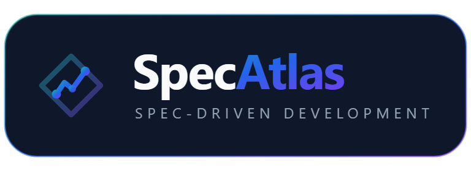

  

# SpecAtlas para VS Code

Panel de Spec-Driven Development sobre el kernel de [SpecAtlas](https://github.com/specatlas): specs vivas, trazabilidad, evidencia y mockups, con gates reales.

## Qué muestra

- **Árbol** proyecto → *Specs vivas* y *Cambios*: estado derivado, progreso de tareas y evidencia, y la **siguiente acción** concreta.
- **Problems**: diagnósticos del kernel (`LINT-*`, `TRACE-*`, `ATLAS-*`) en el panel de problemas.
- **Visor de artefactos**: spec, plan (con diagramas mermaid), tareas, verificación y análisis.
- **Visor de mockups** con selector de pantalla.
- **Acciones**: validar, doctor, trazabilidad, olas, analizar, generar la propuesta para el stakeholder, aprobar (firma con hash y autor) y archivar.

## Requisitos

- Un repositorio con `.sdd/` (créalo con `satlas init`).

## Instalación

- **Desde un `.vsix`**: Extensions → `...` → *Install from VSIX…* (o `code --install-extension specatlas-vscode-<versión>.vsix`).
- **Desarrollo**: abre el repositorio SpecAtlas en VS Code y pulsa `F5` (configuración *Extensión SpecAtlas (Extension Host)*).

## Idiomas

La UI y los artefactos usan el idioma de `.sdd/config.yaml` (`es` por defecto).
